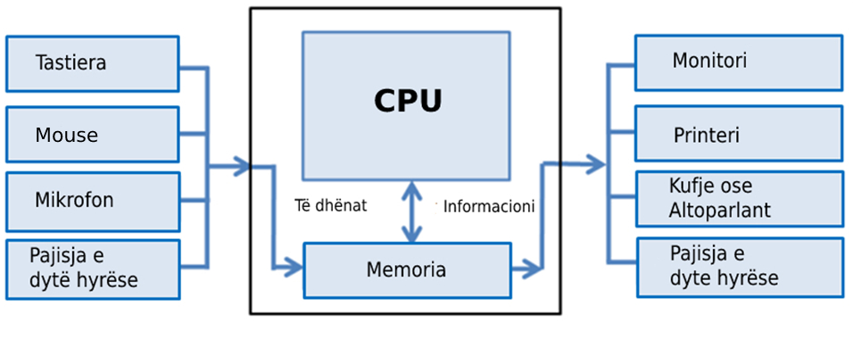
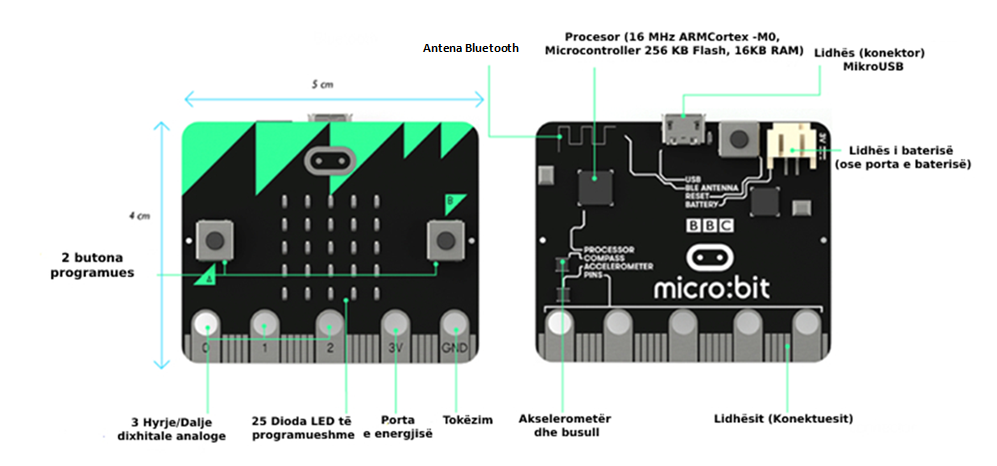
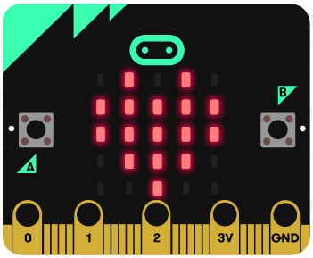
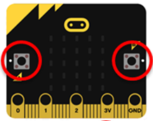
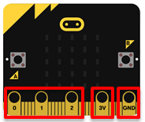
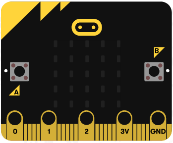
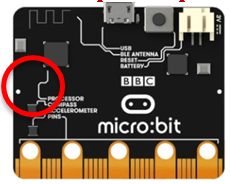
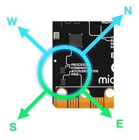
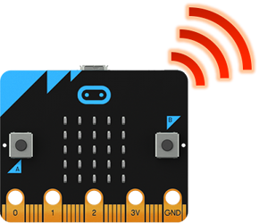
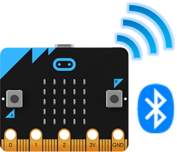

MËSIMI 1 - Gjithçka që duhet të dini në lidhje me një pajisje Micro:bit-i
=========================================================================

Në këtë mësim do të flasim në lidhje me:­

* karakteristikat bazë të pajisjes Micro:bit;

* përbërësit individualë të pajisjes Micro:bit.

Micro:bit-i është një pajisje me origjinë nga Mbretëria e Bashkuar. Është krijuar nga BBC-ja (British Broadcasting Corporation), Microsoft-i dhe kompani të tjera, në mënyrë që të promovojë teknologjinë e informacionit tek grupmoshat më të reja. Përveç nxënies së bazave të programimit, nxënësit mund të zotërojnë edhe bazat e shkencave teknike duke përdorur pajisjen Micro:bit. Duke përdorur një pajisje Micro:bit-i me përbërës shtesë, është e mundur të krijoni pajisjen tuaj e cila shfaq të dhëna reale që mund të përdoren për analiza dhe më pas, për të zgjidhur një problem real, p.sh. monitorimin e temperaturës në dhomë dhe marrjen e vendimit se ku do të vendosen kondicionerët në ndërtesë...

**Le të kujtojmë.** Kompjuteri përbëhet nga 4 përbërës kryesorë:

CPU-ja është një pajisje që përpunon dhe transformon të dhënat. Memoria është një pajisje në të cilën ruhen të dhënat, në çast ose përgjithmonë. Duke përdorur pajisjet e hyrjes, kompjuteri merr informacion (tastierë, maus), ndërsa duke përdorur pajisjet dalëse, informacioni shfaqet ose transmetohet (monitor, printer,).

Tani, le ta shohim nga afër pajisjen Micro:bit.

**Micro:bit-i** është një pajisje që ka një procesor 32-bit, sensorë dhe një ekran të përbërë nga 25 dioda LED. Ka pesë konektorë, hyrës dhe dalës  (I / O) që përdoren për të lidhur pajisjet Micro:bit me pajisje ose sensorë të tjerë, ka pajisje Bluetooth dhe ushqehet nga dy bateri AA. Dhe, më e rëndësishmja - Micro:bit-i mund të programohet. 

Pajisja Micro:bit përbëhet nga përbërësit e mëposhtëm fizikë:

•	25 dioda LED të programueshme individualisht,
•	2 çelësa të programueshëm, të shënuar A dhe B,
•	kunjat,
•	sensorë të temperaturës dhe dritës,
•	sensorë lëvizjeje (akselerometër dhe busull),
•	komunikim pa tel përmes radios dhe Bluetooth-it,
•	Porta USB,
•	butoni i rikonfigurimit.

.. |Taster2| image:: ../_images/5.png
            :width: 150px

.. |USB| image:: ../_images/13.png
            :width: 150px

.. list-table:: Tabela e përmbajtjes e pajisjes Micro-bit
   :widths: 100 100
   :header-rows: 1

   * - Emri i përbërësit:					
     - Funksioni:  

   * - |Led|
     - **LED (LightEmitting Diode)** janë dioda që emetojnë dritë. Micro:bit-i ka 25 LED (të vendosura në një rrjet 5x5) që mund të programohen individualisht dhe të cilat, në varësi të programit, mund të shfaqin tekst specifik, numra, figura.

   * - |Taster1| |Taster2|
     - Ekzistojnë dy butona (butona) në pjesën e përparme të Micro:bit-it (shënuar A dhe B). Shtypja e secilit buton individualisht, ose shtypja e të dy butonave në të njëjtën kohë, shkakton nisjen e programit në pajisje. Ekziston një buton tjetër në pjesën e pasme të Micro:bit-it që ju lejon të rindizni (rivendosni) programin e ngarkuar.

   * - |Pinovi|
     - Micro:bit-i ka 25 kunja - 5 të mëdha dhe 20 të vogla. Pesë kunjat e mëdha janë shënuar me 0, 1, 2, 3V dhe GND. Kunjat 0, 1 dhe 2 janë kunjat e qëllimit të përgjithshëm të input-output-it. Nëpërmjet tyre, mund të lidhim sensorë të ndryshëm shtesë me Micro:bit-in dhe, gjithashtu, të kontrollojmë disa pajisje njëkohësisht. Kunjat 3V dhe GND (tokë - tokë) përdoren për furnizimin me energji elektrike. Shënim: Edhe pse është shënuar me 3V, në daljen e kësaj kunje, marrim një tension të lidhjes me tokën 3.3V.

   * - |Svetlo|
     - Diodat LED janë të vendosura në pjesën e përparme të Micro:bit-it. Në këtë rast, ato luajnë rolin e një pajisjeje hyrëse. Ekrani LED funksionon si një sensor i thjeshtë i dritës i cili tregon intensitetin e dritës në mjedis.

   * - |Temperatura|
     - Nuk ka një sensor të veçantë të temperaturës të integruar në Micro:bit, por është i mundur përdorimi i një sensori që mat temperaturën e procesorit të tij. Ky sensor lejon që Micro:bit-i të tregojë temperaturën aktuale të ambientit, në gradë Celsius.

   * - |Akceleromatar|
     - Akselerometër - është një përbërës që regjistron lëvizjet, d.m.th. ndryshimin e shpejtësisë dhe pozicionit, d.m.th. mund të masë shpejtësinë e lëvizjes. Me këtë përbërës mund të regjistroheni kur lëvizni Micro:bit-in. Gjithashtu mund të zbulohen aktivitete të tjera, të tilla si dridhja, animi ose rënia e lirë.  

   * - |Kompas|
     - Busulla zbulon fushën magnetike të Tokës, e cila na jep aftësinë të përcaktojmë drejtimin përballë të cilit është Micro:bit-i. Busulla duhet të kalibrohet para përdorimit. "Kalibrimi" i busullës jep rezultate të sakta të leximit të drejtuar. Kur fillon kalibrimi, Micro:bit-i do të shfaqë udhëzime në ekran - "Vizato një rreth" ose "Ano për të mbushur ekranin". Kështu që ne do ta zhvendosim pikën në qendër të ekranit, duke lëvizur pajisjen, derisa të shtypet skica e rrethit ose deri sa i gjithë ekrani të mbushet me pika. 

   * - |Radio|
     - Përbërësi i radios lejon komunikimin pa tel ndërmjet dy ose më shumë Micro:bite-ve. Ne mund të përdorim radion për të shkëmbyer mesazhe me Micro:bit-e të tjerë, për të  krijuar lojëra ose teste për shumë lojtarë etj.

   * - |BlueTooth|
     - Antena BLE (Bluetooth me energji të ulët) lejon që Micro:bit-i të dërgojë dhe marrë sinjale Bluetooth-i, pra të komunikojë pa tel me kompjutera, celularë dhe tableta.

   * - |USB|
     - Porta USB na lejon ta lidhim Micro:bit-in me kompjuterin nëpërmjet një kablloje mikro-USB, e cila do ta furnizojë me energji pajisjen dhe do të na lejojë të shkarkojmë kodet e programit në të.

.. infonote::

  **Çfarë kemi mësuar?**
    •  pajisja Micro:bit është krijuar për të mësuar bazat e programimit;
    •  mund të quhet mini-kompjuter;
    •  pajisja Micro:bit ka një ekran të përbërë nga 25 dioda LED;
    •  këto 25 dioda luajnë rolin e pajisjes hyrëse dhe dalëse dhe mund të programohen individualisht;
    •  pajisja Micro:bit ka 3 çelësa, çelësat A dhe B mund të programohen dhe janë të vendosur në pjesën e përparme të Micro:bit, dhe një buton rikonfigurimi të vendosur në mes të pajisjes;
    •  pajisja Micro:bit ka lidhje (kunja) që përdoren për tu lidhur me pajisje të tjera (sensorë, motorë);
    • pajisja Micro:bit mund të masë temperaturën, intensitetin e dritës, shpejtësinë dhe të shërbejë si busull;
    • pajisja Micro:bit mund të komunikojë me pajisje të tjera duke përdorur komunikimin pa tel nëpërmjet Bluetooth-it;
    •  ka tre mënyra për të furnizuar me energji një pajisje Micro:bit-i: duke përdorur një lidhës baterie, duke përdorur një kunj 3V, ose duke u lidhur me një kompjuter nëpërmjet një porte USB.

Test
~~~~

.. mchoice:: L1P1
    :answer_a: 15
    :answer_b: 21
    :answer_c: 23
    :answer_d: 25
    :feedback_a: Përgjigja juaj nuk është e saktë. Provoni përsëri! Kthehuni dhe shikoni pjesën e mësimit që shpjegon numrin e diodave LED në ekranin e Micro:bit-it. 
    :feedback_b: Përgjigja juaj nuk është e saktë. Provoni përsëri! Kthehuni dhe shikoni pjesën e mësimit që shpjegon numrin e diodave LED në ekranin e Micro:bit-it. 
    :feedback_c: Përgjigja juaj nuk është e saktë. Provoni përsëri! Kthehuni dhe shikoni pjesën e mësimit që shpjegon numrin e diodave LED në ekranin e Micro:bit-it.
    :feedback_d: Ju lumtë! Përgjigja juaj është e saktë. Në ekranin e Micro:bit-it ka 25 dioda LED të vendosura  në një rrjet 5x5.
    :correct: d

    Sa dioda LED ndodhen në pjesën e përparme të Micro:bit-it? (Zgjidhni një nga përgjigjet më poshtë).

.. mchoice:: L1P2
    :answer_a: Busulla
    :answer_b: Akselerometër 
    :answer_c: Ram
    :answer_d: Bluetooth
    :feedback_a: Përgjigja juaj nuk është e saktë. Provoni përsëri! Kthehuni dhe shikoni pjesën e mësimit që shpjegon sensorin e lëvizjes.
    :feedback_b: Ju lumtë! Përgjigja juaj është e saktë. Me ndihmën e një akselerometri, është e mundur të regjistroheni kur lëviz Micro:bit-i. Gjithashtu është  e mundur të detektohen aktivitete të tjera, të tilla si vibrimi (dridhja) , animi ose rënia e lirë.
    :feedback_c: Përgjigja juaj nuk është e saktë. Provoni përsëri! Kthehuni dhe shikoni pjesën e mësimit që shpjegon sensorin e lëvizjes.
    :feedback_d: Përgjigja juaj nuk është e saktë. Provoni përsëri! Kthehuni dhe shikoni pjesën e mësimit që shpjegon sensorin e lëvizjes.
    :correct: b

    Cili përbërës i Micro:bit-it lejon detektimin e lëvizjes?(Zgjidhni një nga përgjigjet më poshtë ).

.. mchoice:: L1P3
    :answer_a: Detekton Dritën 
    :answer_b: . Detekton Temperaturën
    :answer_c: Detekton fuqinë e fushës Magnetike 
    :answer_d: Detekton Lëvizjen
    :feedback_a: Përgjigja juaj nuk është e saktë. Provoni përsëri! Kthehuni dhe shikoni pjesën e mësimit që shpjegon busullën.
    :feedback_b: Përgjigja juaj nuk është e saktë. Provoni përsëri! Kthehuni dhe shikoni pjesën e mësimit që shpjegon busullën.
    :feedback_c: Ju lumtë! Përgjigja juaj është e saktë. Busulla detekton fushën magnetike të Tokës, e cila na jep mundësinë të përcaktojmë drejtimin në të cilin ndodhet Micro:bit-i.
    :feedback_d: Përgjigja juaj nuk është e saktë. Provoni përsëri! Kthehuni dhe shikoni pjesën e mësimit që shpjegon busullën.
    :correct: c

    Cili është roli i busullave në Micro:bit? (Zgjidhni një nga përgjigjet më poshtë ).

.. mchoice:: L1P4
        :answer_a: 2
        :answer_b: 1
        :answer_c: 3
        :answer_d: 4
        :feedback_a: Përgjigja juaj nuk është e saktë. Provoni përsëri! Kthehuni dhe shikoni pjesën e mësimit që shpjegon tastierën e Micro:bit-it.
        :feedback_b: Përgjigja juaj nuk është e saktë. Provoni përsëri! Kthehuni dhe shikoni pjesën e mësimit që shpjegon tastierën e Micro:bit-it.
        :feedback_c: Ju lumtë! Përgjigja juaj është e saktë. Ekzistojnë dy butona (butona) në pjesën e përparme të Micro:bit-it (shënuar A dhe B), dhe në pjesën e pasme të Micro:bit-it ekziston një buton tjetër që ju lejon të rikonfiguroni programin e ngarkuar
        :feedback_d: Përgjigja juaj nuk është e saktë. Provoni përsëri! Kthehuni dhe shikoni pjesën e mësimit që shpjegon tastierën e Micro:bit-it.
        :correct: c

        Sa çelësa ka një Micro:bit? (Zgjidhni një nga përgjigjet më poshtë ).

.. mchoice:: L1P5
    :answer_a: Detekton dritën	
    :answer_b: Detekton temperaturën 
    :answer_c: Detekton ndryshimin e shpejtësisë 
    :answer_d: Detekton fuqinë e fushës magnetike 
    :feedback_a: Ju lumtë! Përgjigja juaj është e saktë. Diodat  LED në ekran funksionojnë si një sensor i thjeshtë i dritës që detekton intensitetin e dritës në mjedis.
    :feedback_b: Përgjigja juaj nuk është e saktë. Provoni përsëri! Kthehuni dhe shikoni pjesën e mësimit që shpjegon detektimin e dritës.
    :feedback_c: Përgjigja juaj nuk është e saktë. Provoni përsëri! Kthehuni dhe shikoni pjesën e mësimit që shpjegon detektimin e dritës.
    :feedback_d: Përgjigja juaj nuk është e saktë. Provoni përsëri! Kthehuni dhe shikoni pjesën e mësimit që shpjegon detektimin e dritës.
    :correct: a

    Cili është roli i diodave LED në një Micro:bit?(Zgjidhni një nga përgjigjet më poshtë ).
