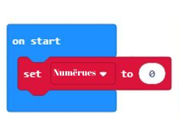
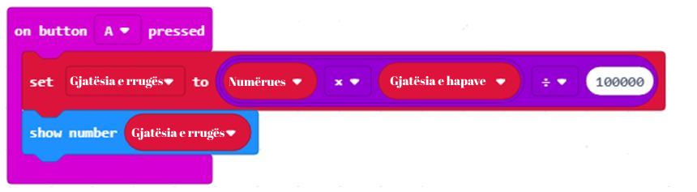
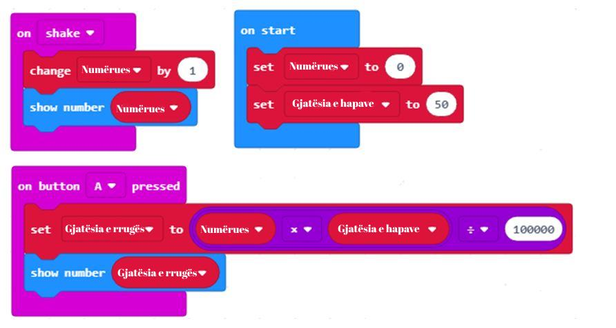

Mësimi 10 – Operacionet aritmetike dhe variablat
================================================

Në këtë mësim do të flasim për: 

•	ruajtjen e rezultatit të ndërmjetëm;
•	krijimin e variablave;
•	operacionet aritmetike dhe llogaritjet në MakeCode;
•	pjesëtimin e numrave të plotë dhe operacionet aritmetike shtesë.

Gjatë krijimit të pedometrit (pajisje që numëron (njehson) hapat duke njohur lëvizjet që ka bërë përdoruesi) është e rëndësishme të kemi informatën për numrin e hapave që ka bërë përdoruesi, për të ditur çfarë distance është përshkuar.

Do të ishte mirë që programi, në çdo moment, të tregojë numrin e hapave të bërë. Ndërsa pas klikimit në butonin A, të tregojë sa kilometra janë përshkuar.

**Faza 1**

**Të menduarit e problemit:** 

Duhet të regjistrohet secila lëvizje e përdoruesit. Për të përcaktuar distancën e kaluar përkufizojmë gjatësinë e hapit, p.sh. 50 cm, të cilën e shndërrojmë në km (në rastin tonë 50cm=0.0005 km) dhe e shumëzojmë me numrin e hapave.

    **Hapi 1:** Numri i hapave në fillim është zero.

    **Hapi 2:** Sa herë bëhet një lëvizje, vlera e numrit të hapave rritet me një.

    **Hapi 3:** Paraqitet numri i hapave të bërë për momentin.

    **Hapi 4:** Pasi përdoruesi të klikojë butonin А: paraqitet numri i kilometrave të kaluara në bazë të numrit të hapave (shumëzohet gjatësia e hapave me numrin e hapave).

.. |dugme6| image:: ../_images/86.png
              :width: 90px

**Faza 2**

Hapni MakeCode për të zgjedhur dhe renditur blloqet në hapësirën për programim.
Në faqen e internetit në https://makecode.microbit.org filloni një projekt të ri duke klikuar në butonin |dugme6|.

Për të ekzekutuar kërkesën për kilometrat e përshkuara në bazë të numrit të hapave, duhet të gjejmë mënyrën për të ruajtur dhe, sipas nevojës, për të ndryshuar vlerën e numëruesit të hapave. Zgjidhja për këtë problem është futja e **variablës**. Variabla mund të kuptohet si hapësirë në memorien e kompjuterit, e ngjashme me një kuti, në të cilën, gjatë ekzekutimit të programit, ruhen vlerat e ndërmjetme. Variablat kanë emrat e tyre. Kur doni të përdorni vlerën e variablës në program, duhet të përmendni emrin e saj.

Variablat krijohen duke klikuar në kategorinë *Variables* (1), pastaj butonin *Make a variable* (Krijo një variabël) (2) dhe në fushë futet emri i variablës (3), në rastin tonë **Numëruesi (Brojac)**. Pasi të klikohet butoni OK (4), krijohet një variabël (5).

.. image:: ../_images/179.png
     :align: center
     :width: 700px

Vlera fillestare e variablës **Numëruese (Brojac)** caktohet zero. Kjo mund të bëhet pasi të tërhiqet blloku set Numërues (Brojac) to 0 nga kategoria *Variables* në bllokun *on start*.

Përveç variablës Numëruese (Brojac) të hapave përkufizohet edhe variabla **GjatësiaEHapave (DuzinaKoraka)**, vlera e së cilës caktohet 50 cm.

.. image:: ../_images/181.png
     :align: center
     :width: 300px

Ndryshimi i numrit të hapave ndodh sa herë që përdoruesi bën një lëvizje. Me fjalë të tjera, vlera e variablës **Numëruese (Brojac)** do të rritet me një, sa herë që bëhet një lëvizje.

Këtë e bëjmë me përdorimin e bllokut on shake, brenda të cilit vendosim bllokun *change GjatësiaEHapave (DuzinaKoraka) by 1*.

.. image:: ../_images/182.png
     :align: center
     :width: 300px

Çdo ndryshim i numrit të hapave duhet të shfaqet në ekranin e Micro:bit-it. Pas shfrytëzimit të bllokut *show number..* në fushën për numër tërheqim variablën **Numëruese (Brojac)** nga kategoria *Variables*.

.. image:: ../_images/183.png
     :align: center
     :width: 300px

**Faza 3**

Testimi dhe analiza e programit.

.. |download| image:: ../_images/97.png
              :width: 200px

Për të testuar programin kemi dy mundësi:

     1. ta nisim atë në simulator duke klikuar butonin |startuj|.

     2. ta kalojmë atë në Micro:bit. Për ta kaluar programin në Micro:bit. duhet ta lidhim atë me kompjuterin me kabllo USB. Klikoni butonin |download| për të shkarkuar skedarin .hex në kompjuterin tuaj. Duke tërhequr skedarin në Micro:bit, pajisja është gati për të punuar.

.. image:: ../_images/184.png
     :align: center
     :width: 500px

Për momentin, programi punon siç duhet; kur bëhet një lëvizje numëruesi i hapave rritet me një. Tani, pas klikimit në butonin A, duhet të shfaqet kilometrazhi total bazuar në numrin e hapave.

Kilometrazhi (gjatësia e përshkuar) njehsohet duke shumëzuar numrin e hapave me gjatësinë e përkufizuar të hapave. Në rastin tonë, gjatësia e hapave është 50 cm. Për të përftuar rezultatin në kilometra duhet të pjesëtohet me 100000 (1km=100000cm)

Për t'i bërë të gjitha këto duhet të përdoren operacionet llogaritëse siç janë mbledhja, zbritja, shumëzimi dhe pjesëtimi. Këto operacione i përdorim përherë në jetën e përditshme. Blloqet që e mundësojnë këtë quhen **operatorë aritmetikë**. Operacionet njehsuese siç janë mbledhja, zbritja, shumëzimi dhe pjesëtimi nuk janë të rëndësishme në orët e matematikës.

Pasi programimi paraqet përpjekje për të lehtësuar jetën e përditshme, në MakeCode mund të bëhet një numër operacionesh llogaritëse, ose siç i quajmë ndryshe - aritmetike.

Blloqet që mundësojnë llogaritjen janë në kategorinë *Math*.

.. image:: ../_images/185.png
     :align: center
     :width: 400px

Rezultati i ekzekutimit të tyre është një **numër**.

Nëse doni të verifikoni si punojnë operatorët aritmetikë për mbledhje, zbritje, shumëzim dhe pjesëtim, mjafton që në fushat e zbrazëta të bllokut të fusni numra, të klikoni dy herë mbi ta dhe të shikoni rezultatin e ekzekutimit.

.. image:: ../_images/186.png
     :align: center
     :width: 600px

Vini re se operacioni llogaritës i shumëzimit shënohet me (*), ndërsa pjesëtimi me ÷.

Shprehjet më të ndërlikuara matematikore (ato me kllapa) mund të njehsohen në MakeCode.

Shprehja aritmetike: (12 + 32) * (56 - 5) mund të duket kështu:

.. image:: ../_images/187.png
     :align: center
     :width: 600px

Kryeni:

Renditni blloqet e duhura dhe në fushat e zbrazëta shënoni rezultatet e ekzekutimit.

.. fillintheblank:: fitb-exL10P1
   :casei:

   (25∙25-255)-525:25

   -   :346: Saktë
       :x: E pasaktë

.. fillintheblank:: fitb-exL10P2
   :casei:

   23∙9-10

   -   :197: Saktë
       :x: E pasaktë

.. fillintheblank:: fitb-exL10P3
   :casei:

   27/3+(23∙9-10)

   -   :197: Saktë
       :x: E pasaktë

.. fillintheblank:: fitb-exL10P4
   :casei:

   5∙(27/3+(23∙9-10))

   -   :206: Saktë
       :x: E pasaktë

.. fillintheblank:: fitb-exL10P5
   :casei:

   210+3∙(42+634)

   -   :676: Saktë
       :x: E pasaktë

.. fillintheblank:: fitb-exL10P6
   :casei:

   (618-(312:4+344)):14-13

   -   :1: Saktë
       :x: E pasaktë

Njehsoni vlerat e shprehjeve të njëjta në fletore dhe krahasojini me rezultatet e pranuara nga MakeCode. Nëse vëreni gabime, analizoni procedurën e zgjidhjes dhe përmirësojini ato.

Përkufizojmë variablën GjatësiaERrugës (DuzinaPuta) e cila do të ruajë vlerën e rrugës së përshkruar në kilometra, të njehsuar me ndihmën e bllokut të mëposhtëm.

.. image:: ../_images/188.png
     :align: center
     :width: 350px

Pasi të klikoni butonin А duhet të ndryshoni operacionet aritmetike me të cilat njehsohet vlera e kilometrazhit të kaluar. Njëkohësisht, në ekranin e Micro:Bit-it shfaqet vlera e dhënë:

Si duket kodi në fund:

Testojmë programin përsëri. Programi punon si duhet.

Përveç operacioneve kryesore aritmetike, një tjetër operacion njehsues është edhe pjesëtimi i numrave të plotë. Përdoret shpesh në programim.

Edhe në blloqe mund të njehsoni mbetjet në pjesëtimin e numrave të plotë. Duhet të përdorni operatorin |ostatak|.

Të përdorim këtë operator dhe të krijojmë një program me të cilin kontrollohet nëse vlera e matur e nivelit të ndriçimit është numër çift?

**Faza 1**

Të menduarit për problemin: Numri është çift nëse pjesëtohet me numrin 2 pa mbetje.

**Faza 2**

Hapni MakeCode për të zgjedhur dhe renditur blloqet në hapësirën për programim.
Në faqen e internetit në https://makecode.microbit.org filloni një projekt të ri duke klikuar butonin |dugme6|.

Kushti me të cilin kontrollohet nëse niveli i ndriçimit është numër çift mund të paraqitet me bllokun:

.. image:: ../_images/192.png
     :align: center
     :width: 400px

Pamja përfundimtare e kodit:

.. image:: ../_images/193.png
     :align: center
     :width: 400px

**Faza 3**

Testimi dhe analiza e programit.

Për të testuar programin kemi dy mundësi:

     1. ta nisim atë në simulator duke klikuar butonin |startuj|.

     2. ta kalojmë atë në Micro:bit. Për ta kaluar programin në Micro:bit duhet ta lidhim me kompjuterin me kabllo USB. Klikoni butonin  |download| për të shkarkuar skedarin .hex në kompjuterin tuaj. Duke tërhequr skedarin në Micro:bit, pajisja është gati për të punuar.

Përveç operacioneve kryesore aritmetike, në kategorinë Math mund të gjejmë edhe blloqet si vijon:

.. |a4| image:: ../_images/197.png
          :width: 200px

.. |a5| image:: ../_images/198.png
          :width: 200px

.. |a6| image:: ../_images/199.png
         :width: 200px

.. |a7| image:: ../_images/200.png
          :width: 200px

.. |a9| image:: ../_images/202.png
          :width: 200px

.. list-table:: Funksionet në kategorinë *Math*
   :widths: 100 100
   :header-rows: 1

   * - Blloku i operacionit
     - Sqarimi i bllokut

   * - |a1|
     - Caktimi i vlerës minimale të numrave nga intervali i paraqitur.

   * - |a2|
     - Caktimi i vlerës maksimale të numrave nga intervali i paraqitur.

   * - |a3|
     - Vlera absolute e numrit.

   * - |a4|
     - Katrori i numrit.

   * - |a5|
     - Rrënja katrore e numrit.

   * - |a6|
     - Rrumbullakosja e numrave (numrave me presje dhjetore) në numrin më të përafërt me numrin me presje dhjetore. Rrumbullakosja e numrit 6.78 është numri 7, ndërsa i numrit 9.3 është numri 9.

   * - |a7|
     - Për ta ndryshuar numrin me presje dhjetore në numrin e plotë pasues me vlerën më të lartë, marrim vlerën më të lartë të numrit. P.sh., vlera më e lartë pasuese për 1.234 është 2, sepse ai është numri i plotë pasues me vlerën më të lartë i 1-shit. Për numrat negativë, p.sh, -3.63, vlera më e lartë pasuese është -3

   * - |a8|
     - Për ta ndryshuar numrin me presje dhjetore në numrin e plotë pasues me vlerën më të ulët, marrim vlerën më të ulët të numrit. P.sh., vlera më e ulët pasuese për 8.76 është 8, sepse ai është numri i plotë pasues me vlerën më të ulët i 8-s. Për numrat negativë, p.sh., -6.17, vlera më e ulët pasuese është -7, sepse është numri i plotë pasues me vlerën më të ulët

   * - |a9|
     - Shkurtimi i numrave. Nëse numri ka vlerën 54.234, vlera e shkurtuar është 54. Shkurtimi i numrave bëhet në mënyrë të njëjtë edhe për numrat negativë. Vlera e shkurtuar e -34.913 është -34.
     
.. infonote::

  **Çfarë mësuam?**
     •	variabla mund të kuptohet si hapësirë në memorien e kompjuterit në të cilën gjatë ekzekutimit të programit ruhen disa vlera të ndërmjetme.
     •	variablat kanë emrat e tyre.
     •	mënyrën e krijimit të variablave.
     •	operatorët të cilët mundësojnë njehsimin (mbledhjen, zbritjen, pjesëtimin, shumëzimin) quhen operatorë aritmetikë.
     •	blloqet që paraqesin operatorët aritmetikë dhe funksionet matematike janë të vendosura në kategorinë Math.

Test
~~~~

.. mchoice:: L10P1
    :answer_a: 42875
    :answer_b: 35
    :answer_c: 105
    :answer_d: 70
    :feedback_a: Ju lumtë! Përgjigja juaj është e saktë.
    :feedback_b: Përgjigja juaj nuk është e saktë. Provoni përsëri!
    :feedback_c: Përgjigja juaj nuk është e saktë. Provoni përsëri!
    :feedback_d: Përgjigja juaj nuk është e saktë. Provoni përsëri!
    :correct: a

    Cili do të jetë rezultati pas ekzekutimit të bllokut më poshtë:

    .. image:: ../_images/203.png
         :align: center
         :width: 300px

.. mchoice:: L10P2
    :answer_a: 56
    :answer_b: 55
    :answer_c: 57
    :answer_d: 50
    :feedback_a: Ju lumtë! Përgjigja juaj është e saktë.
    :feedback_b: Përgjigja juaj nuk është e saktë. Provoni përsëri!
    :feedback_c: Përgjigja juaj nuk është e saktë. Provoni përsëri!
    :feedback_d: Përgjigja juaj nuk është e saktë. Provoni përsëri!
    :correct: a

    Cili do të jetë rezultati pas ekzekutimit të bllokut më poshtë:

    .. image:: ../_images/204.png
         :align: center
         :width: 300px

.. mchoice:: L10P3
    :answer_a: 988
    :answer_b: 987
    :answer_c: 980
    :answer_d: 990
    :feedback_a: Ju lumtë! Përgjigja juaj është e saktë.
    :feedback_b: Përgjigja juaj nuk është e saktë. Provoni përsëri!
    :feedback_c: Përgjigja juaj nuk është e saktë. Provoni përsëri!
    :feedback_d: Përgjigja juaj nuk është e saktë. Provoni përsëri!
    :correct: a

    Cili do të jetë rezultati pas ekzekutimit të bllokut më poshtë:

    .. image:: ../_images/205.png
         :align: center
         :width: 300px

.. mchoice:: L10P4
    :answer_a: 58
    :answer_b: 57
    :answer_c: 59
    :answer_d: 60
    :feedback_a: Ju lumtë! Përgjigja juaj është e saktë.
    :feedback_b: Përgjigja juaj nuk është e saktë. Provoni përsëri!
    :feedback_c: Përgjigja juaj nuk është e saktë. Provoni përsëri!
    :feedback_d: Përgjigja juaj nuk është e saktë. Provoni përsëri!
    :correct: a

    Cili do të jetë rezultati pas ekzekutimit të bllokut më poshtë:

    .. image:: ../_images/206.png
         :align: center
         :width: 300px

.. mchoice:: L10P5
    :answer_a: 3
    :answer_b: 1
    :answer_c: 0
    :answer_d: 4
    :feedback_a: Ju lumtë! Përgjigja juaj është e saktë.
    :feedback_b: Përgjigja juaj nuk është e saktë. Provoni përsëri!
    :feedback_c: Përgjigja juaj nuk është e saktë. Provoni përsëri!
    :feedback_d: Përgjigja juaj nuk është e saktë. Provoni përsëri!
    :correct: a

    Cili do të jetë rezultati pas ekzekutimit të bllokut më poshtë:

    .. image:: ../_images/207.png
         :align: center
         :width: 300px

.. mchoice:: L10P6
    :random:
    :answer_a: numrat nga intervali nga 0 deri 10, duke mos përfshirë 0 dhe 10.
    :answer_b: numrat nga intervali nga 0 deri 10, duke përfshirë 0 dhe 10.
    :answer_c: numrat nga intervali nga 0 deri 10, duke përfshirë edhe 10, por jo 0.
    :answer_d: numrat nga intervali nga 0 deri 10, duke përfshirë edhe 0, por jo 10.
    :feedback_a: Ju lumtë! Përgjigja juaj është e saktë.
    :feedback_b: Përgjigja juaj nuk është e saktë. Provoni përsëri!
    :feedback_c: Përgjigja juaj nuk është e saktë. Provoni përsëri!
    :feedback_d: Përgjigja juaj nuk është e saktë. Provoni përsëri!
    :correct: a

    Cili do të jetë rezultati pas ekzekutimit të bllokut më poshtë:

    .. image:: ../_images/208.png
         :align: center
         :width: 300px

.. mchoice:: L10P7
    :random:
    :answer_a: vlera e variablës item është -5
    :answer_b: vlera e variablës item është 5.
    :feedback_a: Përgjigja juaj nuk është e saktë. Provoni përsëri!
    :feedback_b: Ju lumtë! Përgjigja juaj është e saktë.
    :correct: b

    Cili do të jetë rezultati pas ekzekutimit të bllokut më poshtë:

    .. image:: ../_images/209.png
         :align: center
         :width: 300px
