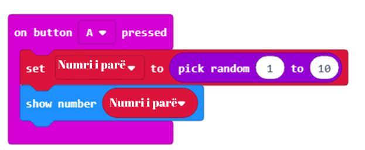
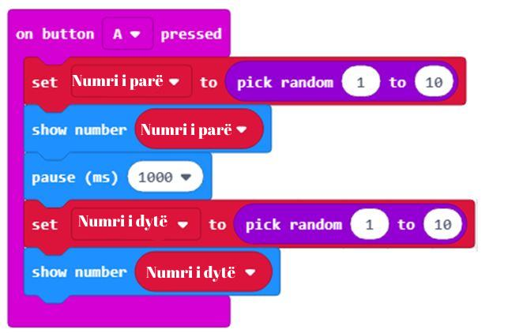

Mësimi 11 –Algoritmi i Euklidit
===============================

Në këtë orë do të flasim për: ¬

•	algoritmin e Euklidit.

Para vetes keni një problem. Në dispozicion keni dy litarë. Njëri është i gjatë 40 metra, tjetri 15 metra. Litarët duhen prerë në mënyrë që të gjitha pjesët e përftuara të jenë me gjatësi të njëjtë. Litarët duhet të priten në atë mënyrë që të fitojmë pjesë sa më të gjata sa të jetë e mundur.

**Faza 1**

Pra, litarin e parë dhe të dytë duhet t'i ndajmë në pjesë me gjatësi të njëjtë, për shembull k. Problemi katë bëjë me përcaktimin e vlerës k.

.. image:: ../_images/210.png
     :align: center
     :width: 500px

Nëse shikoni me kujdes, mund të nxirrni përfundimin se numri duhet të jetë i tillë që edhe 40 edhe 15 të plotpjesëtohen me të, d.m.th., pas pjesëtimit mbetja të jetë 0. Pra, k të plotpjesëtohet me të dy numrat dhe duhet të jetë më i madhi nga numrat që e kanë këtë veçori. Matematikanët do ta quanin më shkurt pjesëtuesi më i madh i përbashkët i numrave 40 dhe 15.

**Shënim:** Pjesëtuesi më i madh i përbashkët i numrave (PMP) është numri më i madh me të cilin secili nga këta numra pjesëtohet pa mbetje.

Erdhëm tek problemi i dytë. E dini çfarë kërkoni, por problemi është si do ta bëni këtë? Janë disa procedura të cilat mund t'ju çojnë te zgjidhja.

Një nga mënyrat është që të përcaktoni cilët janë pjesëtuesit për secilin numër dhe në mesin e tyre të gjeni cilët numra janë të përbashkët për dy numrat dhe të gjeni më të madhin.

Për shembull, për numrat 40 dhe 15, duhet të gjeni pjesëtuesit e thjeshtë:

40=2*2*2*5

15=3*5

Numri më i madh që pjesëton numrat 40 dhe 15 është 5.

Përveç kësaj ekziston edhe një procedurë tjetër e cila përdoret shumë shpesh, e në veçanti nga programuesit. Kjo procedurë është algoritmi i Euklidit.

**Fakt interesant:**

Euklidi (330 – 275 p.e.s.) ishte matematikan i famshëm nga Athina. Njihet për veprat e tij, Elementet, Data, Optika dhe për llogaritjen e pjesëtuesit më të madh të përbashkët (PMP), i cili u quajt sipas emrit të tij, algoritmi i Euklidit.

Shkurtdhe jo krejt saktësisht, **Algoritmi i Euklidit** mund të përshkruhet si vijon: numri më i madh zvogëlohet për vlerën e të voglit, vlerat e reja të përftuara krahasohen dhe procedura përsëritet deri sa të barazohen numrat. Për shembull, procedura e përcaktimit të PMP-së për 40 dhe 15 duket kështu:

Algoritmi i Euklidit bazohet mbi këtë fakt: nëse një numër pjesëtohet, edhe me numrin 40, edhe me numrin 15, ky numër duhet të pjesëtohet edhe me 40 - 15. Kështu, problemin e zbresim në nivel nënproblemi, me fjalë të tjera tani kërkojmë pjesëtuesin më të madh të përbashkët të numrave 25 dhe 15. Kjo procedurë (hap) përsëritet deri sa nuk fitojmë dy numra të barabartë. Më saktë:

Procedura hap pas hapi:

  Nga numri 40 zbresim numrin 15, 40 - 15 = 25

  Pas krahasimit të numrave 25 dhe 15 konkludojmë se numrat nuk janë të barabartë: 25 ≠ 15 
  
  Përsërisim procedurën.

  *Përsërisim procedurën.*

  Nga numri 25 zbresim numrin 15, 25 - 15 = 10

  Pas krahasimit të numrave 15 dhe 10 konkludojmë se numrat nuk janë të barabartë: 15 ≠10

  *Përsërisim procedurën.* Nga numri 15 zbresim numrin 10, 15 - 10 = 5

  Pas krahasimit të numrave 10 dhe 5 konkludojmë se numrat nuk janë të barabartë: 10 ≠ 5

  *Përsërisim procedurën.* Nga numri 10 zbresim numrin 5, 10 - 5 = 5

  Pas krahasimit të numrave 5 dhe 5 konkludojmë se numrat janë të barabartë: 5 = 5

  *Përsërisim procedurën.* Nga numri 5 zbresim numrin 5, 5 - 5 = 0.

  Procedura mbaron.

Konkludojmë se numri më i madh me të cilin mund të pjesëtohen numrat 40 dhe 15 është numri 5.

.. image:: ../_images/212.png
     :align: center
     :width: 600px

Pas zbatimit të algoritmit të Euklidit konkludojmë se litari i gjatë duhet të ndahet në 8 pjesë në gjatësi nga 5 metra, ndërsa litari i shkurtër në 3 pjesë me gjatësi nga 5 metra. Grumbulli i përftuar i litarëve përmban 11 copëza me gjatësi nga 5 metra.

Si është e mundur që algoritmi na ofron një zgjidhje vërtet të mirë? Arsyeja për këtë ka të bëjë me veçoritë e operacioneve të zbritjes dhe shumëzimit, pasoja e të cilave është kjo: Pjesëtuesi më i madh i përbashkët i dy numrave do të jetë PMP-jaediferencës ndërmjet këtyre dy numrave dhe të numrit më të vogël. Siç mund ta vëreni, algoritmi i Euklidit përsëritet në mënyrë të tillë që, në çdo hap vijues, pjesëtuesi nga hapi paraprak bëhet herësi, ndërsa pjesëtuesi është mbetja nga hapi paraprak.

**Faza 2**

Hapni MakeCode për të zgjedhur dhe renditur blloqet në hapësirën për programim.

.. |dugme7| image:: ../_images/86.png
              :width: 70px

Në faqen e internetit nëhttps://makecode.microbit.org filloni një projekt të ri duke klikuar butonin New Project  |dugme7|.

.. |br1| image:: ../_images/213.png
              :width: 200px

.. |br2| image:: ../_images/214.png
              :width: 200px

.. |random1| image:: ../_images/215.png
              :width: 200px

Që programi të llogarisë pjesëtuesin më të madh të përbashkët të numrave të ndryshëm duhet të krijojmë dy variabla: **Numrin e parë** dhe **Numrin e dytë**. Variablën e krijojmë pasi në kategorinë Variables, klikojmë butonin Make a variable dhe në fushë shënojmë emrin e variablës, në rastin tonë **Numri i parë**, |br1|. Në të njëjtën mënyrë përkufizojmë variablën **Numri i dytë** , |br2|.

Tani duhet të përcaktojmë vlerën fillestare për variablat **Numri i parë** dhe **Numri i dytë**. Le të vendosim si vlerë fillestare për dy variablat një vlerë me përzgjedhje të rastësishme prej intervalit nga 1 deri në 10. Vlerën e rastësishme nga intervali i dëshiruar e përftojmë duke shfrytëzuar bllokun  |random1| nga kategoria *Math*.

Vendosim që vlera fillestare e variablës **Numri i parë** të jetë vlerë e përzgjedhur rastësisht nga 0 deri 10. Kjo mund të bëhet duke tërhequr bllokun set *Numri i parë to 0* nga kategoria *Variables* në bllokun |onbuttonA|.

Si duket kodi:

Në të njëjtën mënyrë përkufizojmë variablën **Numri i dytë** .

Si duket kodi:

Nëse analizojmë më vëmendje algoritmin e Euklidit vërejmë se:

1. gjithmonë zbresim numrin e vogëlnga numri i madh.

.. image:: ../_images/219.png
     :align: center
     :width: 400px

2. procedura e zbritjes përsëritet deri sa numrat bëhen të barabartë.

.. image:: ../_images/220.png
     :align: center
     :width: 400px

Skripti përfundimtar duket kështu:

.. image:: ../_images/221.png
     :align: center
     :width: 700px

**Faza 3**

.. |startuj| image:: ../_images/96.png
              :width: 50px

.. |download| image:: ../_images/97.png
              :width: 200px

Për të testuar programin kemi dy mundësi:

     1. ta nisim në simulator duke klikuar butonin  |startuj|.

     2. ta kalojmë në Micro:bit. Për ta kaluar programin në Micro:bit duhet ta lidhim me një kompjuter me kabllo USB. Pasi të klikoni butonin  |download| shkarkoni skedarin .hex në kompjuterin tuaj. Duke e tërhequr skedarin në Micro:bit, pajisja është gati për të punuar.

.. infonote::

  **Çfarë mësuam?**

     •	algoritmi i Euklidit përdoret për përllogaritjen e pjesëtuesit më të madh të përbashkët (PMP);
     •	me ndihmën e algoritmit të Euklidit vijmë tek pjesëtuesi më i madh i përbashkët duke e zbritur vlerën e numrit të vogëlnga numri më i madh, krahasojmë vlerat e numrave të rinj të përftuar dhe e përsërisim procedurën derisa numrat të bëhen të barabartë.

Testi
~~~~~

.. mchoice:: L11P1
    :answer_a: 4
    :answer_b: 8
    :answer_c: 12
    :answer_d: 6
    :feedback_a: Ju lumtë! Përgjigja juaj është e saktë.
    :feedback_b: Përgjigja juaj nuk është e saktë. Provoni përsëri!
    :feedback_c: Përgjigja juaj nuk është e saktë. Provoni përsëri!
    :feedback_d: Përgjigja juaj nuk është e saktë. Provoni përsëri!
    :correct: a

    Cila është PMP-ja për numrat 120 dhe 68? Zbatoni algoritmin e Euklidit.

.. mchoice:: L11P2
    :answer_a: 6
    :answer_b: 2
    :answer_c: 1
    :answer_d: 3
    :feedback_a: Ju lumtë! Përgjigja juaj është e saktë.
    :feedback_b: Përgjigja juaj nuk është e saktë. Provoni përsëri!
    :feedback_c: Përgjigja juaj nuk është e saktë. Provoni përsëri!
    :feedback_d: Përgjigja juaj nuk është e saktë. Provoni përsëri!
    :correct: a

    Në njërën shportë ndodhen 24 mollë, në tjetrën ndodhen 63 dardha. Sa fëmijë duhen për t'i ndarë këto mollë dhe dardha në mënyrë që secili fëmijë të marrë një numër të barabartë mollësh dhe një numër të barabartë dardhash? Zbatoni algoritmin e Euklidit.
