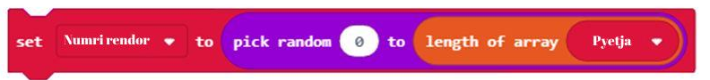
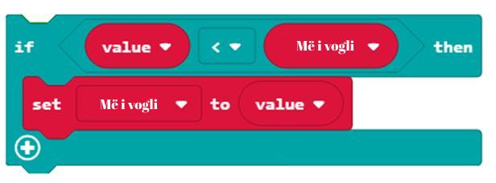

Mësimi 14 –Vargu
================

Në këtë mësim do të flasim për: 

•	ruajtjen e një numri më të madh të të dhënave;
•	vargjet dhe përdorimin e tyre.

Çdo koleksionist pullash postare, kartëmonedhash ose fotografish e di që në një moment të caktuar duhet ta organizojë koleksionin e vet për t'i gjetur sa më lehtë fotografitë ose kartëmonedhat e caktuara. Për shembull, numizmatiku mund të ketë një kuti për monedhat me numra si vijon (si në fotografinë poshtë):

.. image:: ../_images/222.png
     :align: center
     :width: 500px

.. |dugme8| image:: ../_images/86.png
              :width: 90px

.. |niz| image:: ../_images/223.png
          :width: 150px

Për secilën monedhë në koleksion nevojitet hapësirë e veçantë për ruajtje, si dhe adresa unike (0, 1, 2,…) që më vonë të kemi mundësi të gjejmë metelikun e dëshiruar. Pasi programet tona MakeCode shtresëzohen çdo herë e më shumë dhe kërkojnë më shumë variabla për të ndjekur gjëra të caktuara, në vend të variablave që kemi mësuar deri tani do të na duhet të gjejmë mënyra të tjera për ruajtjen dhe organizimin e të dhënave tona. Situatat në të cilat duhet të ruhet një numër më i madh të dhënash janë shumë të shpeshta në punën e çdo programuesi. Ato kërkojnë përdorimin e një lloji tjetër variablash - duhet të përdoret vargu. Për këtë, në MakeCode, mund të shfrytëzojmë bllokun |niz|.

Vargu është një koleksion të dhënash dhe mund të kuptohet si “raft” në të cilin mund të vendosen shumë “kuti”. Çdo “kuti” shënohet me një numër (nga 0 në vazhdim). Në secilën “kuti” ruhet nga një e dhënë (numri, fjala, shenja…). Pra, në vargje mund të ruhen numrat, fjalët ose notat muzikore, të cilat, më fjalë të tjera, quhen **elementet e vargut**.

Secili element në varg përkufizohet me një **indeks**, një numër me të cilin caktohet pozita e caktuar e elementit në varg. Elementi i parë në varg ka indeksin 0. Gjatësia e vargut ka të bëjë me numrin e përgjithshëm të elementeve në varg, ndërsa indeksi i elementit të fundit në varg është gjithnjë një numër më i vogël nga gjatësia e tij (p.sh. nëse gjatësia e vargut është 5, indeksi i elementit të fundit në varg është 4).

Lista krijohet pasi në kategorinë Advanced përzgjidhet nënkategoria *Array* dhe zgjidhet blloku:

.. image:: ../_images/224.png
     :align: center
     :width: 400px

Blloku i epërm krijon listën boshe të emëruar si Listë (duke përzgjedhur opsionin *New variable*… nga lista rënëse).

Lista pastaj mund të plotësohet me pesë numra, të indeksuar nga 0 deri 4. Elementet shtohen pas klikimit mbi shenjën “+” dhe futjen e vlerës në hapësirën e duhur.

.. image:: ../_images/227.png
     :align: center
     :width: 400px

Të bëjmë një program me të cilin do të mund të ushtroni rasat, respektivisht, të përcaktoni rasën për emra të caktuar (Për shembull, cila trajtë e rasës i përgjigjet pyetjes "kush, cili?").

**Faza 1**

Të menduarit për problemin: Për çdo rasë parashtrohet pyetja e duhur. Pasi të klikohet butoni A do të paraqitet pyetja, e cila do të dalë rastësisht, ndërsa duke klikuar butonin B do të paraqitet rasa e cila i përgjigjet pyetjes.

**Faza 2**

Hapni MakeCode për të zgjedhur dhe renditur blloqet në hapësirën për programim.
Në faqen e internetit në https://makecode.microbit.org filloni një projekt të ri duke klikuar në butonin |dugme8|.

.. |list1| image:: ../_images/228.png
              :width: 90px

.. |list2| image:: ../_images/229.png
              :width: 100px

.. |odgovor| image:: ../_images/231.png
              :width: 100px

.. |blok1| image:: ../_images/232.png
              :width: 200px

.. |blok2| image:: ../_images/234.png
              :width: 100px

.. |blok3| image:: ../_images/235.png
              :width: 150px

.. |blok6| image:: ../_images/245.png
              :width: 300px

Për secilën pyetje për rasën ka një përgjigje. Duhet të krijohen dy lista: |list1| и |list2|. Në këto vargje futen elementet e paraqitura në fotografinë më poshtë:

Pamja e vargjeve:

.. image:: ../_images/230.png
     :align: center
     :width: 600px

Përkufizimi i vargjeve |list1| dhe |list2|. Поред тога потребно је да дефинишемо и променљиву |odgovor| као текстуалну променљиву (стринг) која ће чувати вредности низа |list1|: |blok1|.

Pamja e vargjeve:

Pyetjet që parashtrohen për trajtën e rasës duhet të jenë elemente të vargut |list2|. Падежни облик се налазе у низу |list1|.

Siç vërehet, madhësia (dimensioni) e vargut është 7, respektivisht, të dy vargjet kanë nga 7 elemente.

ë vargjet më lart vini re se pyetja në pozitën 1 të vargut është  |list2| има одговор на позицији 1 низа |list1|. E njëjta pyetje vlen edhe elementet e e tjera të vargut. Ky parim është i rëndësishëm për shkak të bashkimit të pyetjes me trajtën e rasës. Që loja të bëhet më interesante (që pyetjet të mos shkojnë nga e para deri te e fundit) mund të përcaktoni përzgjedhjen e rastësishme të pyetjeve nga lista |list2|.

Është e vërtetë se loja do të bëhet më interesante, por po ashtu është e vërtetë se nëse i thoni kompjuterit të zgjedhë pyetjet rastësisht, nuk do të dini se cilën pyetje ka zgjedhur. Kur nuk e dini pyetjen, nuk mund ta dini as rasën.

Në këtë situatë mirë është të përdoret variabla e thjeshtë në të cilën do të ruhet numri rendor i pyetjes.

Krijoni variablën 
|blok2|.

Нека променљива |blok2| узима насумичну вредност од 1 до величине низа (броја елемената у низу можемо дефинисати  коришћењем блока |blok3|):

Ако је садржај променљиве |blok2| број 6, биће постављено шесто питање из низа |list2|.

Kur në Micro:bit shtypet butoni А, pyetja duhet të zgjidhet rastësisht nga vargu |list2| dhe të paraqitet në ekran.

Për të paraqitur një element të caktuar të vargut (p.sh. elementin e tretë të vargut) në ekran, mund të përdorim bllokun në vijim |blok4|.

Pamja e kodit:

.. image:: ../_images/238.png
     :align: center
     :width: 600px

Pasi të klkoni butonin B në Micro:bit do të paraqitet trajta e rasës e cila i përgjigjet pyetjes së dhënë dhe ajo do të paraqitet në ekran.

Pamja e kodit:

.. image:: ../_images/239.png
     :align: center
     :width: 600px

Kodi në fund: https://makecode.microbit.org/_fyhKwVhhUEXT

**Faza 3**

.. |startuj| image:: ../_images/96.png
              :width: 60px

.. |download| image:: ../_images/97.png
              :width: 200px

Për të testuar programin kemi dy mundësi:

     1 - ta nisim atë në simulator duke klikuar butonin |startuj|.

     2 - ta kalojmë atë në Micro:bit. Për ta kaluar programin në Micro:bit. duhet ta lidhim atë me kompjuterin me kabllo USB. Klikoni butonin |download| për të shkarkuar skedarin .hex në kompjuterin tuaj. Duke tërhequr skedarin në Micro:bit, pajisja është gati për të punuar.

Një shembull tjetër i përdorimit të vargut, por me vlera numerike. Në varësi të numrit i cili është gjeneruar rastësisht nga -10 deri 10, në vargun e numrave -10, -5, -2, 0, 2 5, 6, 4, 10 duhet të gjejmë numrin i cili është më i vogël nga ky numër..

**Faza 1**

Të menduarit për problemin: Numri që del me përzgjedhje të rastësishme nga intervali nga -10 deri 10 duhet të krahasohet me secilin element të vargut të numrave -5, -10, 0, -2, 2, 5, 6, 4, 10. Nëse, për shembull, numri i gjeneruar është -1, vlera më e vogël nga ky është -10.

**Faza 2**

Hapni MakeCode për të zgjedhur dhe renditur blloqet në hapësirën për programim.

Në faqen e internetit në https://makecode.microbit.org filloni një projekt të ri duke klikuar butonin |dugme8|.

Përkufizojmë variablën Më i vogli, vlera e së cilës përftohet me përzgjedhje të rastësishme të numrit në intervalin nga -10 deri 10:

Krijojmë edhe Vargun me elementet -5, -10, 0, -2, 2, 5, 6, 4, 10:

Për të kontrolluar secilin element (ruhet në variabël) në listën Vargu përdorim bllokun |blok5|.

Për të kontrolluar cila vlerë e vargut është më e vogël nga numri Më i vogli, dhe për të ruajtur vlerën më të vogël, përdoren blloqet në vijim:

Pamja përfundimtare e kodit:

**Faza 3**

Për të testuar programin kemi dy mundësi:

     1 - ta nisim atë në simulator duke klikuar butoni |startuj|.

     2 - ta kalojmë atë në Micro:bit. Për ta kaluar programin në Micro:bit. duhet ta lidhim atë me kompjuterin me kabllo USB. Klikoni butonin |download| për të shkarkuar skedarin .hex në kompjuterin tuaj. Duke tërhequr skedarin në Micro:bit, pajisja është gati për të punuar.

Krijimi

Krijoni disa elemente 1, 2, 3. Pastaj, në vargun tashmë të krijuar, shtoni numrin 5 në fund të vargut. Ndihmë e vogël: përdorni bllokun |blok6|.

Zgjidhja e mundshme:

.. image:: ../_images/246.png
     :align: center
     :width: 400px

Përveç vlerave numerike, vargjet mund të përdoren edhe për ruajtjen e notave në formën e vargut. Nota paraqitet me oktavë dhe me gjatësi. Forma e një note është: C:2. Kjo nënkupton se dëgjohet nota C për 2 rrahje ritmi. Pauza mund të paraqitet në formën R:1, ku R nënkupton pushim dhe 1 - pushim për një rrahje ritmi. Pushimi është koha gjatë së cilës nuk ka tinguj. Përcaktojmë vargun e Notës 1 për të paraqitur 5 notat e para të melodisë Тwinkle twinkle little star:

.. image:: ../_images/247.png
     :align: center
     :width: 400px

Testimi dhe analiza e programit.

.. infonote::

  **Çfarë mësuam?**
     •	vargu – lloj i të dhënave me një strukturë të ndërlikuar, i cili mundëson ruajtjen e disa vlerave njëkohësisht.
     •	në vargje mund të ruhen numra, fjalë ose nota muzikore, të cilat quhen në mënyrë të përbashkët elementet e vargut.
     •	secili element në varg përkufizohet me një indeks, numri me të cilin përcaktohet pozita e elementit në varg.
     •	elementi i parë në varg ka indeksin 0.
     •	indeksi i elementit të fundit në varg është gjithnjë për një më i vogël se gjatësia e tij.
     •	gjatësia e vargut ka të bëjë me numrin total të elementeve në varg.
     •	Vargjet i krijojmë nga kategoria advanced – array.

Test
~~~~

.. mchoice:: L14P1
    :answer_a: 4
    :answer_b: 2
    :answer_c: 3
    :answer_d: 1
    :answer_e: 5
    :feedback_a: Përgjigja juaj nuk është e saktë. Provoni përsëri!
    :feedback_b: Përgjigja juaj nuk është e saktë. Provoni përsëri!
    :feedback_c: Përgjigja juaj nuk është e saktë. Provoni përsëri!
    :feedback_d: Ju lumtë! Përgjigja juaj është e saktë.
    :feedback_e: Përgjigja juaj nuk është e saktë. Provoni përsëri!
    :correct: d

    Studioni bllokun.

    .. image:: ../_images/248.png
         :align: center
         :width: 400px

    Cila është vlera e elementit me indeks 3?

.. mchoice:: L14P2
    :answer_a: 4
    :answer_b: 2
    :answer_c: 3
    :answer_d: 1
    :answer_e: 5
    :feedback_a: Përgjigja juaj nuk është e saktë. Provoni përsëri!
    :feedback_b: Përgjigja juaj nuk është e saktë. Provoni përsëri!
    :feedback_c: Ju lumtë! Përgjigja juaj është e saktë.
    :feedback_d: Përgjigja juaj nuk është e saktë. Provoni përsëri!
    :feedback_e: Përgjigja juaj nuk është e saktë. Provoni përsëri!
    :correct: c

    Studioni bllokun.

    .. image:: ../_images/249.png
         :align: center
         :width: 400px

    Cila është vlera e elementit me indeks 3?

.. mchoice:: L14P3
    :answer_a: 4
    :answer_b: 3
    :answer_c: 1
    :answer_d: 5
    :answer_e: Në ekranin e Micro:bit-it do të paraqitet gabimi.
    :feedback_a: Përgjigja juaj nuk është e saktë. Provoni përsëri!
    :feedback_b: Përgjigja juaj nuk është e saktë. Provoni përsëri!
    :feedback_c: Ju lumtë! Përgjigja juaj është e saktë.
    :feedback_d: Përgjigja juaj nuk është e saktë. Provoni përsëri!
    :feedback_e: Përgjigja juaj nuk është e saktë. Provoni përsëri!
    :correct: c

    Studioni bllokun.

    .. image:: ../_images/250.png
         :align: center
         :width: 400px

    Cila vlerë do të paraqitet pas ekzekutimit të kodit të paraqitur?

.. mchoice:: L14P4
    :answer_a: 4
    :answer_b: 2
    :answer_c: 3
    :answer_d: 1
    :answer_e: Në ekranin e Micro:bit-it do të paraqitet gabimi.
    :feedback_a: Përgjigja juaj nuk është e saktë. Provoni përsëri!
    :feedback_b: Përgjigja juaj nuk është e saktë. Provoni përsëri!
    :feedback_c: Përgjigja juaj nuk është e saktë. Provoni përsëri!
    :feedback_d: Përgjigja juaj nuk është e saktë. Provoni përsëri!
    :feedback_e: Ju lumtë! Përgjigja juaj është e saktë.
    :correct: e

    Studioni bllokun.

    .. image:: ../_images/251.png
         :align: center
         :width: 400px

    Cila është vlera e elementit me indeks 2?
