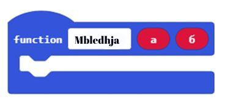
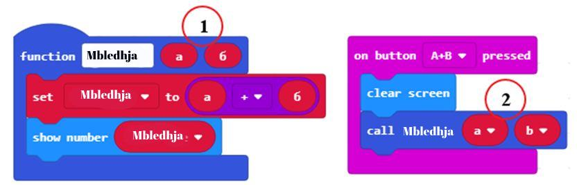
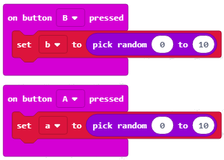
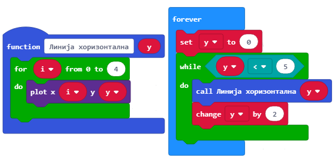
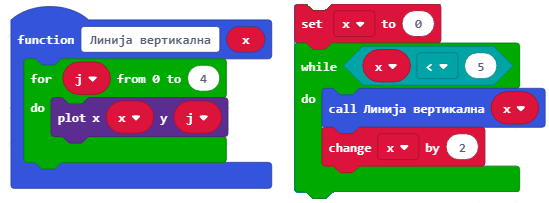
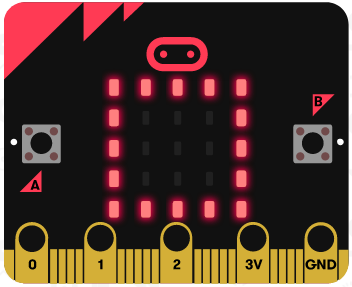
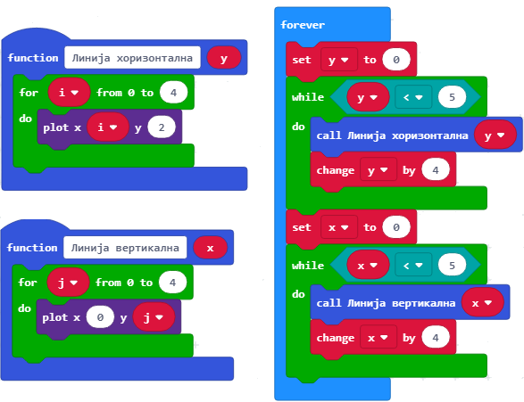
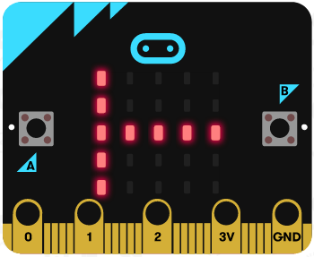

Mësimi 15 – Funksionet
======================

Mësimi 15 – Funksionet:­

•	mënyrën e ndarjes së programeve të ndërlikuara në pjesë – funksione;
•	krijimin e funksioneve në MakeCode;
•	parametrat dhe argumentet.

Ripërdorimi i pjesëve të programit është shumë i rëndësishëm në botën e programimit sepse e bën programin më të thjeshtë dhe më të lexueshëm. Për të shmangur përsëritjen e shkrimit dhe përsëritjen e një programi të njëjtë ose të ngjashëm, përdorim **funksionet**.

Një nga rolet kyç të funksionit është të zbërthejë programin në pjesë të cilat kanë role të përkufizuara saktë. Për shembull, për të bërë një picë, duhet të bëni brumin, të hapni brumin, të shtoni mbushjen, të shtoni përbërësit dhe në fund ta piqni. Nëse do të programonit një robot për prodhimin e picave, të gjithë procedurën e “bëj një picë” mund ta ndani në pjesë me përdorimin e funksioneve – një funksion për secilën pjesë të procesit të të bërit të picës, p.sh. procedura e gatimit të brumit, procesi i pjekjes...

Në përgjithësi, funksionet kanë të bëjnë me procedurën – si duhet të bëhet diçka. 

Funksioni në MakeCode paraqet një grup komandash të cilat duhet të ekzekutohen vetëm kur thirren.

.. |dugme9| image:: ../_images/86.png
              :width: 70px

**Si përkufizohen funksionet**

Për të përkufizuar funksionin nga kategoria Advanced duhet të zgjidhet nënkategoria Function. Nga kategoria Function (1) klikohet butoni Make a Function (2). Pastaj paraqitet dritarja dialoguese (3) e cila mundëson krijimin e funksionit. Në fushën për emrin e funksionit shkruani emrin (4), për shembull Zemër dhe konfirmoni duke klikuar butonin Done (5).

.. image:: ../_images/252.png
     :align: center
     :width: 800px

.. |fun3| image:: ../_images/256.png
              :width: 400px

Në hapësirën e punës do të paraqitet blloku i ri Zemër, i cili i duhet bashkëngjitur bllokut për paraqitjen e fotografisë së zemrës |fun1| (1).

Në program, paraqitja e fotografisë së zemrës (3) të funksionit Zemër bëhet pasi thirret funksioni duke përdorur bllokun |fun2| (2).

.. image:: ../_images/255.png
     :align: center
     :width: 500px

Blloku i ri mund të ketë edhe fusha hyrëse. Falë kësaj, mund të përdorim funksionin për rezultatin e mbledhjes së dy numrave а dhe b. Për të arritur këtë, nga kategoria *Function* duhet të klikojmë butonin *Make a Function*. Hapet dritarja në të cilën fusim emrin e funksionit **Mbledhje**.

Nga katër mundësitë e ofruara për shtimin e fushave të reja në bllokun |fun3|  zgjedhim dy blloqe Number dhe pastaj në bllokun tonë do të paraqiten dy fushat përgjegjëse hyrëse në të cilat do të shkruajmë emrat a dhe b të variablave për dy mbledhësit.

Emrat a dhe b, të cilët i kemi futur në pjesën e sipërme të përkufizimit të funksionit të mbledhjes quhen **parametër** (1). Vlerat konkrete të parametrave do të caktohen si **argumente** (2) të funksioneve të reja të futura. Ky argument zëvendëson parametrat a dhe b, sa herë që paraqiten në funksion. Për parametrin mund të thuhet se është “rojtar” i vendit për argumentin. Për të përdorur funksionin duhet ta “ftojmë” duke thënë emrin e tij e duke përdorur bllokun |fun4|. У поља |fun5|  превлачимо аргументе |fun6| и |fun7| (2).

Argumentet a dhe b krijohen duke përdorur funksionin për përzgjedhjen e rastësishme të vlerave numerike |fun8| nga 0 deri 10 duke klikuar butonat A dhe B në Micro:bit:

**Vizatimi i linjave horizontale (çdo e dytë)**

Për të vizatuar një vijë horizontale (paralele me boshtin x) duhet të lidhen të gjitha pikat që kanë të njëjtën vlerë të koordinatës y. Për shembull, nëse у=0, duhet të vizatohet vetë boshti x. Në fillim ndizet dioda në skajin e majtë të ekranit të Micro:bit-it, në pikën у (0, 0) dhe plotësohen fushat e zbrazëta deri te (5,0). Hapi i radhës është të kalohet te vizatimi i vijës së radhës në rreshtin e dytë dhe të fundit. Nëse duam të vizatojmë të gjitha vijat horizontale, koordinata y e të cilave është numri i cili përfundon me shifrën 0 (i cili pjesëtohet me 2), duhet të përsëritet procedura e përshkruar më lart për у=2 dhe 4.

.. image:: ../_images/265.png
     :align: center
     :width: 500px

Për të qartësuar procedurën, do të ndajmë udhëzimet për vizatimin e një vije horizontale në një tërësi të veçantë – funksioni Vija horizontale, të cilën do ta thërrasim sipas nevojës.

**Vizatimi i vijave vertikale**

Ngjashëm me vizatimin e vijave horizontale, për të vizatuar një vijë vertikale duhet të lidhen të gjitha pikat që kanë të njëjtën vlerë të koordinatës x. Në fillim saktësojmë që është ndezur dioda në skajin e epërm të ekranit, për shembull në pikën (0,0), dhe pastaj ndezim të gjitha diodat në intervalin (0, 5). Hapi i radhës është të kalohet në vizatimin e vijës së radhës në rreshtin e dytë dhe të fundit. Nëse duam të vizatojmë të gjitha vijat horizontale, koordinata x e të cilave është numri i cili përfundon me shifrën 0 (i cili pjesëtohet me 2), do të përsërisim procedurën e përshkruar me lart për x=2 dhe 4.

Mbani mend të gjithë projektin me titullin *Rrjeti*.

**Mendoni:**

Duhet të krijohet një funksion me të cilin vizatohet katrori si në fotografi.

Krijohen funksionet e duhura dhe kodi me të cilin vizatohet katrori.

Megjithatë, këto blloqe për rezultat japin fotografinë në vijim.

Ku qëndron gabimi?

Përgjigja:

Në funksionin Vija vertikale në bllokun plot x …, në vend të 0 vendoset variabla x nga programi kryesor, e njëjta gjë bëhet në funksionin Vija horizontale në bllokun plot y…. - në vend të 0 vendoset variabla y nga programi kryesor.

.. infonote::

    **Çfarë mësuam?**
    
    •	Roli kryesor i funksionit është zbërthimi i programit në pjesë të cilat kanë role të përkufizuara saktësisht
    •	Si krijohen blloqet e reja (funksionet) me dhe pa fusha hyrëse. Blloqet me fusha hyrëse, dhe argumentet që shënohen në to, mbarten duke i zhvendosur te funksioni duke përcaktuar vlerat e parametrit. Kështu, i njëjti bllok mund të realizojë disa aksione të ndryshme në varësi të vlerës së argumenteve.

Test
~~~~

.. mchoice:: L15P1
    :answer_a: Po
    :answer_b: Jo
    :feedback_a: Ju lumtë! Përgjigja juaj është e saktë.
    :feedback_b: Përgjigja juaj nuk është e saktë. Provoni përsëri!
    :correct: а

    A është programi kryesor më i lartë (superior) se funksionet? Zgjidh përgjigjen e saktë.

.. mchoice:: L15P2
    :answer_a: Po
    :answer_b: Jo
    :feedback_a: Përgjigja juaj nuk është e saktë. Provoni përsëri!
    :feedback_b: Ju lumtë! Përgjigja juaj është e saktë.
    :correct: b

    A mund të realizohen në vetëm një mënyrë funksionet në MakeCode? Zgjidh përgjigjen e saktë.

.. mchoice:: L15P3
    :answer_a: Po
    :answer_b: Jo
    :feedback_a: Ju lumtë! Përgjigja juaj është e saktë.
    :feedback_b: Përgjigja juaj nuk është e saktë. Provoni përsëri!
    :correct: а

    A mund të ketë blloku për funksione edhe fusha hyrëse? Zgjidh përgjigjen e saktë.

.. mchoice:: L15P4
    :answer_a: Po
    :answer_b: Jo
    :feedback_a: Përgjigja juaj nuk është e saktë. Provoni përsëri!
    :feedback_b: Ju lumtë! Përgjigja juaj është e saktë.
    :correct: b

    A quhen parametra vlerat të cilat blloku i mbart te funksioni? Zgjidh përgjigjen e saktë.
