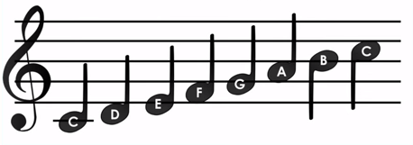
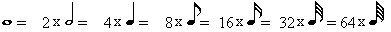
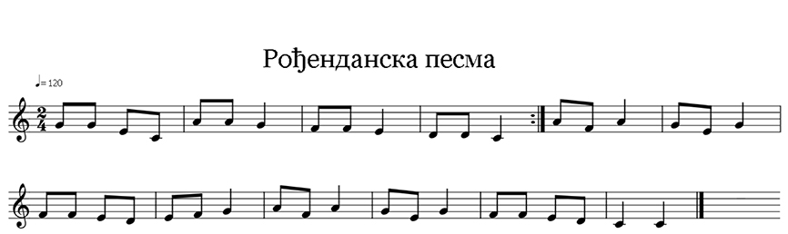

Mësimi 16 - Ushtrimorja
=======================

Ushtrimorja është vendi ku do të ushtroni gjithçka që keni mësuar deri më tani për ruajtjen e një numri më të madh të dhënash, krijimin e vargjeve dhe zbatimin e tyre, përdorimin e funksioneve të cilat përdoruesi i krijon për të ndarë programet e ndërlikuara në tërësi më të thjeshta, mënyrën e përkufizimit të funksioneve dhe përdorimin e parametrave dhe argumenteve.

1.	Shkruani programin për këngën e preferuar.

Ndihmë e vogël:

Sa zgjat secila notë: |nota|

Nëse nuk mund të përzgjidhni këngën e preferuar, përdorni këngën e ditëlindjes.

Krahasoni zgjidhjen tuaj me tonën:  https://makecode.microbit.org/_f90EYb4LcVtV

2.	Krijoni funksionin me të cilin gjeneroni vargun me 20 elemente, vlera e të cilëve janë numra të rastësishëm nga 1 deri në 100. Krahasoni zgjidhjen tuaj me tonën: https://makecode.microbit.org/_ExgfE8ej1Jii

3.	Krijoni funksionin blink me dy parametra x dhe y që aktivizon dhe ndal diodat në koordinatat e caktuara me parametra x dhe y. Krahasoni zgjidhjen tuaj me tonën: https://makecode.microbit.org/_g0tcAz5dmVVc

4.	Krijoni funksionin blink me dy parametra x dhe y që aktivizon dhe ndal të gjitha diodat LED një pas tjetrës. Krahasoni zgjidhjen tuaj me tonën: https://makecode.microbit.org/_1ECLegEjf61L

5.	Shkruani programin i cili mundëson që të ndriçojë dioda e ekranit e cila është më afërt me veriun. Krahasoni zgjidhjen tuaj me tonën: https://makecode.microbit.org/_Mug9F7aJ0JF0

6.	Krijoni funksionin Diagonale me anë të të cilit diodat do të aktivizohen sipas diagonales, respektivisht do të ndizen diodat që kanë vlerë të njëjtë për koordinatën x dhe y (p.sh. (0, 0), (1, 1), (2, 2), … (4, 4)). Simulimi i aktivizimit të diodave mundësohet me futjen e bllokut |pauza|. Krahasoni zgjidhjen tuaj me tonën: https://makecode.microbit.org/_eamEJ0725CgA

7.	Krijoni funksionin Katror, me anë të të cilit do të aktivizohen diodat për të formuar katrorin. Pozita fillestar për vizatimin e katrorit është pika (1, 1). Krahasoni zgjidhjen tuaj me tonën: https://makecode.microbit.org/_9seAtiJEs1dX

8.	Krijoni funksionin Diametri i trekëndëshit me brinjë të barabarta me parametra a dhe b. Gjatësia e anëve krijohet duke përdorur bllokun për përzgjedhje të rastësishme të vlerave numerike. Krahasoni zgjidhjen tuaj me tonën: https://makecode.microbit.org/_6w4ACt5M95xX

9.	Krijoni funksionet në këtë mënyrë:

    a.	Në procedurën Mbledhje në mënyrë të rastësishme, duhet të gjenerohen dy numra: mbledhësi i parë a [10,20] dhe mbledhësi i dytë b nga intervali [1,15]. Në bazë të tyre duhet formuar shuma c = a+b.
    b.	Në procedurën Zbritje në mënyrë të rastësishme, duhet të kategorizohen dy numra, mbledhësi i parë a [10,20] dhe mbledhësi i dytë b nga intervali [1,15]. Në bazë të tyre duhet formuar shuma c = a-b.
    c.	Në procedurën Shumëzim në mënyrë të rastësishme, duhet të kategorizohen dy numra, mbledhësi i parë a [10,20] dhe mbledhësi i dytë b nga intervali [1,15]. Në bazë të tyre duhet formuar shuma c = a*b.
    d.	Në procedurën Pjesëtim në mënyrë të rastësishme, duhet të kategorizohen dy numra, mbledhësi i parë a [10,20] dhe mbledhësi i dytë b nga intervali [1,15]. Në bazë të tyre duhet formuar shuma c = a/b.

Krahasoni zgjidhjen tuaj me tonën: https://makecode.microbit.org/_gby1X26hvTv0
