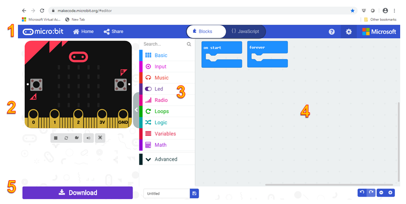

Mësimi 2 - Ambienti i punës MakeCode
====================================

Në këtë mësim do të flasim për: ­

• Mjedisin e punës MakeCode;
• funksionet e blloqeve;
• krijimin e programit të parë;
• Shkarkimin dhe ekzekutimin e kodit në një pajisje Micro:bit

Microsoft MakeCode është një hapësirë në internet e cila përdoret për të mësuar programimin duke përdorur pajisje fizike, të tilla si Micro:bit-i. Avantazhi i kësaj hapësire është se nuk keni nevojë ta instaloni programin në kompjuterin tuaj. Mjafton që të keni të instaluar një browser interneti në kompjuterin tuaj. Në këtë hapësirë, është e mundur të punohet në të dy blloqe Blox  (vizual) (ang. Blocks) dhe në gjuhën e programimit të tekstit JavaScript (JavaScript) ose Python (Python). Ngjashëm me Scratch-in, në Blocks, në vend që të shkruajmë komanda duke përdorur tastierën, krijojmë programe duke lidhur blloqe shumëngjyrëshe të cilat përfaqësojnë komandat.
Për të krijuar një program në Blocks, duhet të njiheni me hapësirën e punës, d.m.th. me **ndërfaqen** (interface).

**Ndërfaqja MakeCode e hapësirës programuese**

Imazhi  më poshtë tregon ndërfaqen e hapësirës të programimit MakeCode, e vendosur në http://www.makecode.com.

Shiriti i menusë (1) në pjesën e sipërme të ekranit ka disa funksione, nga të cilat më të rëndësishmit janë dy butonat qendrorë që ju lejojnë të kaloni shpejt midis gjuhës programuese vizuale dhe asaj të tekstit.

Nën shiritin e menusë gjenden tre seksione kryesore. Në të majtë është imituesi (2). Imituesi aktivizohet  automatikisht sa herë që bëhet një ndryshim në program. Butonat poshtë imituesit ju lejojnë të ndaloni/filloni programin dhe të kontrolloni pjesët e tjera të imituesit (tingullin dhe përcaktimin e madhësisë së imituesit (nëse imituesi do të jetë në ekran të plotë apo jo)). Në të djathtë të imituesit është një paletë me blloqe mjetesh (tools) (3) ku ka kategori të ndryshme të blloqeve të programeve. Kategoritë Bazë, Input, Muzikë, Led dhe Radio sigurojnë qasje në veçoritë specifike të pajisjes Micro:bit. 
Kategoritë Loops, Logic, Variables dhe Math ofrojnë qasje në strukturat themelore të programit, ndërsa kategoria Advanced përfshin funksione shtesë të përdorura për të vënë në funksionim pajisjen Micro:bit, për shembull, kunjat dhe pajisjet e tjera.

Në të djathtë të kutisë së veglave është desktopi për programim -redaktuesi ose redaktori (4) në të cilin krijojmë/editojmë programin. Në pjesën e poshtme të ekranit (5) është një shirit mjetesh (tools) që përmban një buton për shkarkim, të cilin e përdorim për të ruajtur programin në një skedar që kopjohet në pajisjen Micro:bit. Mjetet e tjera në shirit janë për aktivizimin/fikjen e zërit dhe zmadhimin/zvogëlimin e imituesit.

Redaktuesi i Bllokut siguron aftësinë për të krijuar programe duke tërhequr blloqet e duhura nga paleta e blloqeve dhe duke i lidhur ato.

Për të mësuar programimin, gjuha e programimit vizual e bën të lehtë fillimin dhe eksperimentimin me kodimin duke manipuluar direkt me bllok, pa bërë gabime shtypi dhe sintaksore të cilat mund të ndodhin në gjuhët e programimit të tekstit. Baza e mjedisit MakeCode përbëhet nga blloqe. Ne lidhim blloqet për të krijuar një program, i cili do të funksionojë në pajisjen Micro:bit.

Blloqet mund të jenë blloqe të pavarura të cilat korrespondojnë me komandat gjuhësore, por gjithashtu blloqe që përcaktojnë komandat (butoni, lëvizja, (). Në varësi të rolit që luajnë blloqet, ato ndahen në **kategori**.

Në vazhdim të këtij mësimi, do t'ju njohim me kategoritë dhe blloqet e ndryshme që do t'i përdorim më shpesh në mësimet vijuese.

**Kategoria Basic**

Kjo kategori përfshin blloqe me funksione themelore (bazë) për të punuar me një Micro:bit.

.. image:: ../_images/15.png
     :align: center
     :width: 800px

.. |druga| image:: ../_images/18.png
              :width: 180px

.. mchoice:: L2P1
      :answer_a:
      :answer_b:
      :answer_c:
      :answer_d:
      :feedback_a: Ju lumtë! Përgjigja juaj është e saktë
      :feedback_b: Përgjigja juaj nuk është e saktë. Provoni përsëri!
      :feedback_c: Përgjigja juaj nuk është e saktë. Provoni përsëri!
      :feedback_d: Përgjigja juaj nuk është e saktë. Provoni përsëri!
      :correct: a

      Cilin bllok duhet të përdorni që numri 9 të shfaqet në ekran? 

      .. image:: ../_images/16.png
           :align: center
           :width: 200px
      
      Zgjidhni një nga përgjigjet më poshtë

      A. |prva|
      B. |druga|
      C. |treca|
      D. |cetvrta|

.. |slicica| image:: ../_images/22.png
                :width: 25px

.. mchoice:: L2P2
      :answer_a:
      :answer_b:
      :answer_c:
      :answer_d:
      :feedback_a: Përgjigja juaj nuk është e saktë. Provoni përsëri!
      :feedback_b: Ju lumtë! Përgjigja juaj është e saktë
      :feedback_c: Përgjigja juaj nuk është e saktë. Provoni përsëri!
      :feedback_d: Përgjigja juaj nuk është e saktë. Provoni përsëri!
      :correct: b

      Cilin bllok duhet të përdorni për të shfaqur ikonën |slicica|  në ekran.

      .. image:: ../_images/21.png
            :align: center
            :width: 200px
    
      Zgjidhni një nga përgjigjet më poshtë

      A. |prva|
      B. |druga|      
      C. |treca|      
      D. |cetvrta|

**Kategoria Input**

Në këtë kategori ndodhen blloqe me anë të të cilëve përcaktohen ndodhitë ( klikimi i një butoni, lëvizje..) dhe ruhen të dhënat e sensorit. 

.. image:: ../_images/23.png
     :align: center
     :width: 800px

.. image:: ../_images/24.png
      :align: center
      :width: 800px

.. image:: ../_images/25.png
      :align: center
      :width: 800px

.. |prva1| image:: ../_images/26.png
             :width: 180px

.. |druga1| image:: ../_images/27.png
              :width: 180px

.. |treca1| image:: ../_images/28.png
              :width: 180px

.. |cetvrta1| image:: ../_images/29.png
              :width: 180px

.. mchoice:: L2P3
      :answer_a:
      :answer_b:
      :answer_c:
      :answer_d:
      :feedback_a: Përgjigja juaj nuk është e saktë. Provoni përsëri!
      :feedback_b: Ju lumtë! Përgjigja juaj është e saktë.
      :feedback_c: Përgjigja juaj nuk është e saktë. Provoni përsëri!
      :feedback_d: Përgjigja juaj nuk është e saktë. Provoni përsëri!
      :correct: b

      Cilin bllok duhet të përdorni për të ruajtur vlerat e intensitetit të dritës? 

      Zgjidhni një nga përgjigjet më poshtë.

      A. |prva1|     
      B. |druga1|      
      C. |treca1|      
      D. |cetvrta1|      

.. |prva2| image:: ../_images/30.png
             :width: 180px

.. |druga2| image:: ../_images/31.png
             :width: 180px

.. |treca2| image:: ../_images/32.png
              :width: 180px

.. mchoice:: L2P4
    :answer_a:
    :answer_b:
    :answer_c:
    :feedback_a: Përgjigja juaj nuk është e saktë. Provoni përsëri!
    :feedback_b: Përgjigja juaj nuk është e saktë. Provoni përsëri!
    :feedback_c: Ju lumtë! Përgjigja juaj është e saktë
    :correct: c

    Cili bllok përcakton nëse butoni A, B ose të dy janë shtypur në të njëjtën kohë, në Micro:bit?

    Zgjidhni një nga përgjigjet më poshtë.

    A. |prva2|     
    B. |druga2|      
    C. |treca2|  

**Kategoria Music**

Në këtë kategori janë blloqet për punë me muzikë, ose më saktësisht për krijimin e toneve muzikore me pin P0.

.. image:: ../_images/33.png
     :align: center
     :width: 800px

.. |prva3| image:: ../_images/34.png
              :width: 250px

.. mchoice:: L2P5
    :answer_a:
    :answer_b:
    :answer_c:
    :answer_d:
    :feedback_a: Ju lumtë! Përgjigja juaj është e saktë.
    :feedback_b: Përgjigja juaj nuk është e saktë. Provoni përsëri!
    :feedback_c: Përgjigja juaj nuk është e saktë. Provoni përsëri!
    :feedback_d: Përgjigja juaj nuk është e saktë. Provoni përsëri!
    :correct: a

    Cilin bllok duhet të përdorni për të luajtur melodinë?

    Zgjidhni një nga përgjigjet më poshtë.

    A. |prva3|     
    B. |druga3|      
    C. |treca3|      
    D. |cetvrta3|

**Kategoria LED**

Në këtë kategori, ndodhen blloqe për kontrollimin e funksionimit të diodave LED në ekranin e Micro:bit-it.

.. image:: ../_images/38.png
     :align: center
     :width: 800px

.. |prva4| image:: ../_images/39.png
              :width: 180px

.. |cetvrta4| image:: ../_images/42.png
                :width: 180px

.. mchoice:: L2P6
    :answer_a:
    :answer_b:
    :answer_c:
    :answer_d:
    :feedback_a: Ju lumtë! Përgjigja juaj është e saktë.
    :feedback_b: Përgjigja juaj nuk është e saktë. Provoni përsëri!
    :feedback_c: Përgjigja juaj nuk është e saktë. Provoni përsëri!
    :feedback_d: Përgjigja juaj nuk është e saktë. Provoni përsëri!
    :correct: a

    Cilin bllok duhet të përdorni për të ndezur diodën LED?

    Zgjidhni një nga përgjigjet më poshtë.

    A. |prva4|     
    B. |druga4|      
    C. |treca4|      
    D. |cetvrta4|

**Kategoria Radio**

Në këtë kategori ndodhen blloqet për vendosjen e komunikimit radio ndërmjet Micro:bit-eve të ndryshme. Në mënyrë të veçantë, të dhënat dërgohen dhe merren duke përdorur paketën radio.

.. image:: ../_images/43.png
         :align: center
         :width: 850px

.. |prva5| image:: ../_images/44.png
            :width: 200px

.. mchoice:: L2P7
    :answer_a:
    :answer_b:
    :answer_c:
    :answer_d:
    :feedback_a: Ju lumtë! Përgjigja juaj është e saktë.
    :feedback_b: Përgjigja juaj nuk është e saktë. Provoni përsëri!
    :feedback_c: Përgjigja juaj nuk është e saktë. Provoni përsëri!
    :feedback_d: Përgjigja juaj nuk është e saktë. Provoni përsëri!
    :correct: a

    Cilin bllok duhet të përdorni për të formuar të njëjtin grup për komunikimin midis dy ose më shumë pajisjeve Micro:bit?

    Zgjidhni një nga përgjigjet më poshtë.

    A. |prva5|     
    B. |druga5|      
    C. |treca5|      
    D. |cetvrta5|

**Kategoria LOOPS**

Në këtë kategori ndodhen blloqet që përfaqësojnë strukturat themelore të programit të përsëritjes.

.. image:: ../_images/48.png
         :align: center
         :width: 800px

**Kategoria Logic**

Në këtë kategori, ndodhen blloqe të cilat paraqesin strukturat themelore të programeve të vendimmarrjes, operatorëve dhe vlerave logjike.

.. image:: ../_images/49.png
         :align: center
         :width: 800px

**Kategoria Math**

Në këtë kategori, ndodhen blloqe të cilat përfaqësojnë veprimet themelore aritmetike dhe operatorët e krahasimit.

**Kategoria Variables**

Në këtë kategori ndodhen blloqe për krijimin e strukturave themelore të programit - variables.

**Programi im i parë**

.. |projekat| image:: ../_images/50.png
                :width: 50px

Tani le të bëjmë programin e parë duke shfaqur mesazhin "Përshëndetje, botë!" Në ekranin e pajisjes Micro:bit.

Le të zbatojmë MakeCode dhe të fillojmë zgjedhjen dhe rregullimin e blloqeve në hapësirën e programimit (redaktorin).

Në faqen e internetit https://makecode.microbit.org fillojmë një projekt të ri duke klikuar butonin New Project |projekat|

Brenda hapësirës për programim nga kategoritë |Basic| ne përdorim një bllok |Show|. Brenda hapësirës për tekst në vend të tekstit ‘Hello’, vendos tekstin ’Përshëndetje, botë’

**Shënim** Teksti i vendosur duhet të jetë në alfabet latin. Si duhet të duket puna përfundimtare:

Si duhet të duket puna përfundimtare:

.. image:: ../_images/53.png
         :align: center
         :width: 300px

.. |muzika| image:: ../_images/54.png
              :width: 50px

.. |Download| image:: ../_images/55.png
              :width: 200px

Për të testuar programin ekzistojnë dy mundësi: 
  - të ekzekutoni programin në Simulator, duke klikuar në butonin |muzika| i cili ndodhet poshtë dritares së simulatorit. 
  - për ta transferuar atë në një Micro;bit.

Në mënyrë që ta kalojmë programin në Micro;bit, duhet ta lidhim pajisjen me kompjuterin duke përdorur një kabllo USB-je. Duke klikuar butonin |Download| shkarkohet skedari .hex. 
Më tej, duhet të transferoni (kopjoni, ose zhvendosni) skedarin .hex në Micro:bit nga kompjuteri. Kur ndizni programet në Micro:bit, dioda LED e verdhë në pjesën e pasme (mbrapa) të pajisjes pulson, duke treguar që transferimi i të dhënave (skedarit) është në proces. Kur dioda LED fillon të ndizet vazhdimisht, kjo tregon që programi është transferuar në pajisje dhe se mund ta zbatojmë në të njëjtën mënyrë.

**E rëndësishme:** Një pajisje Micro:bit mund të ruajë vetëm një program. Pajisja do të ekzekutojë një program specifik derisa të futet një program i ri.

.. infonote::

  **Çfarë kemi mësuar?**
    •	pjesët kryesore të ndërfaqes së gjuhës programuese Blocks.
    •	 komandat e ngjashme të gjuhës programuese janë vendosur në të njëjtën kategori.
    •	si të krijojmë programin tonë të parë.
    •	si të krijojmë një program duke tërhequr blloqe.
    •	si të testojmë pjesë të programit në simulues.
    •	Si të ruajmë, shkarkojmë dhe ekzekutojmë programin tonë të parë të Micro:bit-it.

Test
~~~~

.. mchoice:: L2P8
    :answer_a: Blloqet e vendimeve
    :answer_b: Blloqet për pune me diodat LED 
    :answer_c: Blloqet me funksione themelore për të punuar në Micro:bit
    :answer_d: Blloqet për punë me muzikë 
    :feedback_a: Përgjigja juaj nuk është e saktë
    :feedback_b: Përgjigja juaj nuk është e saktë
    :feedback_c: Ju lumtë! Përgjigja juaj është e saktë!
    :feedback_d: Përgjigja juaj nuk është e saktë
    :correct: c

    Zgjidhni një nga përgjigjet më poshtë. Cilat Blloqe ndodhen në kategorinë Basic?

.. mchoice:: L2P9
    :answer_a: do të luhet një notë C prej 1000 milisekondash
    :answer_b: do të luhet një notë C prej 10 milisekondash
    :answer_c: do të luhet një notë C prej 10 sekondash
    :answer_d: nuk do të ndodhë asgjë 
    :correct: a
    :feedback_a: Ju lumtë! Përgjigja juaj është e saktë!
    :feedback_b: Përgjigja juaj nuk është e saktë
    :feedback_c: Përgjigja juaj nuk është e saktë
    :feedback_d: Përgjigja juaj nuk është e saktë

    Cili është roli i busullës në pajisjen Micro:bit (Zgjidhni një nga përgjigjet më poshtë)

    .. image:: ../_images/56.png
             :align: center
             :width: 300px

Në imazhin më poshtë , numrat e ndërfaqes MakeCode janë shënuar me numra nga 1 në 5.

.. image:: ../_images/57.png
        :align: center
        :width: 800px

.. dragndrop:: pygame_quiz_koordinate_ocitaj
    :feedback: Përgjigja juaj nuk është e saktë 
    :match_1: Shiriti i menusë|||1
    :match_2: Simulator|||2
    :match_3: Paleta me blloqe veglash|||3
    :match_4: Sipërfaqja e punës për programim/rregullues|||4
    :match_5: Shiriti me vegla ( për shkarkim, ndezje/fikje të zërit Dhe zmadhim/zvogëlim të imazhit)|||5

    Duke u Bazuar në imazhin e mësipërm, bashkoni numrat dhe termat përkatës.