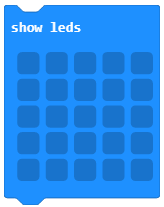
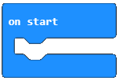
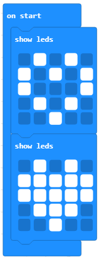
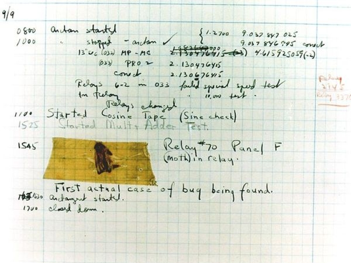
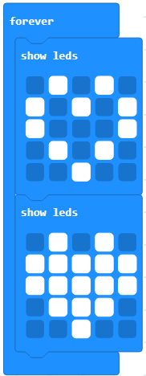
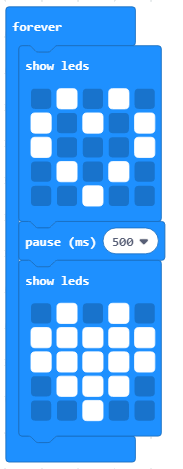
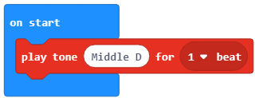
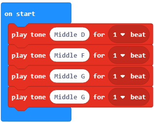
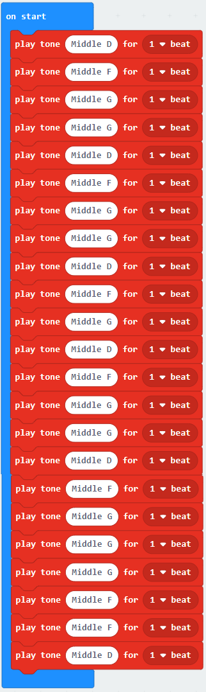
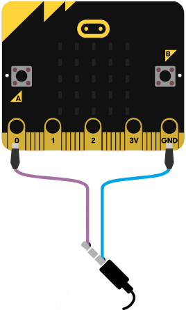

Mësimi 3 - Renditja e blloqeve
==============================

 ¬Në këtë mësim do të flasim për:  ­

•	blloqet në MakeCode
•	lidhjen e blloqeve në programe

Zgjidhja e një problemi, para së gjithash, varet nga përzgjedhja e hapave (veprimeve) që duhet të kryejë pajisja, në rastin tonë - pajisja Micro:bit.

Kjo seri hapash në një mjedis MakeCode quhet program ose skenar dhe përbëhet nga blloqe të ndryshme që janë të lidhura.

Në MakeCode, blloqet e komandave janë ndarë në kategori, siç mund të shihni në figurën më poshtë.

.. image:: ../_images/58.png
     :align: center
     :width: 400px

Emri i kategorisë (p.sh. Muzika) e drejton përdoruesin drejt llojeve të komandave (blloqeve) që mund të gjenden në atë kategori. Të gjithë blloqet e një kategorie kanë të njëjtën ngjyrë.

Në mësimin e mëparshëm, krijuam një program të thjeshtë për tregimin e mesazhit "Përshëndetje, botë!", ku përdorëm disa të dhëna mes thonjëzash që në gjuhët e programimit quhet *varg*. Vargu përbëhet nga një sërë karakteresh, të paraqitura mes thonjëzave. Vargjet kanë një përdorim të madh në programim. Pajisja Micro:bit është e programuar vetëm për kodet e shenjave ASCII nga 32 deri 126, ndër të cilat bëjnë pjesë shkronja, numra, shenja pikësimi dhe disa simbole. Të gjithë shenjat e tjera shfaqen si ? në ekranin e Micro:bit-it.

**Shënim:** ASCII është një grup karakteresh, d.m.th. kodesh, të cilat përdoren më shpesh në informatikë, por edhe në pajisjet e komunikimit dhe administrimit në punën me tekstin.

Le të krijojmë tani disa programe më të thjeshta nëpërmjet përdorimit të blloqeve nga kategoria |basic| dhe |music|. Në të gjitha këto programe, blloqet do t’i rendisim njëra pas tjetrës. Këto programe me të cilat blloqet ekzekutohen sipas renditjes në të cilën janë vendosur, quhen programe lineare. 

Le të marrim si shembull treguesin e zemrës që rreh (e cila simulon veprimin e zemrës) në ekranin e Micro:bit-it. 

Procedura e zgjidhjes së cilësdo detyre (problemi) nënkupton kalimin në të gjitha fazat si vijon:

      **Faza 1**: Mendoni për problemin dhe shkruani ose vizatoni algoritmin (hapat) për ta zgjidhur atë. 

      **Faza 2**: Sipas algoritmit, zgjidhni dhe rregulloni blloqet.

      **Faza 3**: Testoni dhe analizoni punën e programit. Korrigjoni gabimet (në qoftë se ka).

**Faza 1**

Të menduarit për problemin: Shfaqja e zemrës që rreh (simulimi i një zemre që rreh) në ekranin e micro:bit-it përfaqëson ndezjen e diodave individuale LED në formë zemre dhe fikjen e tyre. 

  **Hapi 1.** Shfaqni pamjen e zemrës, duke ndezur diodat në ekranin e Micro:bit-it. 

  **Hapi 2.** Heqja e imazhit të zemrës nga ekrani i Micro:bit-it.  

**Faza 2**

Hapni MakeCode për të zgjedhur dhe renditur blloqet në hapësirën për programim. Në faqen e internetit në https://makecode.microbit.org filloni një projekt të ri duke klikuar në butonin *New Project* |Dugme|.

Për të shfaqur imazhin e zemrës në ekranin e micro:bit-it, është e nevojshme që nga kategoria Basic, në hapësirën për programim, të tërheqim bllokun |showled| në bllok |onstart|.

.. image:: ../_images/64.png
     :align: center
     :width: 600px

Duke klikuar në fusha të caktuara në bllokun *show leds*, vizatojmë një zemër. 

.. image:: ../_images/65.png
     :align: center
     :width: 400px

Më pas, shtojmë edhe një bllok *show leds*, me të cilat do të vizatojmë një zemër të plotë që do të simulojë rrahjet e zemrës 

**Faza 3**

Testimi dhe analiza e programit.

.. |dugmence| image:: ../_images/54.png
             :width: 50px

.. |download| image:: ../_images/55.png
             :width: 200px

Për të testuar programin kemi dy mundësi: 

     -	ta nisim atë në simulator duke klikuar butonin |dugmence|.

     -	ta kalojmë atë në Micro:bit. Për ta kaluar programin në Micro:bit. duhet ta lidhim atë me kompjuterin me kabllo USB. Klikoni butonin  |download| për të shkarkuar skedarin .hex në kompjuterin tuaj. Duke tërhequr skedarin në Micro:bit, pajisja është gati për të punuar. 
     
Pas ndryshimit të programit ai do të funksionojë në Micro:bit. 

**E rëndësishme:** Micro:bit-i mund të ruajë vetëm një program. Micro:bit-i do të ekzekutojë një program të caktuar derisa të futet një program i ri. 

Në rast se nuk kemi pajisjen fizike, mund t’i testojmë programet edhe duke përdorur imituesin e integruar në ambientin e *MakeCode*.

Pas testimit dhe analizës, ndodh një gabim: imazhet e dy zemrave ndryshohen, më saktë, ekzekutohen blloqet për shfaqjen e imazheve. Në program u ekzekutuan të gjitha blloqet, ndaj nuk patëm simulim të rrahjeve të zemrës. Gabimet në programe që shkaktojnë rezultate të papritura ose ekzekutim të pasaktë të programit quhen bugs (çimkë). Procesi i gjetjes dhe korrigjimit të gabimeve quhet heqja e bug-eve.  (angl. debugging).

**Fakte Interesante** Më 9 shtator 1947, kompjuteri Mark 2 paraqiti probleme në funksionim. Pas investigimit të plotë u zbulua një flutur nate brenda kompjuterit. Flutura u hoq dhe u ngjit në ditarin e punës. Teksti lexonte: "Rasti i parë i bug-ut të gjetur".  Menjëherë pas kësaj u përhap lajmi se një ekip shkencëtarësh të Harvardit kishin “hequr bug-et” e kompjuterit. Kështu u krijua termi "heqja e bug-eve të programit kompjuterik". 

Ja se si hiqen bug-et e një programi:  

  1.	Parashikoni çfarë duhet të ndodhte në program. (Shpjegoni zgjidhjen tuaj. Ndërsa shpjegoni, ka një mundësi të madhe që do ta zbuloni se cili është problemi i zgjidhjes ekzistuese.). 

  2.	Gjeni gabimin. (Kur të përcaktoni se programi nuk po punon në mënyrën e pritur, analizoni programin (bllok për bllok). Në këtë mënyrë do të përcaktoni nëse gabimi ka ndodhur për shkak të një zgjidhjeje të menduar gabim ose për shkak të blloqeve të zgjedhura gabimisht në program.) 

  3.	Korrigjoni gabimet (Bëni korrigjimet dhe testoni përsëri programin. Në këtë mënyrë ju jepet një mundësi e shkëlqyer që të mësoni nga gabimet tuaja dhe kështu bëheni një programues më i mirë.).

**Gabimi 1.** Blloqet bëhen vetëm një herë.

.. |break| image:: ../_images/69.png
             :width: 50px

**Korrigjimi i bug-eve.** Do të ndryshojmë mënyrën e fillimit të programit, në vend të bllokut оn start, ku blloqet e renditura ekzekutohen vetëm një herë, do ta tërheqim bllokun |Forever| nga kategoria Basicnë hapësirën për programim. Me përdorimin e bllokut *forever* blloqet ekzekutohen (paraqiten) pandërprerë, derisa Micro:bit-i të shkyçet nga furnizimi ose derisa simulimi të ndërpritet pas klikimit në buton |break|.

Pamja e kodit të ndryshuar: 

**Mendoni:** Blloqe të tillë me pamje të dy zemrave, a simulojnë rrahjet e zemrës, a ndodh ndonjë ndryshim? Pse?

**Gabimi 2.** Imazhet ndryshojnë tepër shpejt.

**Korrigjimi i bug-eve.** Ndërmjet blloqeve show leds shtoni bllokun me të cilin përcaktohet intervali kohor për shembull gjysmë sekonde, ose 500 milisekonda. Blloku |pauza| që përcakton intervalin kohor me të cilin pritet ekzekutimi i bllokut tjetër për një numër të caktuar të milisekondave. Këtë bllok e tërheqim nga kategoria Basic. 

Pas korrigjimit të gabimeve, programi duhet të duket kështu:

Testoni përsëri programin. Tani duket sikur zemra rreh. Shkarkojeni atë në micro:bit. 

Tani le të shkruajmë një program me të cilin do të bëjë melodinë e këngës "Në fund të fshatit, shtëpia e verdhë".

**Faza 1**

**Të menduarit për problemin:** Melodia e këngës "Në fund të fshatit shtëpia e verdhë“ shkruhet:

•	d, f, g, g
•	d, f, g, g
•	d, f, g
•	d, f, g, g
•	d, f, g
•	g, g, f, f, d

**Faza 2**

Hapni MakeCode për të zgjedhur dhe renditur blloqet në hapësirën për programim.  

Në faqen e internetit në adresën https://makecode.microbit.org nisni një projekt të ri duke klikuar butonin *New Project* |Dugme|.

Për të luajtur notën ose melodinë përdorim kategorinë Music dhe blloqet që ndodhen në të. Me ndihmën e bllokut |pesma| riprodhojmë notën me gjatësi të caktuar. Nota e parë që tërheqim në bllokun on start do të jetë nota d, me gjatësi një bit, ose më saktë një milisekondë. 

Pamja e kodit:

Tani vetëm duhet të tërhiqni notat e tjera d, f, g, g, nën bllokun e dhënë. 

Pamja e kodit:

Në të njëjtën mënyrë sistemojmë blloqet për notat e tjera: 

  •	d, f, g, g
  •	d, f, g
  •	d, f, g, g
  •	d, f, g
  •	g, g, f, f, d

Pamja përfundimtare e kodit:

Kodin mund ta shikoni në linkun: https://makecode.microbit.org/_D1553sX4v5Cj

**Faza 3**

Testimi dhe analiza e programit.

Për të testuar programin kemi dy mundësi:

1.  duke e hapur atë në simulator duke klikuar butonin |dugmence|.
2.	duke e kaluar atë në Micro:bit. Për ta transferuar programin në Micro:bit, duhet ta lidhim atë me kompjuterin duke përdorur një kabllo USB. Duke klikuar butonin  |download| në kompjuterin tuaj. Duke tërhequr skedarin (file) në Micro:bit, pajisja është e gatshme për punë.

Pas hedhjes së programit ai do të hapet (funksionojë) në Micro:bit.

**E rëndësishme:** Në mënyrë që të mund të dëgjojmë muzikën në pajisje, është e nevojshme të lidhni kufjet me micro:bit-in, sepse micro:bit-i nuk ka altoparlantë të integruar. Mënyra e lidhjes së altoparlantëve dhe kufjeve me micro:bit-in tregohet në figurë. 

Pjesën e poshtme të lidhësit (më afër plastikës) e lidhim në kunjin GND, ndërsa majën e lidhësit me kunjin P0.

.. infonote::

 **Çfarë mësuam?**
    
    • Programi linear është programi me të cilin blloqet ekzekutohen sipas radhës në të cilën janë vendosur.

    • Procedura e zgjidhjes së çfarëdo detyre (problemi) nënkupton kalimin përmes secilës nga fazat e mëposhtme:

      - Faza 1: Mendoni për problemin dhe shkruani ose vizatoni një algoritëm (hapat) për zgjidhjen e tij.

      - Faza 2: Në përputhje me algoritmin, zgjidhni dhe rregulloni blloqet. 

      - Faza 3: Testoni dhe analizoni punën e programit. Korrigjoni gabimet (nëse ka).
        

    • Blloqet për lëshimin e toneve ose melodive ndodhen në kategorinë Muzikë.

Test
~~~~

.. mchoice:: L3P1
    :answer_a: Input
    :answer_b: Loop
    :answer_c: Music
    :answer_d: Basic
    :feedback_a: Përgjigja juaj nuk është e saktë. Provoni përsëri!
    :feedback_b: Përgjigja juaj nuk është e saktë. Provoni përsëri!
    :feedback_c: Ju lumtë! Përgjigja juaj është e saktë.
    :feedback_d: Përgjigja juaj nuk është e saktë. Provoni përsëri!
    :correct: c

    Në cilën kategori ndodhet blloku i notës G?

.. mchoice:: L3P2
    :answer_a: Do të luhet nota D, ndërsa pas pauzës do të luhet melodia dadadum një herë 
    :answer_b: do të luhet toni D
    :answer_c: do të luhet melodia dadaum një herë 
    :answer_d: nuk do të ndodhë asgjë
    :feedback_a: Ju lumtë! Përgjigja juaj është e saktë.
    :feedback_b: Përgjigja juaj nuk është e saktë. Provoni përsëri!
    :feedback_c: Përgjigja juaj nuk është e saktë. Provoni përsëri!
    :feedback_d: Përgjigja juaj nuk është e saktë. Provoni përsëri!
    :correct: a
    
    Studioni me kujdes kodin

    .. image:: ../_images/78.png
         :align: center
         :width: 500px

    Çfarë do të ndodhë pas ekzekutimit të kodit të dhënë:

.. mchoice:: L3P3
    :answer_a: Input
    :answer_b: Loop
    :answer_c: Music
    :answer_d: Basic
    :feedback_a: Përgjigja juaj nuk është e saktë. Provoni përsëri!
    :feedback_b: Përgjigja juaj nuk është e saktë. Provoni përsëri!
    :feedback_c: Përgjigja juaj nuk është e saktë. Provoni përsëri!
    :feedback_d: Ju lumtë! Përgjigja juaj është e saktë.
    :correct: d

    Në cilën kategori ndodhet blloku për shfaqjen e fytyrës së qeshur? 

.. mchoice:: L3P4
    :answer_a: Input
    :answer_b: Loop
    :answer_c: Music
    :answer_d: Basic
    :feedback_a: Përgjigja juaj nuk është e saktë. Provoni përsëri!
    :feedback_b: Përgjigja juaj nuk është e saktë. Provoni përsëri!
    :feedback_c: Përgjigja juaj nuk është e saktë. Provoni përsëri!
    :feedback_d: Ju lumtë! Përgjigja juaj është e saktë.
    :correct: d

    Në cilën kategori ndodhet blloku që përcakton intervalin kohor që pason ekzekutimin e një blloku? 