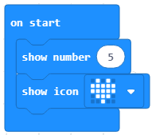

Mësimi 4 –Ushtrimorja
=====================

Ushtrimorja është vendi ku do të ushtroni të gjitha ato që keni mësuar deri më tani për mjedisin e punës MakeCode, funksionet bazë të blloqeve, krijimin e programeve të thjeshta fillestare të linjës me renditje të blloqeve të dëshiruara dhe marrjen dhe inicimin e kodit në Micro:bit.

1.	Krijoni programin me të cilin paraqisni emrin e heroit të preferuar të **librave vizatimorë**. Krahasoni zgjidhjen tuaj me tonën: https://makecode.microbit.org/_93q9fY6Lp6LW

2.	Me këtë kod do të paraqitet numri 5 dhe një ikonë e vogël e zemrës. Përmirësoni kodin që ikona e vogël e zemrës të paraqitet 5 sekonda pas paraqitjes së numrit 5. Krahasoni zgjidhjen tuaj me tonën: https://makecode.microbit.org/_HytWiR3ptK4T

3.  Shkruani programin i cili mundëson që në Micro:bit të shkruhet mesazhi “Përshëndetje!” dhe të paraqitet zemra. Ky aktivitet duhet të përsëritet gjatë gjithë kohës që Micro:bit-i është i kyçur. Krahasoni zgjidhjen tuaj me tonën: https://makecode.microbit.org/_296LeC1hXXp

4.	Krijoni programin për paraqitjen e emrit dhe moshës tuaj. Krahasoni zgjidhjen tuaj me tonën: https://makecode.microbit.org/_gW51xeXv90MC

5.	Krijoni programin me të cilin do të krijoni stemën e klasës tuaj.

6.	Krijoni programin me të cilin do të interpretoni këngën e preferuar.
