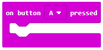
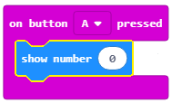
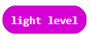
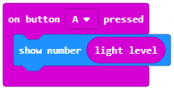
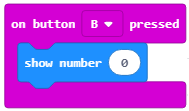
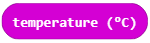
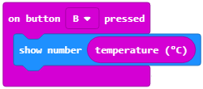

Mësimi 5 –Leximi i të dhënave nga sensori
=========================================

Në këtë mësim do të flasim për: ¬

•	blloqet për leximin e të dhënave nga sensori;
•	blloqet për ruajtjen e të dhënave nga sensori.

Pasi e kemi krijuar programin tonë të parë dhe e kemi nisur në Micro:bit, tani mund të krijojmë programin me të cilin do të përdorim njërin nga funksionet e Micro:bit-it si mjet hyrës. Më saktësisht, Micro:bit-i kryen veprime të caktuara në bazë të informatave që merr nga përdoruesit ose rrethi (mënyra e aktivizimit të programit).

Kategoria *Input* përmban komanda të cilat e aktivizojnë një program të caktuar në bazë të informatave që pajisja Micro:bit merr nga përdoruesi ose rrethi pas shtypjes së butonit A, B ose A+B, si dhe sensorët për ndriçim, temperaturë, akcelometër.

Niveli i ndriçimit në dhomë paraqitet me shtypjen e butonit А, ndërsa temperatura në celsius paraqitet me shtypjen e butonit B.

**Faza 1**

Të menduarit e problemit: Kur përdoruesi shtyp butonin A, programi paraqet nivelin e ndriçimit dhe temperaturën - kur shtyp butonin B.

     - **Hapi 1**: Shtypni butonin A
     - **Hapi 2**: Tregoni leximin momental të nivelit të ndriçimit në dhomë
     - **Hapi 3**: Shtypni butonin B
     - **Hapi 4**: Tregoni leximin momental të temperaturës në dhomë

**Faza 2**

Hapni MakeCode për t’i zgjedhur dhe renditur blloqet në hapësirën për programim. 

.. |dugme1| image:: ../_images/86.png
              :width: 100px

Në faqen e internetit në https://makecode.microbit.org filloni një projekt të ri duke klikuar në butonin *New Project* |dugme1|.

Për të mundësuar pranimin e informatës së përdoruesit nga Micro:bit-i, pasi përdoruesi të shtypë butonin A, nga kategoria *Input* zgjedhim dhe tërheqim në hapësirën programuese bllokun:|dugmeA|. Nga lista rënëse zgjedhim butonin A.

Për ta paraqitur nivelin e ndriçimit në dhomë fillimisht duhet ta tërheqim në bllokun e sipërm bllokun |shownumber| из категорије *Basic*, nga kategoria Basic, i cili përdoret për paraqitjen e vlerave numerike. Këtë bllok e shfrytëzojmë për paraqitje pasi niveli momental i ndriçimit në dhomë paraqitet nga 0 deri në 255, ku 0 paraqet errësirën në dhomë, ndërsa 255 paraqet ndriçim të fortë.

Si duket kodi:

Вредност нивоа осветљења у просторији "чува" се у блоку |light|. Ne e tërheqim këtë bllok në fushën e bllokut |shownumber| , të caktuar për vlerën numerike. Ju rikujtojmë edhe një herë, blloku |light| e ruan vlerën e lexuar nga sensori i ndriçimit i cili, në fakt, është një ekran (display) i Micro:bit-it (rrjeti i diodave LED në ekranin e Micro:bit-it paraqet sensorin e dritës).

Si duket kodi në fund:

Për të mundësuar që Micro:bit-i ta pranojë informatën nga përdoruesi, pasi përdoruesi të shtypë butonin A, nga kategoria Input zgjedhim dhe tërheqim në hapësirën e programimit bllokun:|dugmeA|.

Nga lista rënëse zgjedhim butonin B. Për të paraqitur temperaturat në dhomë fillimisht duhet ta tërheqim në bllokun e sipërm bllokun |shownumber| nga kategoria Basic, i cili përdoret për paraqitjen e vlerave numerike.

Si duket kodi:

Vlera e temperaturës momentale në dhomë “ruhet” në bllokun |temperatura|. Овај блок превлачимо у поље блока |shownumber| të caktuar për vlerën numerike.

Blloku |temperatura| e ruan vlerën e lexuar të sensorit për temperaturën e mikroprocesorit të Micro:bit-it, pasi nuk ekziston një sensor i veçantë për temperaturë i instaluar në Micro:bit. Vlera e lexuar nga sensori paraqitet në celsius.

Si duket pjesa e kryer e kodit:

Si duket programi në fund:

.. image:: ../_images/95.png
     :align: center
     :width: 500px

**Faza 3**

Testimi dhe analiza e programit.

.. |dugmence| image:: ../_images/96.png
             :width: 60px

.. |download| image:: ../_images/97.png
             :width: 200px

Për ta testuar programin kemi dy mundësi:

     1. ta nisim në simulator duke klikuar butonin |dugmence|.

     2. ta kalojmë në Micro:bit. Për ta kaluar programin në Micro:bit duhet ta lidhim me një kompjuter me kabllo USB. Pasi të klikoni butonin |download| преузмите .hex фајл на ваш рачунар. shkarkoni skedarin .hex në kompjuterin tuaj. Duke e tërhequr skedarin në Micro:bit, pajisja është gati për të punuar. 

Programin mund ta kontrolloni edhe në simulues:

.. image:: ../_images/98.png
     :align: center
     :width: 500px

.. infonote::

  **Çfarë mësuam?**
    •	blloqet për leximin dhe paraqitjen e gjendjes së sensorëve janë në kategorinë  |input|.
    •	blloku |light| ruan vlerën e lexuar nga sensori për ndriçim;
    •	niveli i ndriçimit paraqitet si vlerë numerike nga 0 deri në 255, ku 0 paraqet errësirën në dhomë, ndërsa 255 paraqet ndriçim të fortë;
    •	blloku |temperatura| ruan vlerën e lexuar nga sensori për temperaturën e procesorit të Micro:bit-it;
    •	temperatura matet me gradë celsius;
    •	blloku  |ubrzanje| ruan përshpejtimin kur Micro:bit-i lëviz në drejtimin majtas ose djathtas (x), kur Micro:bit-i lëviz para-prapa (y), kur Micro:bit-i lëviz lart e poshtë (z), ose ruan përshpejtimin në të tri dimensionet (drejtimet) (strength).

Test
~~~~

.. mchoice:: L5P1
    :answer_a: Kur përdoruesi shtyp butonin A+B, nëpër diodat LED në ekranin e Micro:bit-it lëviz teksti “Përshëndetje botë!” 
    :answer_b: Kur përdoruesi shkund Micro:bit-in, nëpër diodat LED në ekran lëviz teksti “Përshëndetje botë!”.
    :answer_c: Kur përdoruesi shtyp butonin A+B, nëpër diodat LED në ekran lëviz teksti “Përshëndetje botë!” 
    :answer_d: Nuk do të shfaqet asgjë.
    :feedback_a: Ju lumtë! Përgjigja juaj është e saktë.
    :feedback_b: Përgjigja juaj nuk është e saktë. Provoni përsëri!
    :feedback_c: Përgjigja juaj nuk është e saktë. Provoni përsëri!
    :feedback_d: Përgjigja juaj nuk është e saktë. Provoni përsëri!
    :correct: a

    Çfarë do të shfaqet në Micro:bit pas zbatimit të kodit të paraqitur poshtë:

    .. image:: ../_images/102.png
         :align: center
         :width: 300px

    Zgjidhni përgjigjen e saktë.

.. mchoice:: L5P2
    :answer_a: Kur përdoruesi shtyp butonin A+B, nëpër diodat LED në ekranin e Micro:bit-it lëviz teksti “Përshëndetje botë!”
    :answer_b: Kur përdoruesi shtyp butonin A+B, nëpër diodat LED në ekran lëviz teksti “Përshëndetje botë!” 
    :answer_c: . Kur përdoruesi shtyp butonin A+B, nëpër diodat LED në ekran lëviz teksti “Përshëndetje botë!” 
    :answer_d: Nuk do të shfaqet asgjë.
    :feedback_a: Përgjigja juaj nuk është e saktë. Provoni përsëri!
    :feedback_b: Përgjigja juaj nuk është e saktë. Provoni përsëri!
    :feedback_c: Përgjigja juaj nuk është e saktë. Provoni përsëri!
    :feedback_d: Ju lumtë! Përgjigja juaj është e saktë.
    :correct: d

    Çfarë do të shfaqet në Micro:bit pas zbatimit të kodit të paraqitur poshtë:

    .. image:: ../_images/103.png
         :align: center
         :width: 300px

    Zgjidhni përgjigjen e saktë.

.. mchoice:: L5P3
    :answer_a: Në ekran shfaqet butoni që është shtypur: A, B ose të dy në të njëjtën kohë.
    :answer_b: Në ekran shfaqen A dhe B me renditje të rastësishme.
    :answer_c: shfaqet shkronja А e pastaj shkronja B.
    :answer_d: Nuk do të shfaqet asgjë.
    :feedback_a: Ju lumtë! Përgjigja juaj është e saktë.
    :feedback_b: Përgjigja juaj nuk është e saktë. Provoni përsëri!
    :feedback_c: Përgjigja juaj nuk është e saktë. Provoni përsëri!
    :feedback_d: Përgjigja juaj nuk është e saktë. Provoni përsëri!
    :correct: a

    Шта ће бити приказано на микробиту када се изврши доњи код:

    .. image:: ../_images/104.png
         :align: center
         :width: 700px

    Zgjidhni përgjigjen e saktë.
