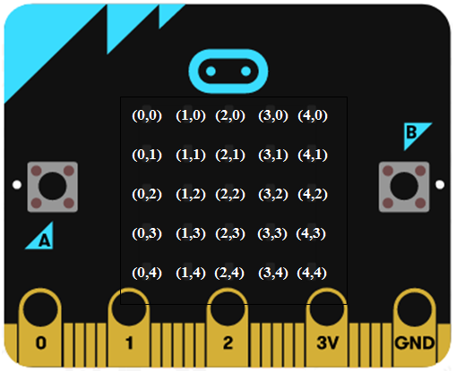
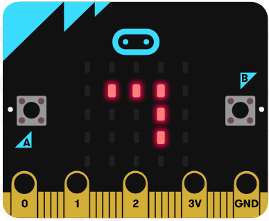
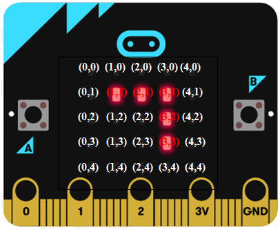
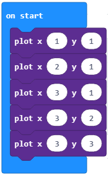
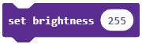
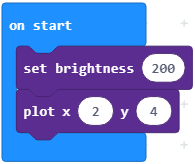

Mësimi 6 –Kontrolli i diodave LED të ekranit
============================================

Në këtë mësim do të flasim për:­

•	Sistemin koordinativ të Micro:bit-it;
•	Blloqet për kontrollin e diodave LED.

Ekrani i pajisjes Micro:bit ka 25 dioda LED të kuqe të vendosura në rrjetin 5x5 (5 dioda në horizontale dhe 5 dioda në vertikale).

Sistemi koordinativ kartezian përdoret në matematikë për të përkufizuar pozitën e pikave në hapësirë. Në sistemin koordinativ kartezian, në rrafsh përkufizohen dy boshte: x dhe y.

Koordinatat (x,y) i përdorim për të përcaktuar renditjen e diodave LED në rrjetin e diodave LED, ku koordinata x paraqet pozitën horizontale (vlerat e së cilës janë 0,1,2,3,4) dhe koordinata y paraqet pozitën vertikale (0, 1, 2, 3, 4).

Për të kuptuar koordinatat x,y vendoseni Micro:bit-in në pozitë horizontale. Këto janë koordinatat x,y për diodat LED në rrjetin 5x5:

Me ndihmën e këtij rrjeti 5x5 të diodave LED mund të bëni gjëra të ndryshme. Secila diodë LED mund të ndizet dhe të fiket veç e veç. Kështu mund të “vizatoni” figura siç janë zemra ose buzëqeshja. Siç mund ta shohim në këtë rrjet 5x5 të diodave LED , fillimi koordinues (0,0) gjendet në këndin e majtë lart të rrjetit të diodave LED. Vlera e koordinatave x lëviz nga 0 deri 4 dhe rritet nga e majta në të djathtë, ndërsa vlera e koordinatës y lëviz nga 0 deri 4 dhe rritet nga lart-poshtë.

Le të krijojmë një program në të cilin do të përdorim blloqet për ndezje/fikje të diodave LED, me anë të cilit do të formohet figura e poshtme:

**Faza 1**

**Të menduarit e problemit:** Për të formuar figurën e sipërme do të përdorim koordinatat (x,y) për të përcaktuar renditjen e diodave LED në rrjet. Koordinata x paraqet pozitën horizontale (me vlera 0,1,2,3,4) dhe koordinata y paraqet pozitën vertikale (0, 1, 2, 3, 4). Fillimisht, në fotografinë e sipërme përcaktojmë koordinatat e diodave LED të ndezura.

Në bazë të fotografisë mund të nxirrni përfundimin se janë të ndezura diodat LED në pozitën horizontale dhe ato janë në koordinatat (1,1), (2,1), (3,1), ndërsa diodat LED e ndezura në pozitën vertikale janë në koordinatat (3,1), (3,2) dhe (3,3).

**Faza 2**

Hapni MakeCode për t’i zgjedhur dhe renditur blloqet në hapësirën për programim. 

.. |dugme2| image:: ../_images/86.png
              :width: 80px

Në faqen e internetit në https://makecode.microbit.org filloni një projekt të ri duke klikuar në butonin *New Project* |dugme2|.

Për të ndezur diodën LED duhet të përdorim bllokun |plot| nga kategoria |led|.

Ja si duket kodi:

**Faza 3**

Testimi dhe analiza e programit.

.. |download| image:: ../_images/97.png
              :width: 200px

Për ta testuar programin kemi dy mundësi:

     1. ta nisim në simulator duke klikuar butonin |startuj|.

     2. ta kalojmë në Micro:bit. Për ta kaluar programin në Micro:bit duhet ta lidhim me kompjuter me kabllo USB. Pasi të klikoni butonin |download| shkarkoni skedarin .hex në kompjuterin tuaj. Duke e tërhequr skedarin në Micro:bit, pajisja është gati për të punuar.

Tani krijojmë programin me të cilin do të rregullojmë intensitetin e ndriçimit të diodave LED të ndezura. Duam të aktivizojmë diodën LED (2,4) intensiteti i ndriçimit i së cilës është vendosur në 200.

**Faza 1**

**Të menduarit e problemit:** Koordinata x paraqet pozitën horizontale (me vlera 0,1,2,3,4) dhe koordinata y paraqet pozitën vertikale (0, 1, 2, 3, 4). Vlera e nivelit të ndriçimit ndryshon nga 0 (zi) deri në 255 (dritë).

**Faza 2**

Hapni MakeCode për t’i zgjedhur dhe renditur blloqet në hapësirën për programim. Në faqen e internetit në https://makecode.microbit.org filloni një projekt të ri duke klikuar në butonin New Project |dugme2|.

Për të përcaktuar nivelin e ndriçimit për diodat LED përdorim bllokun |setb| nga kategoria |led|. А, да бисмо укључили лед диоду користимо блок |plot| из исте категорије.

Si duket kodi:

**Faza 3**

Testimi dhe analiza e programit.

Për ta testuar programin kemi dy mundësi:

    1.ta nisim në simulator duke klikuar butonin |startuj|.

    2. ta kalojmë në Micro:bit. Për ta kaluar programin në Micro:bit duhet ta lidhim me kompjuter me kabllo USB. Pasi të klikoni butonin |download| shkarkoni skedarin .hex në kompjuterin tuaj. Duke e tërhequr skedarin në Micro:bit, pajisja është gati për të punuar.

.. infonote::

  **Çfarë mësuam?**
    •	diodat LED janë të vendosura në rrjetin 5x5 në ekranin e Micro:bit-it.
    •	secila diodë LED ka pozitën e vet në ekranin e Micro:bit-it, të përcaktuar me koordinatën x (horizontale) dhe koordinatën y (vertikale). 
    •	si të ndezim dhe të fikim diodat LED dhe si të ndryshojmë gjendjen e diodave individuale nga gjendja ndezur në gjendjen fikur. 
    •	si të kontrollojmë gjendjen momentale të diodave LED, përkatësisht nëse janë të ndezura apo të fikura.
    •	si të përdorim bllokun me të cilin përcaktojmë nivelin e ndriçimit të diodave LED.

Test
~~~~

.. mchoice:: L6P1
    :answer_a: (1,1)
    :answer_b: (0,1)
    :answer_c: (0,0)
    :answer_d: (1,0)
    :feedback_a: Përgjigja juaj nuk është e saktë. Provoni përsëri!
    :feedback_b: Përgjigja juaj nuk është e saktë. Provoni përsëri!
    :feedback_c: Ju lumtë! Përgjigja juaj është e saktë.
    :feedback_d: Përgjigja juaj nuk është e saktë. Provoni përsëri!
    :correct: c

    Cila është pozita (koordinatat) e diodës LED lart majtas në ekranin e Micro:bit-it? Zgjidhni përgjigjen e saktë.

.. mchoice:: L6P2
    :answer_a: (3,3)
    :answer_b: (4,4)
    :answer_c: (0,0)
    :answer_d: (1,1)
    :feedback_a: Përgjigja juaj nuk është e saktë. Provoni përsëri!
    :feedback_b: Ju lumtë! Përgjigja juaj është e saktë.
    :feedback_c: Përgjigja juaj nuk është e saktë. Provoni përsëri!
    :feedback_d: Përgjigja juaj nuk është e saktë. Provoni përsëri!
    :correct: b

    Cila është pozita (koordinatat) e diodës LED poshtë djathtas në ekranin e Micro:bit-it? Zgjidhni përgjigjen e saktë.

.. mchoice:: L6P3
    :answer_a: (3,2)
    :answer_b: (2,3)
    :answer_c: (2,4)
    :answer_d: (4,2)
    :feedback_a: Përgjigja juaj nuk është e saktë. Provoni përsëri!
    :feedback_b: Ju lumtë! Përgjigja juaj është e saktë.
    :feedback_c: Përgjigja juaj nuk është e saktë. Provoni përsëri!
    :feedback_d: Përgjigja juaj nuk është e saktë. Provoni përsëri!
    :correct: b

    Cila është pozita (koordinatat) e diodës LED së ndezur në ekranin e Micro:bit-it të paraqitur në fotografinë poshtë?

    .. image:: ../_images/114.png
         :align: center
         :width: 300px

    Zgjidhni përgjigjen e saktë.

.. mchoice:: L6P4
    :answer_a: Diodat LED në (3,2) dhe (1,4) të ndezura.
    :answer_b: Diodat LED në (3,2) dhe (1,4) të fikura.
    :answer_c: Diodat LED në (3,2) dhe (4,1) të ndezura.
    :answer_d: Nuk do të paraqitet asgjë.
    :feedback_a: Ju lumtë! Përgjigja juaj është e saktë.
    :feedback_b: Përgjigja juaj nuk është e saktë. Provoni përsëri!
    :feedback_c: Përgjigja juaj nuk është e saktë. Provoni përsëri!
    :feedback_d: Përgjigja juaj nuk është e saktë. Provoni përsëri!
    :correct: a

    Studioni kodin me kujdes:

    .. image:: ../_images/115.png
         :align: center
         :width: 200px

    Çfarë do të paraqitet në ekranin e Micro:bit-it? Zgjidhni përgjigjen e saktë.
