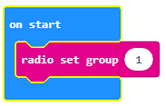
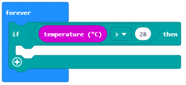
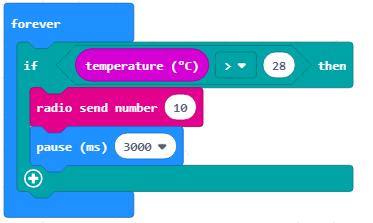
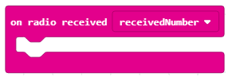
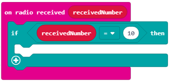
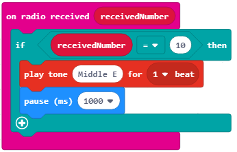
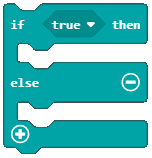
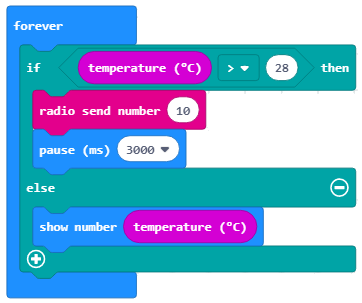
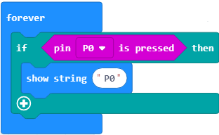
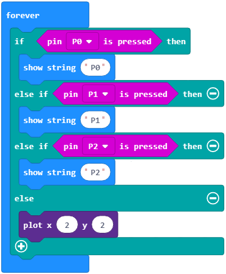

Mësimi 7 –Vendimmarrja
======================

Në këtë mësim do të flasim për:

•	vendimmarrjen në program;
•	blloqet e vendimmarrjes;
•	operatorët e krahasimit dhe operatorët logjikë.

Sa herë ballafaqoheni gjatë ditës me vendimet nga të cilat varet si do ta kaloni ditën, p.sh., nëse do të mësoni apo do të shkoni për të luajtur me shoqet dhe shokët tuaj?

Edhe programet në MakeCode mund të marrin vendime.

A mund ta përfytyroni si bëhet kjo?

Deri më tani, të gjitha programet që kemi shkruar ishin programe të linjës, më saktësisht, programe që ekzekutohen nga blloku i parë, bllok pas blloku, nga fillimi në fund.

Në dallim nga këto programe ku çdo hap, respektivisht secila komandë, zbatohet vetëm një herë, në programet e vendimmarrjes, ose më saktë në **programet e degëzuara (të kushtëzuara)**, disa urdhëresa do të zbatohen, ndërsa disa jo, varësisht nga plotësimi i kushteve (ose më saktë nga vendimi i marrë).

Për të siguruar të kuptuarit e plotë të programeve të kushtëzuara do të bëjmë një program me anë të të cilit, kur temperatura e dhomës është më e lartë se 28 gradë, Micro:bit-i do të dërgojë informatën te Micro:bit-i tjetër për të reaguar. Vetëm nëse temperatura kalon 28 gradë pajisja do ta dërgojë informatën te pajisja tjetër për të reaguar. Nëse përgjigja nuk është e saktë (nëse temperatura nuk kalon 28 gradë), blloqet që sigurojnë dërgimin e informatës nuk do të ekzekutohen. Pra, në bazë të vendimit nëse temperatura e “shënuar” është apo nuk është më e lartë se 28 gradë, disa blloqe do të ekzekutohen, e të tjerët jo.

**Faza 1**

**Të menduarit e problemit:** Me ndihmën e sensorëve për temperaturën në Micro:bit paraqitet temperatura ekzistuese e cila krahasohet me temperaturën e caktuar. Nëse është më e lartë nga vlera e caktuar, informata i dërgohet Micro:bit-it tjetër. Kur duam të vendosim komunikim (të përdorim radio-komunikimin) ndërmjet Micro:bit-ëve, të gjithë Micro:bit-ët e ndezur duhet t’i takojnë të njëjtit grup, pra të përdorin të njëjtin ID të grupit.

    **Hapi 1:** Krijohet hapësira për komunikim ndërmjet dy pajisjeve Micro:bit.

    **Hapi 2:** "Leximi” i vlerës nga sensori i temperaturës.

    **Hapi 3:** Krahasimi i vlerës së sensorit me vlerën e caktuar (më shumë se 28).

    **Hapi 4:** Nëse kushti është i saktë informata i dërgohet Micro:bit-it tjetër.

    **Hapi 5:** Kur Micro:bit-i tjetër pranon informatën, zbatohet blloku për riprodhimin e tingullit.

**Faza 2**

Hapeni MakeCode-in për t’i zgjedhur dhe renditur blloqet në hapësirën për programim.

.. |dugme3| image:: ../_images/86.png
              :width: 70px

Në faqen e internetit në https://makecode.microbit.org filloni një projekt të ri duke klikuar në butonin NewProject |dugme3|.

Me krijimin e ID-së së grupit, në fakt krijohet hapësira në të cilën do të komunikojnë dy Micro:bit-ët.

Për të krijuar ID-në e grupit nga kategoria Radio në bllok tërheqim on start radio bllokun **set group …** Në hapësirën ku shënohet numri ose teksti shënojmë numrin e dëshiruar për ID-në e grupit, i cili mund të jetë çfarëdo numri. Ne do ta lemë 1. Kështu kemi krijuar grupin me ID-në 1 në të cilin do të komunikojnë dy Micro:bit-ët.

**Shënim:** Kur përdorim radio-blloqet nga kategoria Radio në Simulator, do të paraqiten dy Micro:bit-ë.

Njëjtë si në orën e matematikës, MakeCode mundëson krahasimin e vlerave duke përdorur krahasimet që janë në kategorinë *Logic*.

.. image:: ../_images/118.png
     :align: center
     :width: 300px

Si rezultat të krahasimit marrim vlerën saktë ose pasaktë.

**Mendoni:**

.. fillintheblank:: fitb-ex1
   :casei:

   Provoni të plotësoni vendet e zbrazëta me vlerat përkatëse Saktë ose Pasaktë.

   |slika11|

   -   :Pasaktë|pasaktë|Pasakte|pasakte: Saktë.
       :x: E pasaktë

.. fillintheblank:: fitb-ex2
   :casei:

   Provoni të plotësoni vendet e zbrazëta me vlerat përkatëse Saktë ose Pasaktë.

   |slika21|

   -   :Saktë|saktë|Sakte|sakte: Saktë
       :x: E pasaktë

.. fillintheblank:: fitb-ex3
   :casei:

   Provoni të plotësoni vendet e zbrazëta me vlerat përkatëse Saktë ose Pasaktë.

   |slika31|

   -   :Saktë|saktë|Sakte|sakte: :Saktë|saktë|Sakte|sakte:.
       :x: E pasaktë

.. fillintheblank:: fitb-ex4
   :casei:

   Provoni të plotësoni vendet e zbrazëta me vlerat përkatëse Saktë ose Pasaktë.

   |slika41|

   -   :Pasaktë|pasaktë|Pasakte|pasakte: Saktë.
       :x: E pasaktë

Krahasimi kthen vlerën saktë në rastin kur vlera e “lexuar” nga sensori i temperaturës është më e lartë se 28. Në të gjitha rastet tjera e kthen pasaktë.

Në bllokun forever tërheqim bllokun if... then nga kategoria Logic. Në pjesën për kushtin duhet të tërheqim blloqet me të cilat përkufizohet kushti që temperatura të jetë më e lartë se 28.

Në rastin tonë, kushtin që temperatura të jetë më e lartë se 28 e përkufizojmë me bllokun |uslov|. Vlera e lexuar e sensorit të temperaturës ruhet në bllokun e temperaturës (në gradë Celsius).

Kushti nga supozimi i detyrës së paraqitur përkufizohet si vijon:

Kur plotësohet kushti, ose më saktë kur temperatura e lexuar është më e lartë se 28, Micro:bit-i dërgon vlerën duke shfrytëzuar radio-bllokun *send number...* nga kategoria *Logic*. Në fushën për numër shënojmë çfarëdo vlere (p.sh. 10). Që sensori të reagojë, ose më saktë të detektojë lëvizjet do ta konfigurojmë që për këtë të nevojitet një kohë e caktuar, p.sh., 3 sekonda (ose 3000 milisekonda). Për këtë do të përdorim bllokun pause (ms) nga kategoria *Basic*. Në fushë shënojmë 3000 ms që do të jetë koha kur sensori reagon ndaj ndryshimit që ndodh.

Në fund, duhet të programohet Micro:bit-i i dytë (i cili lëshon tingullin), pra pasi të pranojë informatën nga Micro:bit-i të lëshojë tingullin.

Duhet të krijojmë grupin e njëjtë me ID-në 1.

Micro:bit-i duhet të pranojë informatën (në rastin tonë numrin - 10) në bazë të së cilës do të “reagojë” duke dëgjuar tingullin. Për këtë, nga kategoria Radio do të tërheqim bllokun:

Aty do të tërheqim bllokun *if... then*. Tërheqim bllokun për krahasimin me të cilin kontrollohet nëse vlera e pranuar (blloku receivedNumber) është e barabartë me 10.

Nëse vlera e pranuar është e barabartë me 10, kushti është plotësuar dhe tingulli riprodhohet. Për riprodhimin e tingullit tërheqim bllokun nga kategoria Music. Përveç këtij blloku shtojmë edhe intervalin kohor prej një sekonde për të regjistruar të gjitha ndryshimet që ndodhin.

Коначан изглед кода:

**Faza 3**

Testimi dhe analiza e programit.

.. |startuj| image:: ../_images/96.png
              :width: 60px

.. |download| image:: ../_images/97.png
              :width: 200px

Për ta testuar programin i kemi dy mundësi:

     1. ta nisim në simulator duke klikuar butonin  |startuj|.

     2. ta kalojmë në Micro:bit. Për ta kaluar programin në Micro:bit duhet ta lidhim me kompjuter me kabllo USB. Pasi të klikoni butonin |download| shkarkoni skedarin .hex në kompjuterin tuaj. Duke e tërhequr skedarin në Micro:bit, pajisja është gati për të punuar.

**Mendo:**

Studiojeni shembullin e mësipërm edhe një herë. Çfarë do të ndodhë me programin nëse temperatura është më e ulët se 26?

Do të ishte mirë nëse programi jep informatën kthyese edhe kur temperatura është më e vogël se 28. Në këtë rast, nga kategoria Logic mund të zgjedhim bllokun:

ose në bllokun *if... then* përdorim shenjën  |plus| dhe fusim një degë të re (*else*), në të cilën do të zbatohen blloqet nëse temperatura është më e vogël ose është 28 gradë. Nëse temperatura është më e vogël ose e barabartë me 28 gradë do të tregohet temperatura e momentit. Për paraqitjen e temperaturës së momentit tërheqim bllokun shownumber... nga kategoria *Basic*. Në fushën për numrin tërheqim bllokun *temperature (C)*.

Testo programin përsëri.

Kushtet mund të jenë të ndërlikuara (krijohen me lidhjen e kushteve të thjeshta). Për lidhjen e kushteve të thjeshta përdorim operatorët logjikë: EDHE (ang. AND), OSE (ang. OR), JO (ang. NOT)).

Me këto kushte ballafaqoheni në jetën e përditshme kur merrni vendime, për shembull dhurata që do t’i blini për ditëlindje shoqes (varësisht nga shuma e parave që keni do t’i blini një libër edhe/ose biletë për koncert).

Në MakeCode operatorët logjikë janë të paraqitur si vijon:

.. list-table:: Operatorët logjikë
   :widths: 100 100
   :header-rows: 1

   * - Emri i operatorit
     - Përshkrimi i operatorit

   * - |and|
     - Lidh dy kushte dhe si rezultat kthen Saktë vetëm nëse **dy kushtet janë të sakta**.

   * - |or|
     - Lidh dy kushte dhe si rezultat kthen Saktë kur së paku **një kusht është i saktë**.

   * - |not|
     - Vendoset para njërit kusht dhe si rezultat kthen **Saktë** në rast se **nuk plotësohet kushti**.

.. fillintheblank:: fitb-ex5
   :casei:

   Provoni të plotësoni vendet e zbrazëta me vlera përkatëse Saktë ose Pasaktë.

   |slika1|

   -   :Saktë|saktë|Sakte|sakte: Saktë.
       :x: E pasaktë

.. fillintheblank:: fitb-ex6
   :casei:

   Provoni të plotësoni vendet e zbrazëta me vlera përkatëse Saktë ose Pasaktë.

   |slika2|

   -   :Pasaktë|pasaktë|Pasakte|pasakte: Saktë.
       :x: E pasaktë

.. fillintheblank:: fitb-ex7
   :casei:

   Provoni të plotësoni vendet e zbrazëta me vlera përkatëse Saktë ose Pasaktë.

   |slika3|

   -  :Pasaktë|pasaktë|Pasakte|pasakte: Saktë.
       :x: E pasaktë

Le të bëjmë edhe një detyrë të vogël me të cilën do të mundësojmë që në ekranin e Micro:bit-it të paraqitet numri i pinit të prekur.

**Faza 1**

**Të menduarit e problemit:** Gjendja e pinit (nëse është i shtypur ose jo) “ruhet” nga blloku |pin1| i cili gjendet në kategorinë Input. Vlera që kthehet nga ky bllok është Saktë, nëse pini është i shtypur, dhe Pasaktë, nëse pini nuk është i shtypur. Programi shfaq emrin e pinit të shtypur.

  **Hapi 1.** Nëse është i shtypur pini P0, shfaqet emri i tij në ekranin e Micro:bit-it.

  **Hapi 2.** Në të kundërt, verifikohet nëse është i shtypur pini P1. Nëse është i shtypur pini P1, shfaqet emri i tij në ekranin e Micro:bit-it.

  **Hapi 3.** Në të kundërt, verifikohet nëse është i shtypur pini P2. Nëse është i shtypur pini P2, të shfaqet emri i tij në ekranin e Micro:bit-it.

  **Hapi 4.** Në të kundërt, ndizen të gjitha diodat LED në ekranin e Micro:bit-it.

**Faza 2**

Hapeni MakeCode për t’i zgjedhur dhe renditur blloqet në hapësirën për programim.

 Në faqen e internetit në https://makecode.microbit.org filloni një projekt të ri duke klikuar në butonin NewProject  |dugme3|.

Në bllokun forever tërheqim bllokun if... then...else nga kategoria Logic. Për të shfaqur emrin e pinit të shtypur do të përdorim bllokun e rrënjosur if. Në pjesën për kushtin duhet të tërheqim bllokun me të cilin përcaktohet kushti nëse është i shtypur pini P0.

Nëse është i shtypur pini P0, shfaqet emri i tij në ekranin e Micro:bit-it.

Si duket kodi:

në të kundërt, verifikohet nëse është i shtypur pini P1.

Nëse është i shtypur pini P1, shfaqet emri i tij në ekranin e Micro:bit-it, në të kundërt, verifikohet nëse është i shtypur pini P2.

Nëse është i shtypur pini P2, shfaqet emri i tij në ekranin e Micro:bit-it, në të kundërt, ndizen të gjitha diodat LED në pozitën (2, 2).

Dukja e kodit në fund:

**Faza 3**

Testimi dhe analiza e programit.

Për të testuar programin kemi dy mundësi:

     1. ta nisim në simulator duke klikuar butonin |startuj|.

     2. ta kalojmë në Micro:bit. Për ta kaluar programin në Micro:bit duhet ta lidhim me kompjuter me kabllo USB. Pasi të klikoni butonin  |download| shkarkoni skedarin .hex në kompjuterin tuaj. Duke e tërhequr skedarin në Micro:bit, pajisja është gati për të punuar

.. infonote::

  **Çfarë mësuam?**
    •	në programet e vendimmarrjes, më saktë programet e degëzuar (kushtëzuar) disa komanda do të zbatohen, ndërsa disa të tjera jo, varësisht nga plotësimi i kushteve (respektivisht nga vendimi i marrë).
    •	për të krijuar kushte përdorim operatorët e krahasimit.
    •	për të krijuar një kusht të ndërlikuar përdorim operatorët logjik and, or dhe not.
    •	Për të pasur më shumë kushte përdorim strukturat e degëzuara (të kushtëzuara)

Testi
~~~~~

.. mchoice:: L7P1
    :answer_a: kur shtypet butoni A do të shfaqet zemra në ekranin e Micro:bit-it.
    :answer_b: nëse nuk është i shtypur butoni A do të shfaqet zemra në ekranin e Micro:bit-it.
    :answer_c: kur shtypet butoni A nuk do të shfaqet asgjë.
    :feedback_a: Ju lumtë! Përgjigja juaj është e saktë.
    :feedback_b: Përgjigja juaj nuk është e saktë. Provoni përsëri!
    :feedback_c: Përgjigja juaj nuk është e saktë. Provoni përsëri!
    :correct: a

     Studioni me kujdes bllokun e komandave.

     .. image:: ../_images/136.png
         :align: center
         :width: 400px

     Çfarë do të shfaqet pas ekzekutimit të bllokut të komandave më poshtë?

.. mchoice:: L7P2
    :multiple_answers:
    :correct: a,c
    :answer_a: kur shtypet butoni A do të shfaqet zemra në ekranin e Micro:bit-it.
    :answer_b: nëse nuk është i shtypur butoni A do të shfaqet zemra në ekranin e Micro:bit-it.
    :answer_c: nëse nuk është i shtypur butoni A do të shfaqet një kryq i vogël në ekranin e 
    :answer_d: kur shtypet butoni A nuk do të shfaqet asgjë.
    :feedback_a: Ju lumtë! Përgjigja juaj është e saktë.
    :feedback_b: Përgjigja juaj nuk është e saktë. Provoni përsëri!
    :feedback_c: Ju lumtë! Përgjigja juaj është e saktë.
    :feedback_d: Përgjigja juaj nuk është e saktë. Provoni përsëri!

     Studioni me kujdes bllokun e komandave.

     .. image:: ../_images/137.png
         :align: center
         :width: 400px

     Çfarë do të shfaqet pas ekzekutimit të bllokut të komandave më poshtë? Zgjidhni të gjitha përgjigjet e sakta.

.. mchoice:: L7P3
    :answer_a: Saktë
    :answer_b: E pasaktë
    :feedback_a: Përgjigja juaj nuk është e saktë. Provoni përsëri!
    :feedback_b: Ju lumtë! Përgjigja juaj është e saktë.
    :correct: b

    A “ruan” blloku  |isshake| nëse ka ndodh ndonjë lëvizje?
