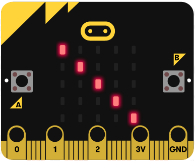

Mësimi 8 –Ushtrimorja
=====================

Ushtrimorja është vendi ku do të ushtroni gjithçka që keni mësuar deri më tani për blloqet për leximin e të dhënave nga sensorët, vendimmarrjen në program, operatorët e krahasimit dhe operatorët logjikë, mënyrën e prezantimit të pikselëve në ekranin e Micro:bit-it dhe të kuptuarit si përdoren koordinatat x dhe y për ndezjen ose fikjen e diodave LED.

1.	Shkruani programin me të cilin çdo 5 sekonda do të shfaqet sa lëviz Micro:bit-i lartë, krahasuar me sipërfaqen e rrafshët. Krahasoni zgjidhjen tuaj me zgjidhjen tonë: https://makecode.microbit.org/_JJHashX8u0CK

2.	2.	Kur shtypet pini P0 paraqitet fotografia e një fytyre të buzëqeshur, ndërsa kur shtypet pini P1 paraqitet një fytyrë e mërzitur. Krahasoni zgjidhjen tuaj me zgjidhjen tonë: https://makecode.microbit.org/_bz1fMhYCqY2P

3.	3.	Shkruani programin i cili do të ndezë diodat në diagonalen kryesore të ekranit të Micro:bit-it. Ndihmë e vogël: Diagonalja kryesore paraqet vijën e cila lidh këndin e ekranit lart majtas me këndin poshtë djathtas. Krahasoni zgjidhjen tuaj me zgjidhjen tonë: https://makecode.microbit.org/_AgE1wL6qLWCD

4.	4.	Shkruani programin i cili me pauza prej gjysmë sekonde do të ndezë një nga një diodat e ekranit në kolonën e parë, duke filluar nga dioda e sipërme e kolonës së parë. Krahasoni zgjidhjen e juaj me zgjidhjen tonë: https://makecode.microbit.org/_MoHJtbaWTat2

5.	5.	Shkruani programin i cili me pauza prej gjysmë sekonde do të ndezë një nga një diodat e ekranit të llojit të parë, duke filluar nga dioda e sipërme. Krahasoni zgjidhjen tuaj me zgjidhjen tonë: https://makecode.microbit.org/_FY8JUdidXeVs

6.	6.	Krijoni programin me të cilin paraqitet fotografia e katrorit në Micro:bit në bazë të temperaturës së matur (më e lartë se 20) dhe nivelit të ndriçimit (më i lartë se 130). Krahasoni zgjidhjen tuaj me zgjidhjen tonë: https://makecode.microbit.org/_d1XW1RMaXatv

7.	7.	Krijoni programin në bazë të të cilit do të ndezim të gjitha diodat LED në ekranin e Micro:bit-it nëse niveli i ndriçimit është më i vogël se 150. Krahasoni zgjidhjen tuaj me zgjidhjen tonë: https://makecode.microbit.org/_UvPbW8LuWgym

8.	8.	Krijoni programin i cili do të tregojë anët e horizontit të globit në Micro:bit. Ndihmë e vogël: Micro:bit-i mat drejtimin e busullës, nga 0 deri në 359 shkallë, me ndihmën e çipit të vet busull. Duhet ta dini se nën-intervalet e ndryshme të intervalit 0 deri në 359 paraqesin veriun, lindjen, jugun dhe perëndimin. Krahasoni zgjidhjen tuaj me zgjidhjen tonë: https://makecode.microbit.org/_Cekbz9e1ziF7
