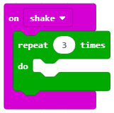
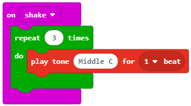
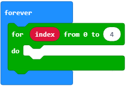
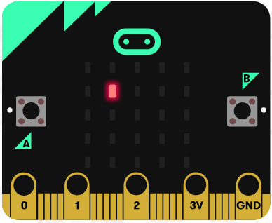
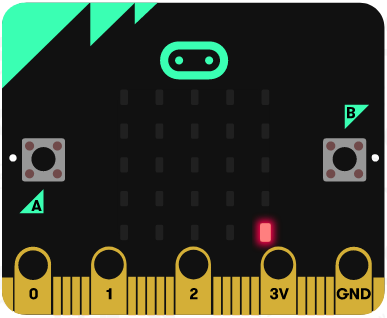

Mësimi 9 – Përsëritja
=====================

Në këtë mësim do të flasim për:

* përsëritjen e pjesëve të programit;
* përsëritjen e pjesëve të programit.

Në natyrë ekzistojnë procese të cilat përsëriten pareshtur ose kohë pas kohe (p.sh. batica dhe zbatica). Ashtu si në natyrë edhe në programim është e nevojshme që disa pjesë të programit të ekzekutohen disa herë për të zgjidhur detyrat përkatëse.

Programet me hapa të caktuar që përsëriten disa herë quhen **programe ciklike** ose **programet e përsëritjes**.

Për të mos shkruar të njëjtën komandë disa herë ekziston një strukturë programore e nyjës (cikël) e cila mundëson përsëritjen e një ose më shumë komandave. Për këto programe themi që përmbajnë përsëritje, të cilat i quajmë cikle.

Përsëritja e komandave është një dukuri e përhapur në programim.

MakeCode përmban tri lloje blloqesh në të cilat vendosen blloqet tjera, ekzekutimi i të cilëve duhet të përsëritet:

- ­	me numër të caktuar të përsëritjeve:

.. image:: ../_images/146.png
    :align: center
    :width: 200px

.. |dugme4| image:: ../_images/148.png
              :width: 30px

Ky bllok duhet të përdoret kur e dimë paraprakisht numrin e saktë të përsëritjeve (gjithashtu thuhet edhe iteracion). ¬
­

-  me numër të pakufizuar të përsëritjeve (pa ndërprerje, deri sa shfrytëzuesi të ndalë programin):

.. image:: ../_images/147.png
     :align: center
     :width: 200px

Ky është një nga blloqet i cili përdoret më së shpeshti. Ekzekutimi i tij ndalet duke klikuar butonin për ndaljen e punës së programit (|dugme4|).

-  derisa nuk plotësohet një kusht i caktuar:

.. image:: ../_images/149.png
      :align: center
      :width: 200px

Ky bllok duhet të përdoret kur nuk e dimë sa herë duhet të ekzekutohen blloqet brenda bllokut për përsëritje dhe për këtë arsye duam që ato të ekzekutohen derisa të plotësohet një kusht i caktuar.

Të krijojmë një program që aktivizon tingullin i cili përsëritet një numër të caktuar herësh, çdo herë kur shfrytëzuesi e lëviz Micro:bit-in.

**Faza 1**

**Të menduarit e problemit:** Kur shkundet ose bëhet çfarëdo lëvizjeje me pajisjen Micro:bit, tingulli do të përsëritet 3 herë.

    **Hapi 1:** Detektoni lëvizjen

    **Hapi 2:** Përsëriteni tingullin tri herë

**Faza 2**

.. |dugme5| image:: ../_images/86.png
              :width: 90px

Hapni MakeCode për të zgjedhur dhe renditur blloqet në hapësirën për programim.

Në faqen e internetit në https://makecode.microbit.org filloni një projekt të ri duke klikuar butonin New Project |dugme5|.

Për të mundësuar detektimin e çdo lëvizjeje, në hapësirën për programim tërheqim bllokun on shake nga kategoria Input:

.. image:: ../_images/150.png
      :align: center
      :width: 400px

Pasi duam që zëri të përsëritet tri herë, në bllokun *on shake* tërheqim bllokun *repeat* .. for nga kategoria *Loops*. Në hapësirën ku shënohet vlera (numri) shënojmë numrin 3.

Në bllokun e mësipërm do të tërheqim bllokun *play tone* … *for* … nga kategoria *Music* me të cilin riprodhohet tingulli.

.. image:: ../_images/152.png
      :align: center
      :width: 400px

Në bllokun e paraqitur nga lista rënëse zgjedhim tonin dhe gjatësinë.

.. image:: ../_images/153.png
      :align: center
      :width: 350px

Si duket kodi në fund:

**Faza 3**

Testimi dhe analiza e programit.

.. |startuj| image:: ../_images/96.png
              :width: 60px

.. |download| image:: ../_images/97.png
              :width: 200px

Për të testuar programin kemi dy mundësi:

      1. ta nisim në simulator duke klikuar butonin  |startuj|.

      2. ta kalojmë në Micro:bit. Për ta kaluar programin në Micro:bit duhet ta lidhim me një kompjuter me kabllo USB. Pasi të klikoni butonin |download| shkarkoni skedarin .hex në kompjuterin tuaj. Duke e tërhequr skedarin në Micro:bit, pajisja është gati për të punuar.

Pas testimit dhe analizës nëse ekzistojnë gabime, tingulli duhet të dëgjohet qartë tri herë

**Gabimi 1.** Nuk dëgjohet qartë përsëritja e tingullit.

**Korrigjimi i gabimeve.** Për të bërë që tingulli të dëgjohet qartë tri herë do të ndërfusim bllokun *pause* ... nga kategoria *Basic*. Do të caktojmë që intervali kohor pas së cilit përsëritet tingulli të jetë 1 sekondë (ose 1000 milisekonda).

Si duket programi në fund pas kodit të përmirësuar:

.. image:: ../_images/155.png
      :align: center
      :width: 400px

Testojmë përsëri programin. Tani punon si duhet.

Le të bëjmë edhe një program i cili aktivizon ndezjen e diodave LED në mes të ekranit të Micro:bit-it për sa kohë temperatura e dhomës është më e vogël se 30.

**Faza 1**

**Të menduarit e problemit:** Për sa kohë temperatura e matur është më e vogël se 30 ndizet dioda LED në mes të ekranit të Micro:bit-it.

**Faza 2**

Hapni MakeCode për të zgjedhur dhe renditur blloqet në hapësirën për programim. Në faqen e internetit në https://makecode.microbit.org filloni një projekt të ri duke klikuar butonin New Project |dugme5|.

Për të ekzekutuar komanda të caktuara (ndezjen e diodave LED) derisa të plotësohet një kusht (temperatura më e ulët se 30), në bllokun *forever* tërheqim bllokun *while...do* ...:

Si duket kodi:

.. image:: ../_images/156.png
      :align: center
      :width: 400px

.. |plot| image:: ../_images/108.png
              :width: 200px

Për të ndezur diodën LED në mes të ekranit, më saktë në pozitën (2, 2) nga menyja *Led* tërheqim bllokun:  |plot| .

Si duket programi në fund:

.. image:: ../_images/157.png
      :align: center
      :width: 400px

**Faza 3**

Testimi dhe analiza e programit.

Për të testuar programin kemi dy mundësi:

      1. ta nisim në simulator duke klikuar butonin |startuj|.

      2. ta kalojmë në Micro:bit. Për ta kaluar programin në Micro:bit duhet ta lidhim me një kompjuter me kabllo USB. Pasi të klikoni butonin |download| shkarkoni skedarin .hex në kompjuterin tuaj. Duke e tërhequr skedarin në Micro:bit, pajisja është gati për të punuar.

**Mendoni:**

Studioni me kujdes blloqet e mësipërm. Çfarë ndodh kur temperatura rritet dhe bëhet më e lartë se 30? Pse?

Plotësoni kodin e mësipërm që dioda LED të ndizet vetëm kur temperatura është më e ulët se 30.

Zgjidhja e mundshme: https://makecode.microbit.org/_92LeH58vY4je

Ju kujtohet detyra nga Mësimi 3 – Futja e të dhënave - me të cilën kemi ndezur diodat LED në diagonalen kryesore të ekranit të Micro:bit-it.

.. image:: ../_images/158.png
      :align: center
      :width: 300px

**Faza 1**

**Të menduarit e problemit:** Diagonalja kryesore paraqet vijën e cila lidh pjesën e sipërme majtas të ekranit me atë poshtë djathtas. Këtë detyrë e kemi zgjidhur me një program të vijës duke renditur blloqet |plot| nga kategoria |led| një pas tjetrit.

Si duket kodi:

.. image:: ../_images/159.png
      :align: center
      :width: 200px

**Faza 2**

Hapni MakeCode për të zgjedhur dhe renditur blloqet në hapësirën për programim. Në faqen e internetit në https://makecode.microbit.org filloni një projekt të ri duke klikuar në butonin New Project  |dugme5|.

.. |blok| image:: ../_images/160.png
          :width: 200px

.. |b1| image:: ../_images/161.png
          :width: 60px

.. |p1| image:: ../_images/162.png
          :width: 100px

Megjithatë, kjo detyrë zgjidhet në një mënyrë më elegante me përdorimin e bllokut  |blok| nga kategoria *Loops*. Ky bllok përdoret për përsëritjen e pjesës së programit aq herë sa dëshironi (limiti shënohet te blloku  |b1|) me përdorimin e variablës |p1|. (Për variablat do të flasim më me hollësi në mësimin e ardhshëm, e mund t’i konsideroni si “kujdestarë” të vlerave të ndryshme, numerike apo tekstuale).
Në bllokun *forever* tërheqim bllokun *for ... from to* … Kufiri nga i cili nis numërimi është 0, ndërsa aty ku përfundon është 4 sepse, në këtë rast, pozita e diodave LED në ekranin e Micro:bit-it përkufizohet sipas horizontales dhe vertikales nga 0 deri 4.

Si duket kodi:

Në bllokun lart tërheqim |plot| nga kategoria |led|. Координату x дефинишемо превлачењем |p1|, координату y дефинишемо превлачењем |p1|.

Hap pas hapi ekzekutohet blloku *for ... from to* …

.. |s1| image:: ../_images/164.png
            :width: 150px

.. |plot11| image:: ../_images/108.png
            :width: 150px

.. |plot2| image:: ../_images/167.png
            :width: 150px

.. |s3| image:: ../_images/168.png
            :width: 150px

.. |s4| image:: ../_images/170.png
            :width: 150px

.. |plot4| image:: ../_images/171.png
            :width: 150px

.. list-table:: Tabela e përbërësve të Micro:bit-it
   :widths: 100 100 100
   :header-rows: 1

   * - Variabla  |p1|
     - E bllokut |plot|
     - Ekzekutimi i kodit në ekranin e Micro:bit-it

   * - index = 0
     - |plot11|
     - |s1|

   * - index = 1
     - |plot1|
     - |s2|

   * - index = 2
     - |plot2|
     - |s3|

   * - index = 3
     - |plot3|
     - |s4|

   * - index = 4
     - |plot4|
     - |s5|

Blloku do të përsëritet pesë herë.

Si duket kodi në fund:

.. image:: ../_images/173.png
      :align: center
      :width: 300px

**Faza 3**

Testimi dhe analiza e programit.

Për të testuar programin kemi dy mundësi:

1	ta nisim në simulator duke klikuar butonin  |startuj|.

2	ta kalojmë në Micro:bit. Për ta kaluar programin në Micro:bit duhet ta lidhim me kompjuter me kabllo USB. Pasi të klikoni butonin |download| shkarkoni skedarin .hex në kompjuterin tuaj. Duke e tërhequr skedarin në Micro:bit, pajisja është gati për të punuar.

.. image:: ../_images/174.png
      :align: center
      :width: 300px

.. infonote::

  **Çfarë mësuam?**

      • programet tek të cilët blloqet e caktuara përsëriten disa herë quhen programe ciklike ose programe të përsëritjes.
      • ekzistojnë blloqe të ndryshme për përsëritje (numerikë, të pafund dhe të kushtëzuar) dhe kur përdoren ata
      • blloqet numerike ekzekutohen kur dihet saktë sa herë do të përsëritet një veprim.
      • përsëritjet e kushtëzuara përdoren kur nuk dihet sa herë duhet të ekzekutohet një veprim. Ky bllok ekzekutohet derisa të plotësohet një kusht i veçantë.
      • cilat vlera merr index-i në bllokun e përsëritjes, më saktë, cila është vlera fillestare dhe cila është përfundimtare.

Testi
~~~~~

.. mchoice:: L9P1
    :answer_a: Në ekran do të shfaqet një zemër.
    :answer_b: Në ekran do të shfaqet një zemër për sa kohë mbahet shtypur butoni А.
    :answer_c: Në ekran do të shfaqet një zemër derisa temperatura është të jetë e lartë se 30.
    :answer_d: Në ekran nuk do të shfaqet asgjë.
    :feedback_a: Përgjigja juaj nuk është e saktë. Provoni përsëri!
    :feedback_b: Ju lumtë! Përgjigja juaj është e saktë.
    :feedback_c: Përgjigja juaj nuk është e saktë. Provoni përsëri!
    :feedback_d: Përgjigja juaj nuk është e saktë. Provoni përsëri!
    :correct: b

    Studioni kodin me kujdes:

    .. image:: ../_images/175.png
          :align: center
          :width: 300px

    Çfarë do të shfaqet në Micro:bit?

.. mchoice:: L9P2
    :answer_a: Në ekran do të shfaqet vlera e matur e temperaturës momentale dhe një zemër.
    :answer_c: Në ekran do të shfaqet një zemër tri herë.
    :answer_d: Në ekran do të shfaqet tri herë vlera e matur e temperaturës momentale dhe një zemër.
    :feedback_a: Përgjigja juaj nuk është e saktë. Provoni përsëri!
    :feedback_b: Përgjigja juaj nuk është e saktë. Provoni përsëri!
    :feedback_c: Ju lumtë! Përgjigja juaj është e saktë.
    :feedback_d: Përgjigja juaj nuk është e saktë. Provoni përsëri!
    :correct: c

    Studioni kodin me kujdes:

    .. image:: ../_images/176.png
          :align: center
          :width: 300px

    Çfarë do të shfaqet në Micro:bit?

.. mchoice:: L9P3
    :answer_a: Në ekran do të renditen numrat nga 0 deri 4.
    :answer_b: Në ekran do të shfaqet numri 5.
    :answer_c: Në ekran do të shfaqet pesë herë numri 4.
    :answer_d: Në ekran nuk do të shfaqet asgjë.
    :feedback_a: Ju lumtë! Përgjigja juaj është e saktë.
    :feedback_b: Përgjigja juaj nuk është e saktë. Provoni përsëri!
    :feedback_c: Përgjigja juaj nuk është e saktë. Provoni përsëri!
    :feedback_d: Përgjigja juaj nuk është e saktë. Provoni përsëri!
    :correct: a

    Studioni kodin me kujdes:

    .. image:: ../_images/177.png
          :align: center
          :width: 300px

    Çfarë do të shfaqet në Micro:bit?

.. mchoice:: L9P4
      :answer_a: Në ekran do të paraqitet një zemër katër herë (simulim i rrahjes së zemrës).
      :answer_b: Në ekran do të shfaqet një zemër.
      :answer_c: Në ekran nuk do të shfaqet asgjë.
      :feedback_a: Përgjigja juaj nuk është e saktë. Provoni përsëri!
      :feedback_b: Përgjigja juaj nuk është e saktë. Provoni përsëri!
      :feedback_c: Ju lumtë! Përgjigja juaj është e saktë.
      :correct: c

      Studioni kodin me kujdes:

      .. image:: ../_images/178.png
            :align: center
            :width: 300px

      Çfarë do të shfaqet në Micro:bit?
