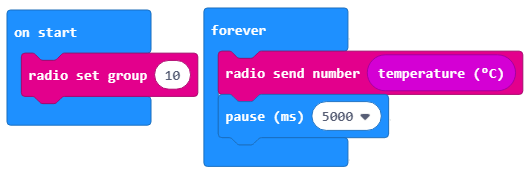
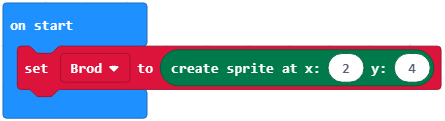
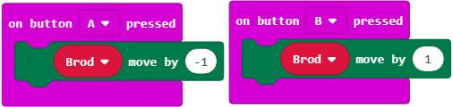
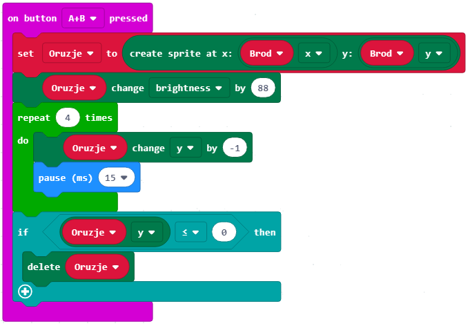
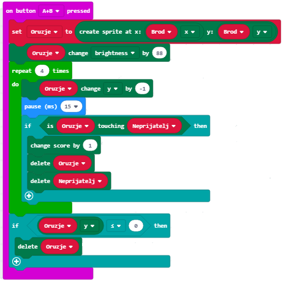
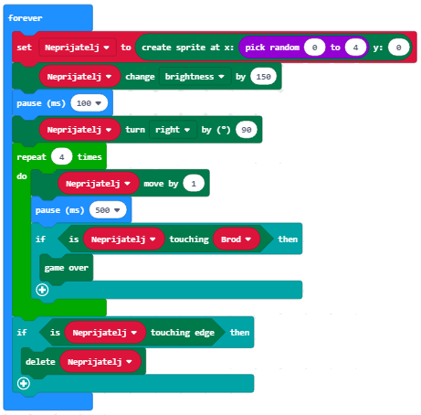
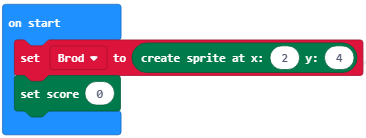
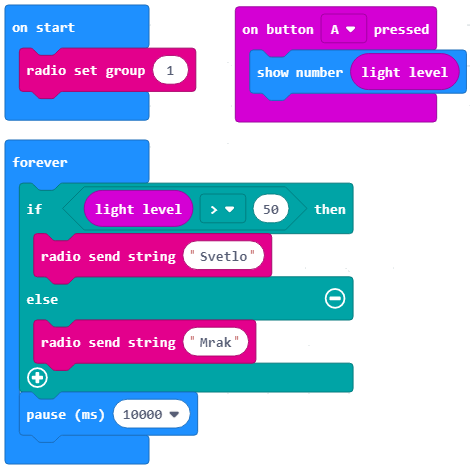
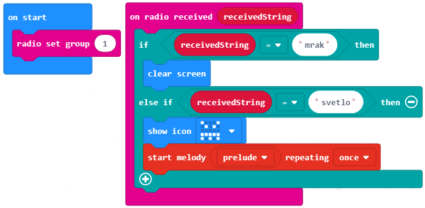

Истраживачки пројекат
=====================

За реализацију пројекта планирана су три часа.

Твоја програмерска знања већ су на довољно високом нивоу да можеш да их употребиш у новом истраживачком пројекту. 
Уместо да правиш презентацију, програмираћеш у Блоксу. И овога пута, помоћи ће ти наставници и родитељи, као и другови и другарице из одељења.

Предлажемо ти да одабереш једну од тема којом се твој тим није бавио.

•	Алармни систем;

•	Игра школица;

•	Квиз;

•	Музички инструмент;

•	и сл.

Први час
--------

Већ знаш да пројекат није активност која се дешава случајно, већ има своју специфичну структуру. Подсећамо те на њене најважније елементе.

**Одабир теме и сарадника**

а. Размисли о понуђеним темама и одабери једну којом ћеш се бавити наредна три школска часа.

б. Пронађи сараднике – другове и другарице који се интересују за исту тему. Формирајте тим.

в. Дефинишите истраживачки задатак.

Други час
-----------

**Пројектне активности**

а. У оквиру тима, дефинишите пројектне активности.

б. Одредите реализаторе за сваку од активности.

в. Одредите временски оквир за реализацију активности.

г. Представите резултате активности (дигиталне слике, текстове и звучне записе) свим члановима групе.

**Предлог пројеката**

Даћемо ти примере неких пројеката које можеш да урадиш. Пројекте ћемо урадити делимично, али у довољном обиму да стекнеш увид у његову израду. Ако желиш, можеш да наставиш да га дорађујеш, и креираш потпуно нове. Твоја машта нема граница.

**Пројекат 1**

Покушај да измериш спољашњу температуру на даљину. Коришћењем овог принципа можеш да направиш и метеролошку станицу.

Шта је потребно?

­	- два микробита,

­	- паковање батерија (4 батерије),

­	- кеса, или пластична кутија (водоотпорни материјал).

У овом пројекту користимо два различита програма, од којих је један за микробит на отвореном, и преноси коришћењем радио сигнала, у оквиру једне радио групу 10.
Микробит који се налази напољу користи свој сензор температуре да утврдимо колико је топло, а колико је хладно. Овај микробит користи радио сигнал, како би очитану температуру послао микробиту који се налази у унутрашњости.
Када микробит који је у соби (или затвореној просторији) прими очитану вредност температуре спољашњег микробита, он треба да је прикаже на екрану микробита. Та очитана температура се чува у променљивој која је дефинисана по именом spoljaTemperatura.
Да бисмо упоредили собну и спољашњу температуру, постављамо да када се притисне тастер А на микробиту који је у соби приказује собну очитану температуру, док кад је притиснут тастер B, на микробиту који је у соби приказује се температура која је очитана са спољњег микробита.

Кôд микробита који се налази у соби: https://makecode.microbit.org/_gw1PsATeq7YV

.. image:: ../_images/271.png
     :align: center
     :width: 500px

Кôд микробита који се налази споља: https://makecode.microbit.org/_3VYFL4EaD9Ud

**Пројекат 2.**

Шта је потребно?

­	- један микробит;

­	- батерија.

Покушај да направиш игрицу која ће да симулира игицу потапање бродова - брод који уништава непријатељске бродове.

Спрајт је један пискел који може да се креће. Има координате x и y којим се одређује смер кретања пиксела по екрану микробита.

Почетна позиција спрајта (Брода).

Користимо тастере А и Б за кретање писела лево и десно.

Осим тога користићемо комбинацију тастера А+Б да употребимо своје оружје за пуцање.

Најпре креирамо променљиву Оружје. Креирамо оружје које нам служи за уништавање непријатељских бродова.

Непријатељски бродови долазе са горње стране микробита. Креирамо променљиву непријатељ. Чија је почетна вредност дефинисана тако да x координата узима насумице вредности од 0 до 4, а y координата има вредност 0, јер непријатељски бродови нападају са врха.

Убацујемо блок којим проверавамо да ли је дошло да додира са непријатељем.

Уједно додајемо и део кода којим се проверава да ли је наш брод својим оружјем уништио непријатеља.

Да бисмо омогућили да наша игра приказује скор потребно је додати променљиву која чува резултат.

Линк ка пројекту: https://makecode.microbit.org/_JzTVWjUc6UYJ

**Пројекат 3**

Потребно је да креирамо два програма на два микробита. Један микробит, на пример ставите у кутију у којој се налази нека вредна ствар, а други поставите на неком видном месту, који може бити повезан са слушалицама или звучником.
Када се кутија помери, на микробиту акцелерометар детектује покрет. На екрану микробита се показује љуто лице. 
Такође, шаље поруку "лопов!". Када прими радио поруку други микробит се оглашава мелодијом, налик сирене, и на тај начин упозорава да је неко померио предмет, или отворио кутију.

Шта је потребно?

­	- 2 микробита;

­	- батерија;

­	- слушалице или звучник.

Линк ка задатку: https://makecode.microbit.org/_UjLKtoMme4Ao

**Пројекат 4**

У овом пројекту користимо особину микробита за мерењем колики је ниво осветљења у просторији.
Програм сваких 10 секунди шаље радио поруку да ли је мрак или светлост. Ако је осветљење веће од 50, слаће поруку да има светла, и ако је мање од 50 да је мрак.
Креира се иста радио група за комуникацију.
Када се притисне тастер А на екрану микробит се приказује ниво осветљења.
Микробит реагује сваки 10 секунди када прими поруку од микробита који  очитава вредност сензора светла. У зависности од поруке коју прими, микробит ће се огласити, чуће се нека мелодија (ако је стигла порука светло, тачније ако је сензор прочитао вредност већу од 50), или се неће приказати ништа на екрану миктобита, ако је примљена порука мрак.

Шта је потребно?

­	- 2 микробита;

­	- батерија;

­	- слушалице или звучник.

Први микробит:

Линк ка коду: https://makecode.microbit.org/_fDzEwgTJXK48

Други микробит:

Линк ка коду: https://makecode.microbit.org/_Wod2gYJmqiqj

Ово су само неки предлози пројеката. Можеш их испробати све, али можеш заједно са својим друговима и другарицама осмислите друге различите пројекте.

Трећи час
----------

**Представљање резултата пројекта публици**

а. Направите програм у Блоксу поштујући све четири фазе израде програма.

•	Размислите о проблему, осмисли решење.

•	У складу са идејом решења, одаберите и сложите блокове.

•	Тестирајте и анализирајте рад програма. Исправите грешке (ако их има).

б. Снимите видео-запис пројекта Блоксу.

в. Осмислите сценарио за усмену презентацију.

г. Поделите улоге.

**Лични осврт на пројектне активности**

а. Размисли о проблемима који су се јављали и начинима на које су превазиђени.

б. Утврди које одлуке су биле добре, а које погрешне.

в. Да ли је тим функционисао добро или је било одређених проблема?

**Процена успешности пројекта**

а. На основу повратних информација публике (другова, другарица и наставника) и личних закључака, у оквиру тима процените успешност пројекта.

б. Формирајте листу закључака чијом применом би пројекат био ефикасније реализован.

Сада си ти на реду. :)

Одабери пројектну тему, формирај тим и започни програмерску пројектну авантуру. Срећно!
