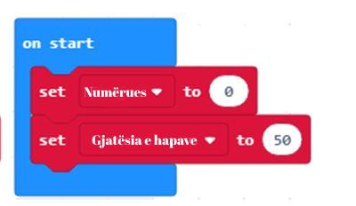
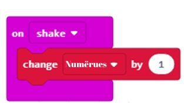
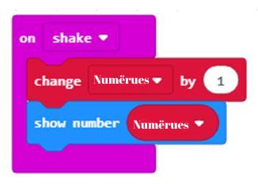
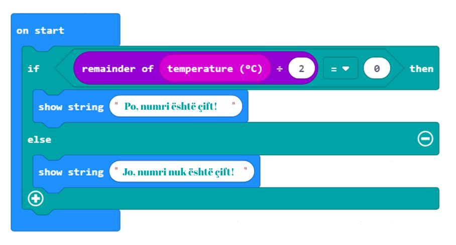

Час 10 - Аритметичке операције и променљиве
===========================================

На овом часу говорићемо о: ­

* ­чување међурезултата;

* креирање променљивих;

* аритметичке операције и рачунања у МејкКоду;

*	целобројном дељењу и додатним математичким операцијама.

Приликом прављења педометра (уређаја који броји (рачуна) кораке препознајући покрете које је корисник направио) важно да имамо информацију о броју корака које је корисник направио, како бисмо знали колико је растојање пређено.

Било би добро да програм, у сваком тренутку, приказује број остварених корака. А, да кликом на дугме А, приказује колико је пређено километара.

**Фаза 1**

**Разумевање проблема:** 

Свако кретање корисника мора да буде забележено. За одређивање пређеног растојања у километрима дефинишемо дужину корака, нпр. 50 cm, коју претварамо у km (у нашем примеру 50cm=0.0005km) и множимо са бројем корака.
    **Корак 1:** Број корака на почетку је нула.

    **Корак 2:** Сваки пут када се направи покрет (кретање) вредност бројача корака се увећава за један.

    **Корак 3:** Приказује се број тренутно остварених корака.

    **Корак 4:** Када корисник кликне на дугме А: приказује се број пређених километара на основу броја корака (множи се дужина корака са бројем корака).

.. |dugme6| image:: ../_images/86.png
              :width: 90px

**Фаза 2**

Покрени МејкКод за одабир и слагање блокова у простор за програмирање.

На интернет страници на адреси https://makecode.microbit.org покрени нов пројекат кликом на дугме New Project |dugme6|.

Да би захтев о пређеној километражи на основу броја корака могао да буде испуњен, морамо да пронађемо начин да чувамо и по потреби мењамо вредност бројача корака. Решење за овај проблем јесте увођење **променљиве**. Променљиву можеш да схватиш као простор у меморији рачунара, сличан кутији, у коме се, за време извршавања програма, чувају неке међувредности. Променљиве имају своја имена. Када у програму желиш да користиш вредност променљиве, довољно је да наведеш њено име.

Променљиву креирамо тако што, у категорији *Variables* (1), кликнемо на дугме *Make a variable* (Направи променљиву) (2) и у поље уносимо име променљиве (3), у нашем случају **Brojac**. Кликом на дугме ОК (4), креирана је променљива (5).

.. image:: ../_images/179.png
     :align: center
     :width: 700px

Постављамо да је почетна вредност променљиве **Brojac** постављена на нулу. То је могуће урадити превлачењем блока set Brojac to 0 из категорије *Variables* у блок *on start*.

.. image:: ../_images/180.png
     :align: center
     :width: 300px

Поред променљиве Brojac корака дефинисаћемо променљиву **DuzinaKoraka**, чија је вредност постављена на 50cm.

Промена броја корака дешава се сваки пут када корисник направи неки покрет. Другим речима, вредност променљивом **Brojac** ће се увећавати за један сваки пут када се направи покрет.

То ћемо постићи коришћењем блока *on shake*, у оквиру кога упацујемо блок *change DuzinaKoraka by 1*.

Потребно је сваки промену броја корака приказати на екрану микробита, коришћењем блока *show number..* у пољу за број превлачимо променљиву **Brojac** из категорије *Variables*.

**Фаза 3**

Тестирање и анализа програма.

.. |startuj| image:: ../_images/96.png
              :width: 60px

.. |download| image:: ../_images/97.png
              :width: 200px

Да бисмо тестирали програм имамо две могућности:

     1. да га покренемо у симулатору кликом на дугме |startuj|.

     2. да га пребацимо на микробит. Да бисмо програм пребацили на микробит треба да га прикачимо на рачунар коришћењем USB кабла. Кликом на дугме |download| преузмите .hex фајл на ваш рачунар. Превлачењем фајла на микробит, уређај је спреман за рад.

.. image:: ../_images/184.png
     :align: center
     :width: 500px

Програм за сада ради како треба, када се оствари покрет бројач корака се увећава за један.
Сада је потребно да кликом на дугме А добијемо приказ укупне километраже на основу броја корака.

Километражу (дужина које је пређена) рачунамо тако што број корака помножимо са дефинисаном дужином корака. У нашем случају дужина корака је 50 cm. Да бисмо добили резултат у километрима потребно га је поделити са 100000 (1km=100000cm)

Да бисмо све то постигли користимо рачунске операције попут сабирања, одузимања, множења и дељења. То су операције које непрестано користимо у свакодневном животу. Блокови који омогућавају рачунање називају се **аритметички оператори**. Рачунске операције попут сабирања, одузимања, множења и дељења немају значај само на часовима математике.

Како је програмирање покушај да олакшамо свакодневни живот, у МејкKоду је могуће извршити одређени број рачунских, кажемо и аритметичких, операција.

Блокови који омогућавају рачунање налазе се у категорији *Math*.

.. image:: ../_images/185.png
     :align: center
     :width: 400px

Резултат њиховог извршавања је **број**.

Ако желиш да провериш како аритметички оператори за сабирање, одузимање, множење и дељење раде, довољно је да у празна поља блока унесеш бројеве, два пута кликнеш на њега и видиш резултат извршавања.

.. image:: ../_images/186.png
     :align: center
     :width: 600px

Примећујеш да се рачунска операција множење означава са (*), а дељење са ÷.

Сложеније математичке изразе (оне са заградама) можеш да израчунаваш у МејкКоду.

Аритметички израз: (12 + 32) * (56 - 5) може да изгледа овако:

.. image:: ../_images/187.png
     :align: center
     :width: 600px

Уради:
У Мејккоду сложи одговарајуће блокове и у празна места упиши резултате њиховог извршавања.

.. fillintheblank:: fitb-exL10P1
   :casei:

   (25∙25-255)-525:25

   -   :346: Тачно.
       :x: Није тачно.

.. fillintheblank:: fitb-exL10P2
   :casei:

   23∙9-10

   -   :197: Тачно.
       :x: Није тачно.

.. fillintheblank:: fitb-exL10P3
   :casei:

   27/3+(23∙9-10)

   -   :197: Тачно.
       :x: Није тачно.

.. fillintheblank:: fitb-exL10P4
   :casei:

   5∙(27/3+(23∙9-10))

   -   :206: Тачно.
       :x: Није тачно.

.. fillintheblank:: fitb-exL10P5
   :casei:

   210+3∙(42+634)

   -   :676: Тачно.
       :x: Није тачно.

.. fillintheblank:: fitb-exL10P6
   :casei:

   (618-(312:4+344)):14-13

   -   :1: Тачно.
       :x: Није тачно.

Вредности истих израза израчунај у свесци и упореди са резултатима добијеним у МејкКоду. Ако уочиш грешке, анализирај поступак решавања и исправи их.

Дефинишемо променљиву *DuzinaPuta* која ће да чува вредност пређеног пута у километрима израчунату помоћу доњег блока.

.. image:: ../_images/188.png
     :align: center
     :width: 350px

Кликом на дугме А, потребно је применити аритметичке операције којим се израчунава вредност пређене километраже. Уједно приказује се дата вредност на екрану микробита:

.. image:: ../_images/189.png
     :align: center
     :width: 600px

Коначан изгледа програма:

.. image:: ../_images/190.png
     :align: center
     :width: 600px

.. |ostatak| image:: ../_images/191.png
              :width: 150px

Тестирајмо поново програм. Програм ради као треба.

Поред основних аритметичких оперција, јако корисна рачунска операција је и целобројно дељење. Често се користи у програмирању.

И у Мејккоду можеш да израчунаш остатак при целобројном дељењу. Потребно је да користиш оператор |ostatak|.

Хајде да искористимо овај оператор и направимо програм којим се проверава да ли је измерена вредност нивоа осветљења паран број?

**Фаза 1**

Размишљање о проблему: Број је паран ако је дељив бројем 2 без остатка.

**Фаза 2**

Покрени МејкКод за одабир и слагање блокова у простор за програмирање.

На интернет страници на адреси https://makecode.microbit.org покрени нов пројекат кликом на дугме New Project |dugme6|.

Услов којим проверавамо да ли је ниво осветљења паран број можемо представити блоком:

.. image:: ../_images/192.png
     :align: center
     :width: 400px

Коначан изглед кода:

**Фаза 3**

Тестирање и анализа програма.

Да бисмо тестирали програм имамо две могућности:

     1. да га покренемо у симулатору кликом на дугме |startuj|.

     2. да га пребацимо на микробит. Да бисмо програм пребацили на микробит треба да га прикачимо на рачунар коришћењем USB кабла. Кликом на дугме |download| преузмите .hex фајл на ваш рачунар. Превлачењем фајла на микробит, уређај је спреман за рад.

Поред основих аритметичких операција у категорији *Math* можемо пронаћи и следеће блокове:

.. |a1| image:: ../_images/194.png
          :width: 200px

.. |a2| image:: ../_images/195.png
          :width: 200px

.. |a3| image:: ../_images/196.png
          :width: 200px

.. |a4| image:: ../_images/197.png
          :width: 200px

.. |a5| image:: ../_images/198.png
          :width: 200px

.. |a6| image:: ../_images/199.png
         :width: 200px

.. |a8| image:: ../_images/201.png
          :width: 200px

.. |a9| image:: ../_images/202.png
          :width: 200px

.. list-table:: Функције у категорији *Math*
   :widths: 100 100
   :header-rows: 1

   * - Блок операције
     - Објашњење блока

   * - |a1|
     - Одређивање минималне вредности бројева из датог интервала.

   * - |a2|
     - Одређивање максималне вредности бројева из датог интервала.

   * - |a3|
     - Апсолутна вредност броја.

   * - |a4|
     - Квадрат броја.

   * - |a5|
     - Квадратни корен броја.

   * - |a6|
     - Заокругљивање бројева (приказивање бројева у децималном запису) на жељени број децимала. Заокругљивање броја 6.78 је број 7, а броја 9.3 је број 9.

   * - |a7|
     - Да бисмо променили број у наредни већи цели број, узимамо горњу вредност горње тачке броја. Вредност горње границе за 1.234 је 2, јер је то следећи већи цели број. За негативни број -3,63, његова горња граница је -3.

   * - |a8|
     - Да бисмо променили број у наредни мањи цели број, узимамо доњу вредност броја. Доња вредност за 8,76 је 8 јер је то следећи доњи цео број. За негативни број 6,17, његов следећи број је -7, јер је то следећи доњи цели број.

   * - |a9|
     - Скраћивање броја. Ако број има вредност 54.234, скраћена вредност је 54. Скраћивање се врши на исти начин и за негативни број. Скраћена вредност -34.913 је -34.

.. infonote::

  **Шта смо научили?**
    •	променљива се може да се схвати као простор у меморији рачунара, у коме се, за време извршавања програма, чувају неке међувредности.
    •	променљиве имају своја имена.
    •	начин креирања променљивих.
    •	оператори који омогућавају рачунање (сабирање, одузимање, дељење, множење) називају се аритметички оператори.
    •	блокови који представљају аритметичке операторе и математичке функције се налазе у категорији Math.

Квиз
~~~~

.. mchoice:: L10P1
    :answer_a: 42875
    :answer_b: 35
    :answer_c: 105
    :answer_d: 70
    :feedback_a: Браво! Твој одговор је тачан.
    :feedback_b: Твој одговор није тачан. Покушај поново!
    :feedback_c: Твој одговор није тачан. Покушај поново!
    :feedback_d: Твој одговор није тачан. Покушај поново!
    :correct: a

    Шта ће бити резултат извршавања следећег блока:

    .. image:: ../_images/203.png
         :align: center
         :width: 300px

.. mchoice:: L10P2
    :answer_a: 56
    :answer_b: 55
    :answer_c: 57
    :answer_d: 50
    :feedback_a: Браво! Твој одговор је тачан.
    :feedback_b: Твој одговор није тачан. Покушај поново!
    :feedback_c: Твој одговор није тачан. Покушај поново!
    :feedback_d: Твој одговор није тачан. Покушај поново!
    :correct: a

    Шта ће бити резултат извршавања следећег блока:

    .. image:: ../_images/204.png
         :align: center
         :width: 300px

.. mchoice:: L10P3
    :answer_a: 988
    :answer_b: 987
    :answer_c: 980
    :answer_d: 990
    :feedback_a: Браво! Твој одговор је тачан.
    :feedback_b: Твој одговор није тачан. Покушај поново!
    :feedback_c: Твој одговор није тачан. Покушај поново!
    :feedback_d: Твој одговор није тачан. Покушај поново!
    :correct: a

    Шта ће бити резултат извршавања следећег блока:

    .. image:: ../_images/205.png
         :align: center
         :width: 300px

.. mchoice:: L10P4
    :answer_a: 58
    :answer_b: 57
    :answer_c: 59
    :answer_d: 60
    :feedback_a: Браво! Твој одговор је тачан.
    :feedback_b: Твој одговор није тачан. Покушај поново!
    :feedback_c: Твој одговор није тачан. Покушај поново!
    :feedback_d: Твој одговор није тачан. Покушај поново!
    :correct: a

    Шта ће бити резултат извршавања следећег блока:

    .. image:: ../_images/206.png
         :align: center
         :width: 300px

.. mchoice:: L10P5
    :answer_a: 3
    :answer_b: 1
    :answer_c: 0
    :answer_d: 4
    :feedback_a: Браво! Твој одговор је тачан.
    :feedback_b: Твој одговор није тачан. Покушај поново!
    :feedback_c: Твој одговор није тачан. Покушај поново!
    :feedback_d: Твој одговор није тачан. Покушај поново!
    :correct: a

    Шта ће бити резултат извршавања следећег блока:

    .. image:: ../_images/207.png
         :align: center
         :width: 300px

.. mchoice:: L10P6
    :random:
    :answer_a: бројеве из интервала од 0 до 10, укључујући  0 и 10.
    :answer_b: бројеве из интервала од 0 до 10, укључујући и 0, а не 10.
    :answer_c: бројеве из интервала од 0 до 10, укључујући и 10, а не 0.
    :answer_d: бројеве из интервала од 0 до 10, не укључујући  0 и 10.
    :feedback_a: Браво! Твој одговор је тачан.
    :feedback_b: Твој одговор није тачан. Покушај поново!
    :feedback_c: Твој одговор није тачан. Покушај поново!
    :feedback_d: Твој одговор није тачан. Покушај поново!
    :correct: a

    Шта ће бити резултат извршавања следећег блока:

    .. image:: ../_images/208.png
         :align: center
         :width: 300px

.. mchoice:: L10P7
    :random:
    :answer_a: вредност променљиве item је -5.
    :answer_b: вредност променљиве item је 5.
    :feedback_a: Твој одговор није тачан. Покушај поново!
    :feedback_b: Браво! Твој одговор је тачан.
    :correct: b

    Шта ће бити резултат извршавања следећег блока:

    .. image:: ../_images/209.png
         :align: center
         :width: 300px
