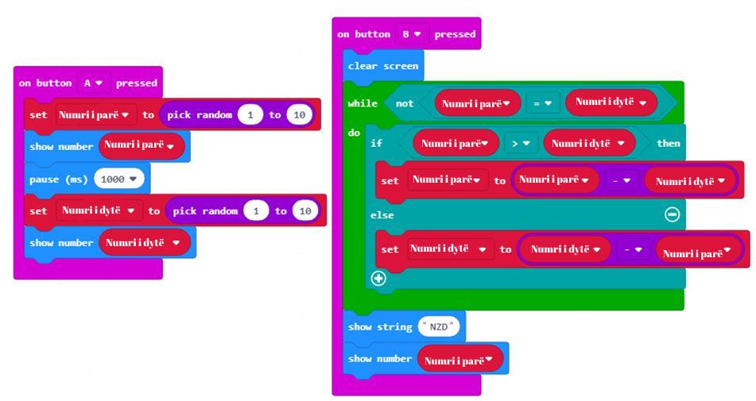

Час 11 - Еуклидов алгоритам
===========================

На овом часу говорићемо о: ­

* ­­	еуклидовом алгоритму.

Пред тобом је проблем. На располагању су ти два конопца. Један је дугачак 40 метара, а други 15 метара. Конопце треба исећи тако да сви добијени комади буду једнаких дужина.  Потребно је да конопце исечеш тако да добијеш најдуже могуће појединачне комаде.

**Фаза 1**

Дакле, потребно ти је да и први и други канап изделиш на парчиће једнаких дужина, на пример k. Проблем се своди на одређивање вредности k.

.. image:: ../_images/210.png
     :align: center
     :width: 500px

Ако погледаш пажљиво, можеш да закључиш да је број такав да се и 40 и 15 могу њиме поделити, а да при томе остатак при дељењу буде 0. Дакле, k дели оба броја и мора да буде највећи међу бројевима који имају ту особину. Математичари би га краће назвали највећим заједничким делиоцем бројева 40 и 15.

**Напомена:** Највећи заједнички делилац бројева (НЗД) је највећи број којим је сваки од тих бројева дељив, без остатка.

Стигли смо до другог проблема. Знаш шта тражиш, али проблем је на који начин ћеш то да урадиш? Постоји више поступака који те мoгу довести до решења.

Један од начина јесте да за оба броја одредиш који су њихови делиоце и да међу онима који су заједнички за оба броја нађеш највећи.

На пример, за бројеве 40 и 15, потребно је да нађеш просте чиниоце:

40=2*2*2*5

15=3*5

Највећи заједнички број који деле 40 и 15 је 5.

Поред овог постоји још један поступак који се врло често користи, а нарочито га користе програмери. То је Еуклидов алгоритам.

**Занимљивост:**

.. image:: ../_images/211.jpg
     :align: center
     :width: 200px

Еуклид (330 - 275. п.н.е) је био познати грчки математичар из Атине. Познат је по својим делима Елементи, Дата, Оптика и алгоритму за израчунавање највећег заједничког делиоца (НЗД) који је по њему назван Еуклидов алгоритам.

**Еуклидов алгоритам** се укратко и не превише прецизно може описати овако:  већи број се умањује за вредност мањег, новодобијене вредности се пореде и поступак се понавља све док се бројеви не изједначе.
На примеру, поступак одређивања НЗД за 40 и 15 изгледа овако:

Еуклидов алгоритам се заснива на следећој чињеници: ако неки број дели и 40 и 15, тај исти број мора да дели и 40–15.
На тај начин проблем сводимо на подпроблем, тј. сада тражимо највећи заједнички делилац  бројева 25 и 15. Овај поступак (корак) понављамо, све док не добијемо два једнака броја. Tачније:

Поступак, корак по корак:

  Од броја 40 одузимаш број 15, 40 - 15 = 25

  Поређењем бројева 25 и 15 закључујеш да бројеви нису једнаки: 25 ≠ 15

  *Поступак настављамо.*

  Од броја 25 одузимаш број 15, 25 - 15 = 10

  Поређењем бројева 15 и 10 закључујеш да бројеви нису једнаки: 15 ≠10

  Поступак настављамо. Од броја 15 одузимаш број 10, 15 - 10 = 5

  Поређењем бројева 10 и 5 закључујеш да бројеви нису једнаки: 10 ≠ 5

  *Поступак настављамо.* Од броја 10 одузимаш број  5, 10 - 5 = 5

  Поређењем бројева 5 и 5 закључујеш да су бројеви једнаки: 5 = 5

  *Поступак настављамо.* Од броја 5 одузимаш број  5, 5 - 5 = 0.

  Поступак се зауставља.

Закључујеш да је највећи број којим можеш да поделиш бројеве 40 и 15 број 5.

.. image:: ../_images/212.png
     :align: center
     :width: 600px

Применом Еуклидовог алгоритма, закључујеш да дужи конопац треба поделити на 8 делова дужине по 5 метара, а краћи конопац на 3 дела дужине по 5 метара. Победнички свежањ конопаца садржи 11 парчића дужине по 5 метара.

Како то да алгоритам заиста даје добро решење? Разлог томе лежи у особинама операције одузимања и множења, чија је последица следећа: Највећи заједнички делилац два броја ће бити и НЗД разлике та тва броја и мањег броја.
Као што видиш, Еуклидов алгоритам се понавља тако да је у сваком следећем кораку делилац из претходног корака постаје дељеник, а делилац је остатак из претходног корака.

**Фаза 2**

Покрени МејкКод за одабир и слагање блокова у простор за програмирање.

.. |dugme7| image:: ../_images/86.png
              :width: 70px

На интернет страници на адреси https://makecode.microbit.org покрени нов пројекат кликом на дугме New Project |dugme7|.

.. |br1| image:: ../_images/213.png
              :width: 200px

.. |br2| image:: ../_images/214.png
              :width: 200px

.. |onbuttonA| image:: ../_images/216.png
                :width: 200px

Да би програм израчунавао највећи заједнички делилац различитих бројева, потребно је да креирамо две променљиве: **Prvi broj** и **Drugi broj**. Променљиву креирамо тако што, у категорији *Variables*, кликнемо на дугме *Make a variable* и у поље уносимо име променљиве, у нашем случају **Prvi broj**, |br1|. На исти начин креирамо и другу променљиву **Drugi broj**, |br2|.

Сада је потребно доделити почетну вредност променљивима **Prvi broj** и **Drugi broj**. Нека почетна вредност обе променљиве буде вредност насумично изабрана из интервала од 1 до 10. Насумичну вредност из жељеног интервала добијамо коришћењем блока |random1| из категорије *Math*.

Постављамо да је почетна вредност променљиве **Prvi broj** насумично изабрана вредност од 0 до 10. То је могуће урадити превлачењем блока *set Prvi broj to 0* из категорије *Variables* у блок |onbuttonA|.

Изглед кода:

.. image:: ../_images/217.png
     :align: center
     :width: 400px

На исти начин дефинишемо променљиву **Drugi broj**.

Изглед кода:

.. image:: ../_images/218.png
     :align: center
     :width: 400px

Ако пажљиво анализирамо Еуклидов алгоритам уочавамо да:

­1. увек одузимамо мањи од већег броја.

.. image:: ../_images/219.png
     :align: center
     :width: 400px

2.­	поступак одузимања се понавља све док бројеви не постану једнаки.

.. image:: ../_images/220.png
     :align: center
     :width: 400px

Коначна скрипта изгледа овако:

**Фаза 3**

Да бисмо тестирали програм имамо две могућности:

.. |startuj| image:: ../_images/96.png
              :width: 50px

.. |download| image:: ../_images/97.png
              :width: 200px

Да бисмо тестирали програм имамо две могућности:

     1. да га покренемо у симулатору кликом на дугме |startuj|.

     2. да га пребацимо на микробит. Да бисмо програм пребацили на микробит треба да га прикачимо на рачунар коришћењем USB кабла. Кликом на дугме |download| преузмите .hex фајл на ваш рачунар. Превлачењем фајла на микробит, уређај је спреман за рад.

.. infonote::

  **Шта смо научили?**
    •	да се еуклидов алгоритам користи за израчунавање највећег заједничког делиоца (НЗД);
    •	да помоћу Еуклидовог алгоритма до највећег заједничког делиоца долазимо тако што већи број умањујемо за вредност мањег, упоређујемо вредности новодобијених бројева и поступак понављамо све док бројеви не постану једнаки.

Квиз
~~~~

.. mchoice:: L11P1
    :answer_a: 4
    :answer_b: 8
    :answer_c: 12
    :answer_d: 6
    :feedback_a: Браво! Твој одговор је тачан.
    :feedback_b: Твој одговор није тачан. Покушај поново!
    :feedback_c: Твој одговор није тачан. Покушај поново!
    :feedback_d: Твој одговор није тачан. Покушај поново!
    :correct: a

    Колики је НЗД за бројеве 120 и 68? Примени Еуклидовог алгоритма.

.. mchoice:: L11P2
    :answer_a: 6
    :answer_b: 2
    :answer_c: 1
    :answer_d: 3
    :feedback_a: Браво! Твој одговор је тачан.
    :feedback_b: Твој одговор није тачан. Покушај поново!
    :feedback_c: Твој одговор није тачан. Покушај поново!
    :feedback_d: Твој одговор није тачан. Покушај поново!
    :correct: a

    У једној корпи има 24 јабуке, а у другој 63 крушке. Колико ће деце моћи да поделе те јабуке и крушке, тако да свако дете добије једнак број јабука и једнак број крушака? Примени Еуклидовог алгоритма.
