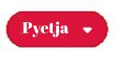
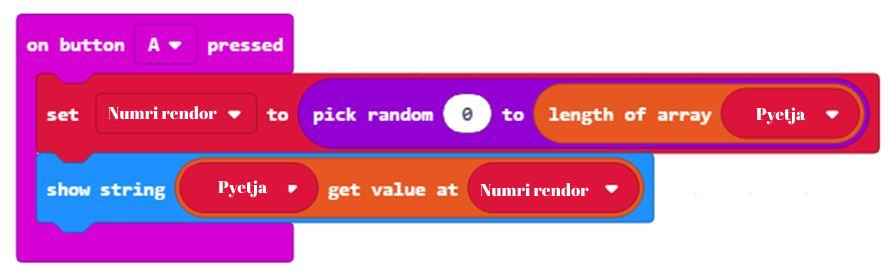
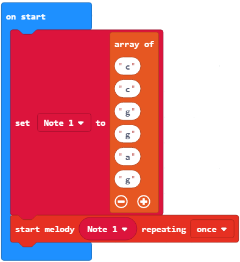

Час 14 - Низови
===============

На овом часу говорићемо о: ­

* ­­чувању већег броја података;

* низовима и њиховој примени.

Сваки колекционар маркица, новчаница или сличица зна да je у неком тренутку потребно да организује своју колекцију, како би на што лакши начин могли да пронађу одређене сличице или новчанице. На пример, колекционар кованица може имати кутију за кованице нумерисане на овај начин (као на доњој слици):

.. image:: ../_images/222.png
     :align: center
     :width: 500px

.. |dugme8| image:: ../_images/86.png
              :width: 90px

.. |niz| image:: ../_images/223.png
          :width: 150px

Свакој кованици (новчићу) у колекцији потребан је властити простор за складиштење и јединствена адреса (0, 1, 2,...) како бисмо касније могли да пронађемо жељену кованицу.
Како се наши МејкКоду програми све више усложњавају и захтевају више променљивих да бисмо пратили одређене ствари, мораћемо да уместо променљивих које смо до сада изучили да пронађемо друге начине за складиштење и организовање свих својих података. Ситуације у којима треба да сачуваш већи број података честе су у раду сваког програмера. Оне захтевају примену другачије врсте променљивих, потребно је користити **низове**. За то у МејкКоду можемо користити блок |niz|.

Низови представљају колекцију податка и можеш да га схватиш као „полицу” на којој се налази велики број "кутија". Свака од "кутија" нумерисана је бројем (од 0 надаље). У свакој од "кутија" чува се по један податак (број, реч, знак,...). Дакле, у низовима се могу чувати бројеви, речи или музичке ноте, који се једним именом називају **елементи низа**.

Сваки елемент у низу је дефинисан **индексом**, број којим је одређен положај елемента у низу. Први елемент у низу има индекс 0. Дужина низа односи се на укупан број елемената у низу, а индекс последњег елемента у низу је увек један мањи од његове дужине (нпр. ако је дужина низа 5, индекс последњег елемента низа је 4).

Листу креираш тако што у категорији *Advanced* изабереш подкатегорију *Array* и изабереш блок:

.. image:: ../_images/224.png
     :align: center
     :width: 400px

Горњи блок креира празну листу под именом **Lista** (одабиром опције *New variable…* из падајуће листе).

.. image:: ../_images/225.png
     :align: center
     :width: 400px

Затим, листу можемо попунити са пет бројева, индексираних од 0 до 4. Елементе додајеш кликом на знак "+" уписивањем вредности у одговарајући  простор.

.. image:: ../_images/227.png
     :align: center
     :width: 400px

Хајде да направимо програм помоћу кога ћеш провежбати падеже, тачније утврдити падежни облик одређене речи (нпр. Који падежни облик добијаш одговором на питања ко, шта?).

**Фаза 1**

Размисли о проблему: За сваки падежни облик поставља се одговарајуће питање. Кликом на дугме А биће приказано питање, које ће се насумично бирати, док ће кликом на дугме Б бити приказан падежни облика који одговара том питању.

**Фаза 2**

Покрени МејкКод одабери и сложи блокове у простор за програмирање.

На интернет страници на адреси https://makecode.microbit.org покрени нов пројекат кликом на дугме New Project |dugme8|.

.. |odgovor| image:: ../_images/231.png
              :width: 100px

.. |blok1| image:: ../_images/232.png
              :width: 200px

.. |blok2| image:: ../_images/234.png
              :width: 100px

.. |blok3| image:: ../_images/235.png
              :width: 150px

.. |blok4| image:: ../_images/236.png
              :width: 400px

.. |blok5| image:: ../_images/242.png
              :width: 200px

.. |blok6| image:: ../_images/245.png
              :width: 300px

Сваком падежном облику одговара одређено питање. Потребно је да се креирају две листе: |list1| и |list2|. У ове низове уносиш елементе приказане на следећој слици:

Изглед низова:

.. image:: ../_images/230.png
     :align: center
     :width: 600px

Дефинисање низова |list1| и |list2|. Поред тога потребно је да дефинишемо и променљиву |odgovor| као текстуалну променљиву (стринг) која ће чувати вредности низа |list1|: |blok1|.

Изглед кода:

.. image:: ../_images/233.png
     :align: center
     :width: 300px

Питања која се постављају за падежни облик треба да буду елементи низа |list2|. Падежни облик се налазе у низу |list1|.

Као што видиш, величина (димензија) низа је 7, тј. оба низа имају по 7 елемената.

У горњим низовима, уочаваш да питање на позицији 1 низа |list2| има одговор на позицији 1 низа |list1|. Ово важи и за све остале елементе низа. Овакав принцип нам је важан због спаривања питања са падежним обликом.
Да би игра била што занимљивија (да питања не би увек кретала од првог и ишла до  последњег), можеш да уведеш насумични одабир питања из листе |list2|.

Тачно је да ће игра бити интересантнија, али је исто тако тачно да, ако рачунару кажеш да насумично бира питање, нећеш знати које питање је изабрао. Чим не знаш питање, не можеш знати ни падеж.

У овој ситуацији, добро је да користиш обичну променљиву у којој ћеш чувати редни број питања.

Креирај променљиву |blok2|.

Нека променљива |blok2| узима насумичну вредност од 1 до величине низа (броја елемената у низу можемо дефинисати  коришћењем блока |blok3|):

Ако је садржај променљиве |blok2| број 6, биће постављено шесто питање из низа |list2|.

Када је притиснут тастер А на Микробиту потребно је насумично изабрати питање из низа |list2| и приказати га на екрану.

Да бисмо приказали одређени елемент низа (нпр. трећи елемент низа) можемо приказати на екрану коришћењем следећег блока |blok4|.

Изглед кода:

Када је притиснут тастер B на микробиту биће приказан падежни облик који одговара датом питању и приказаће га на екрану.

Изглед кода:

.. image:: ../_images/239.png
     :align: center
     :width: 600px

Коначан код: https://makecode.microbit.org/_fyhKwVhhUEXT

**Фаза 3**

.. |startuj| image:: ../_images/96.png
              :width: 60px

.. |download| image:: ../_images/97.png
              :width: 200px

Да бисмо тестирали програм имамо две могућности:

     1. да га покренемо у симулатору кликом на дугме |startuj|.

     2. да га пребацимо на микробит. Да бисмо програм пребацили на микробит треба да га прикачимо на рачунар коришћењем USB кабла. Кликом на дугме |download| преузмите .hex фајл на ваш рачунар. Превлачењем фајла на микробит, уређај је спреман за рад.

Још један пример употребе низова, али на нумеричке вредности. Потребно је да у зависности од броја који је генерисан случајним избором из интервала од -10 до 10, пронађемо број у низу од бројева -10, -5, -2, 0, 2 5, 6, 4, 10 који је мањи од њега.

**Фаза 1**

Размисли о проблему: Број који добијамо случаним избором из интервала од -10 до 10 потребно је да упоредимо са сваким од елемената низа бројева -5, -10, 0, -2, 2, 5, 6, 4, 10. Ако је на пример генерисани број -1, вредност која је мања од ње је -10.

**Фаза 2**

Покрени МејкКод одабери и сложи блокове у простор за програмирање.

На интернет страници на адреси https://makecode.microbit.org покрени нов пројекат кликом на дугме New Project |dugme8|.

Дефинишемо променљиву Najmanji чија се вредност добија случаним избором броја из интервала од -10 до 10:

.. image:: ../_images/240.png
     :align: center
     :width: 400px

Креирамо и низ Niz чији су елементи -5, -10, 0, -2, 2, 5, 6, 4, 10:

.. image:: ../_images/241.png
     :align: center
     :width: 300px

Да бисмо проверили сваки елемент (чува се у променљивој value) листе Niz користимо блок |blok5|.

Да бисмо проверили која је вредност низа мања од броја Najmanji, и да бисмо сачували најамњу вредност користимо следеће блокове:

.. image:: ../_images/243.png
     :align: center
     :width: 400px

Коначан изглед кода:

.. image:: ../_images/244.png
     :align: center
     :width: 400px

**Фаза 3**

Да бисмо тестирали програм имамо две могућности:

     1. да га покренемо у симулатору кликом на дугме |startuj|.

     2. да га пребацимо на микробит. Да бисмо програм пребацили на микробит треба да га прикачимо на рачунар коришћењем USB кабла. Кликом на дугме |download| преузмите .hex фајл на ваш рачунар. Превлачењем фајла на микробит, уређај је спреман за рад.

Уради

Креирај низ елемената 1, 2, 3. Затим, у већ креиран низ додај број 5 на крај низа. Мала помоћ: користи блок |blok6|.

Могуће решење:

.. image:: ../_images/246.png
     :align: center
     :width: 400px

Поред нумеричких вредности могуће је да користите низове и за чување нота у облику стринга. Нота је представљена октавом, као и дужином. Облик једне ноте је: C:2. То значи да се чује нота C током 2 откуцаја времена. Паузу можемо да представимо у облику R:1, где R значи одмор и одмор за један ритам. Одмор је време тишине, у звуку. Дефинишемо низ Ноте 1 да бисмо представили првих пет нота Тwinkle twinkle little star:

Тестирање и анализа програма.

.. infonote::

  **Шта смо научили?**
    •	низ – тип података сложене структуре који омогућава чување више вредности истовремено.
    •	у низовима се могу чувати бројеви, речи или музичке ноте, који се једним именом називају елементи низа.
    •	сваки елемент у низу је дефинисан индексом, број којим је одређен положај елемента у низу.
    •	први елемент у низу има индекс 0.
    •	индекс последњег елемента у низу је увек један мањи од његове дужине.
    •	дужина низа односи се на укупан број елемената у низу.
    •	низове креирамо из категорије Advanced - Array.

Квиз
~~~~

.. mchoice:: L14P1
    :answer_a: 4
    :answer_b: 2
    :answer_c: 3
    :answer_d: 1
    :answer_e: 5
    :feedback_a: Твој одговор није тачан. Покушај поново!
    :feedback_b: Твој одговор није тачан. Покушај поново!
    :feedback_c: Твој одговор није тачан. Покушај поново!
    :feedback_d: Браво! Твој одговор је тачан.
    :feedback_e: Твој одговор није тачан. Покушај поново!
    :correct: d

    Проучи блок.

    .. image:: ../_images/248.png
         :align: center
         :width: 400px

    Коју вредност има елемент са индексом 3?

.. mchoice:: L14P2
    :answer_a: 4
    :answer_b: 2
    :answer_c: 3
    :answer_d: 1
    :answer_e: 5
    :feedback_a: Твој одговор није тачан. Покушај поново!
    :feedback_b: Твој одговор није тачан. Покушај поново!
    :feedback_c: Браво! Твој одговор је тачан.
    :feedback_d: Твој одговор није тачан. Покушај поново!
    :feedback_e: Твој одговор није тачан. Покушај поново!
    :correct: c

    Проучи блок.

    .. image:: ../_images/249.png
         :align: center
         :width: 400px

    Коју вредност има елемент са индексом 3?

.. mchoice:: L14P3
    :answer_a: 4
    :answer_b: 3
    :answer_c: 1
    :answer_d: 5
    :answer_e: На екрану микробита биће приказана грешка.
    :feedback_a: Твој одговор није тачан. Покушај поново!
    :feedback_b: Твој одговор није тачан. Покушај поново!
    :feedback_c: Браво! Твој одговор је тачан.
    :feedback_d: Твој одговор није тачан. Покушај поново!
    :feedback_e: Твој одговор није тачан. Покушај поново!
    :correct: c

    Проучи блок.

    .. image:: ../_images/250.png
         :align: center
         :width: 400px

    Која вредност ће бити приказана након извршавање следећег кода?

.. mchoice:: L14P4
    :answer_a: 4
    :answer_b: 2
    :answer_c: 3
    :answer_d: 1
    :answer_e: На екрану микробита биће приказана грешка.
    :feedback_a: Твој одговор није тачан. Покушај поново!
    :feedback_b: Твој одговор није тачан. Покушај поново!
    :feedback_c: Твој одговор није тачан. Покушај поново!
    :feedback_d: Твој одговор није тачан. Покушај поново!
    :feedback_e: Браво! Твој одговор је тачан.
    :correct: e

    Проучи блок.

    .. image:: ../_images/251.png
         :align: center
         :width: 400px

    Коју вредност има елемент са индексом 2?
