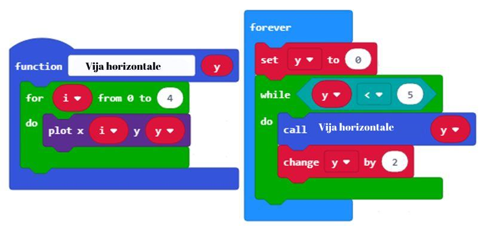
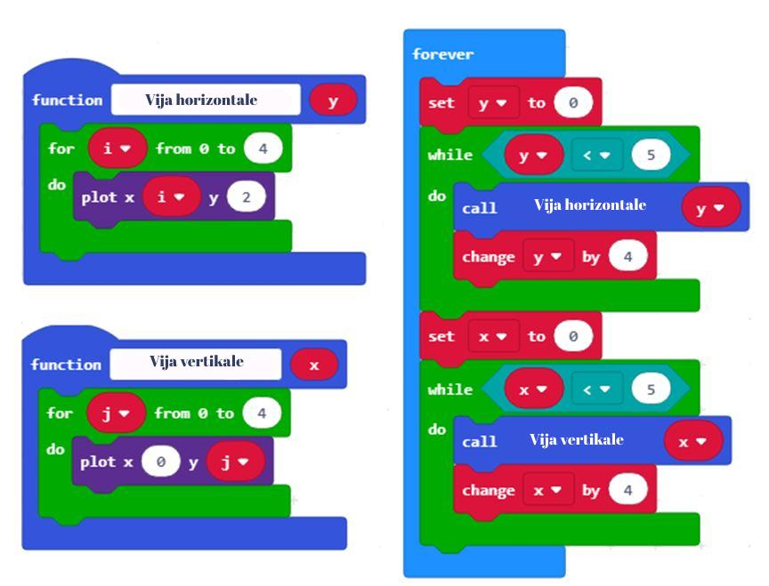

Час 15 - Функције
=================

На овом часу говорићемо о: ­

* ­­­томе како се сложени програми деле на делове – функције;

* креирању функција у МејкКоду;

*	параметрима и аргументима.

У свету програмирања, поновно коришћење делова програма је веома важно, јер чини програм једноставнијим и читљивијим. Како бисмо избегли поновно писање и понављање истог или сличног програма, користимо **функције**.

Једна од главних улога функције је да рашчлани програм на делове који имају тачно дефинисане улоге. На пример, за прављење пице, потребно је да направиш тесто, развучеш тесто, додаш преливе, додаш састојке, и на крају је испечеш. Ако бисте програмирали робота за производњу пица, коришћењем функција можеш целокупни поступак "направи пицу" да поделиш на делове - једна функција за сваки део процеса прављења пица, нпр. поступак прављења теста, процес печења,.....

Уопштено говорећи, функције се односе на процедуру – како ћемо нешто урадити.

Функција у MeјкКоду представља групу наредби које се извршавају само када су позване.

.. |dugme9| image:: ../_images/86.png
              :width: 70px

**Како се дефинишу функције**

Да бисмо дефинисали функцију потребно је да изаберемо из категорије Advanced подкатегорију Function. Из категорије Function (1) кликнемо на дугме Make a Function (2). Појавиће се дијалошки прозор (3) који омогућава креирање функције. У пољу за назив функције упиши име (4), на пример Срце и потврди кликом на дугме Done (5).

.. image:: ../_images/252.png
     :align: center
     :width: 800px

.. |fun2| image:: ../_images/254.png
              :width: 100px

.. |fun3| image:: ../_images/256.png
              :width: 400px

.. |fun4| image:: ../_images/258.png
              :width: 150px

.. |fun5| image:: ../_images/259.png
              :width: 70px

.. |fun6| image:: ../_images/260.png
              :width: 50px

.. |fun7| image:: ../_images/261.png
              :width: 50px

.. |fun8| image:: ../_images/263.png
              :width: 150px

У радном окружење појавиће се нови блок Срце, којем треба придружити блок за приказивање слике срца |fun1| (1).

У програму, приказивање слике срца (3) функције Срце вршимо позивањем функције користећи блок |fun2| (2).

.. image:: ../_images/255.png
     :align: center
     :width: 500px

Нови блок може да има и улазна поља. Захваљујући томе можемо да користимо функцију за израчунавање збира два броја а и b. Да бисмо то постигли, потребно је да из категорије *Function*, кликнемо на дугме *Make a Function*. Отвара се прозор у коме уносимо име функције **Сабирање**.

Од четири могућности које су понуђене за додавање нових поља у блоку |fun3| изабраћемо два блока *Number* и на нашем блоку ће се појавити одговарајућа два улазна поља у које ћемо уписати а и b имена променљивих за два сабирка.

.. image:: ../_images/257.png
     :align: center
     :width: 300px

Име a и b који смо унели у заглавље дефиниције фунције Сабирање назива се **параметар** (1). Конкретне вредности параметара ћемо задати као **аргумент** (2) новоуведене функције. Тај аргумент ће заменити свако појављивање параметра а и b у функцији. За параметар можемо да кажемо да је „чувар“ места за аргумент. Да бисмо функцију користили, морамо да је "позовемо" навођењем њеног имена, коришћењем блока |fun4|. У поља |fun5|  превлачимо аргументе |fun6| и |fun7| (2).

.. image:: ../_images/262.png
     :align: center
     :width: 500px

Аргументе a и b ћемо креирати користећи функцију за насумично биране бројчаних вредности |fun8| од 0 до 10, тако што притиснемо тастере А и Б на микробиту:

**Цртање хоризонталних линија (свака друга)**

.. image:: ../_images/264.png
     :align: center
     :width: 300px

Да бисмо нацртали хоризонталну линију (паралелну х оси) потребно је да повежемо све тачке које имају исту вредност координате у. На пример, ако је у=0 нацртаћемо саму х осу. На почетку укључујемо диодицу на левом рубу екрана микробита у тачку (0, 0), и попуњавамо празна поља све до (5,0). Следећи корак да пређемо на цртање следеће линије у другом и последњем реду.
Ако желимо да нацртамо све хоризонталне линије чија је у координата број који се завршава цифром 0 (дељив са 2) понављаћемо претходно описани поступак за у=2 и 4.

.. image:: ../_images/265.png
     :align: center
     :width: 500px

Да би поступак био прегледнији, издвојићемо инструкције за цртање једне хоризонталне линије у засебну целину – функцију Линија хоризонтална, коју ћемо, по потреби, позивати.

**Цртање вертикалних линија**

Слично цртању хоризонталне линије, да бисмо нацртали вертикалну линију потребно је да повежемо све тачке које имају исту вредност координате х. На почетку поставимо да је упаљена диода на горњи руб екрана, на пример у тачку (0,0), и затим, укључујемо све диоде у интервалу (0, 5). Следећи корак да пређемо на цртање следеће линије у другом и последњем реду.
Ако желимо да нацртамо све хоризонталне линије чија је x координата број који се завршава цифром 0 (дељив са 2) понављаћемо претходно описани поступак за x=2 и 4.

.. image:: ../_images/267.png
     :align: center
     :width: 500px

Упамтите цео појекат под називом *Мрежа*.

**Размисли:**

Треба да креираш функцију којом се исцртава квадрат као на слици.

.. image:: ../_images/268.png
     :align: center
     :width: 300px

Креиране су одговарајуће функције и код којим се црта квадрат.

Међутим, ови блокови као резултат дају следећу слику.

.. image:: ../_images/270.png
     :align: center
     :width: 300px

Где је грешка?

Одговор:
У функцији Линија вертикална у блоку *plot x ….*  уместо 0 постави променљиву x из главног програма, исто урадити у функцији Линија хоризонтална у блоку *plot y….* уместо 0 постави променљиву y из главног програма.

.. infonote::

  **Шта смо научили?**
    •	да је главна улога функције да рашчлани програм на делове који имају тачно дефинисане улоге.
    •	како се креирају нови блокови (функције) са и без улазних поља. Блокови са улазним пољима, аргументе који се у њих уписују прослеђује функцији дајући параметра вредности. На тај начин, један исти блок може да реализује више различитих акција у зависности вредности аргумената.

Квиз
~~~~

.. mchoice:: L15P1
    :answer_a: Да
    :answer_b: Не
    :feedback_a: Браво! Твој одговор је тачан.
    :feedback_b: Твој одговор није тачан. Покушај поново!
    :correct: а

    Да ли је главни програм надређен функцијама? Означи тачан одговор.

.. mchoice:: L15P2
    :answer_a: Да
    :answer_b: Не
    :feedback_a: Твој одговор није тачан. Покушај поново!
    :feedback_b: Браво! Твој одговор је тачан.
    :correct: b

    Да ли се у MeјкКоду функције могу реализовати на само један начин? Означи тачан одговор.

.. mchoice:: L15P3
    :answer_a: Да
    :answer_b: Не
    :feedback_a: Браво! Твој одговор је тачан.
    :feedback_b: Твој одговор није тачан. Покушај поново!
    :correct: а

    Да ли блок за функцију може да има и улазна поља? Означи тачан одговор.

.. mchoice:: L15P4
    :answer_a: Да
    :answer_b: Не
    :feedback_a: Твој одговор није тачан. Покушај поново!
    :feedback_b: Браво! Твој одговор је тачан.
    :correct: b

    Да ли се вредности које блок предаје функцији називају параметри? Означи тачан одговор.
