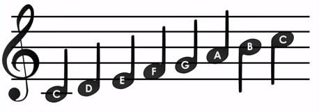

Час 16 - Вежбаоница
===================

Вежбаоница је место где ћеш провежбати све што до сада знаш о чувању већег броја података, креирању низова и њихове примене, употреби функција које корисник креира у сврхе дељења сложених програма на једноставне целине, начину дефинисања функција и коришћењу параматара и аргумената.

1.	Написати програм за твоју омиљену песму.

Мала помоћ:

Колико свака нота траје:|nota|

.. |nota| image:: ../_images/82.png
            :width: 400px

Ако не можеш да изабереш песмицу, искористи рођенданску песму.

.. image:: ../_images/83.jpg
     :align: center
     :width: 600px

Упореди своје решење са нашим: https://makecode.microbit.org/_f90EYb4LcVtV

2.	Креирај функцију помоћу које генеришеш низ од 20 елемената, чије вредности насумично изабрани бројеви од 1 до 100. Упореди своје решење са нашим: https://makecode.microbit.org/_ExgfE8ej1Jii

3.	Креирај функцију блинк, са два параметра x и y, која укључује и искључује диоде на координатама одређеним параметрима x и y. Упореди своје решење са нашим: https://makecode.microbit.org/_g0tcAz5dmVVc

4.	Креирај функцију блинк, са два параметра x и y, која укључује и искључује све лед диоде једну за другом. Упореди своје решење са нашим: https://makecode.microbit.org/_1ECLegEjf61L

5.	Напишите програм који омогућава да светли диода екрана која је најближа северу. Упореди своје решење са нашим: https://makecode.microbit.org/_Mug9F7aJ0JF0

.. |pauza| image:: ../_images/84.png
              :width: 150px

6.	Креирај функцију Дијагонала којом ће бити укључиване диодне по дијагонали, тачније биће укључиване диоде које имају исте вредности за x и y координату (нпр, (0, 0), (1, 1), (2, 2), ... (4, 4)). Симулирање укључивања диода ће бити омогућено увођењем блока |pauza|. Упореди своје решење са нашим: https://makecode.microbit.org/_eamEJ0725CgA

7.	Креирај функцију Квадрат, којом ће бити укључиване диоде тако да формирају квадрат. Почетна позиција за исцртавање квадрата је тачка (1, 1). Упореди своје решење са нашим: https://makecode.microbit.org/_9seAtiJEs1dX

8.	Креирај функције Обим једнакокраког троугла, са параметрима а и b. Дужине страница креирате коришћењем блока за насумично биране бројчаних вредности. Упореди своје решење са нашим: https://makecode.microbit.org/_6w4ACt5M95xX

9.	Креирај функције на следећи начин:

    a)	У процедури Сабирање на случајан начин треба генерисати два броја, први сабирак a [10,20] и други сабирак  b из интервала [1,15]. На основу њих формирати збир c = a+b.
    b)	У процедури Одузимање на случајан начин треба генерисати два броја, први сабирак a [10,20] и други сабирак  b из интервала [1,15]. На основу њих формирати разлику c = a-b.
    c)	У процедури Множење на случајан начин треба генерисати два броја, први сабирак a [10,20] и други сабирак  b из интервала [1,15]. На основу њих формирати производ c = a*b.
    d)	У процедури Дељење на случајан начин треба генерисати два броја, први сабирак a [10,20] и други сабирак  b из интервала [1,15]. На основу њих формирати количник c = a/b.

Упореди своје решење са нашим: https://makecode.microbit.org/_gby1X26hvTv0
