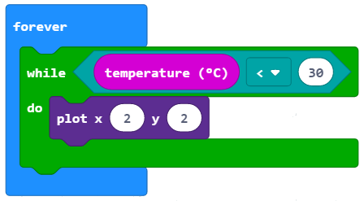
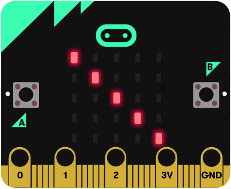

Час 9 - Понављање
=================

На овом часу говорићемо о: ­

* ­понављању делова програма;

* понављању делова програма.

У природи постоје процеси који се непрестано или с времена на време понављају (нпр. плима и осека). Као и у природи, у програмирању је, за решавање појединих задатака, неопходно да се неки делови програма изврше више пута.

Програми код којих се одређени кораци понављају више пута називају се **циклични програми** или **програми понављања**.

Да се једна иста наредба не би писала више пута, постоји програмска структура петље (циклуси) која омогућава понављање једне или више наредби. За такве програме кажемо да садрже понављања, које називамо циклуси.

Понављање наредби је врло честа појава у програмирању.

МејкКод садржи три врсте блокова у које се умећу други блокови чије извршавање треба да се понови:

- ­	одређени број пута:

.. image:: ../_images/146.png
    :align: center
    :width: 200px

Овај блок треба да користимо када унапред знамо тачан број понављања (каже се и итерација).
­

-  бесконачан број пута (непрестано, све док корисник не заустави програм):

То је један од најчешће коришћених блокова. Његово извршавање зауставља се кликом на дугме за престанак рада програма (|dugme4|).

-  све док не буде испуњен одређени услов:

.. image:: ../_images/149.png
      :align: center
      :width: 200px

Овај блок треба да користимо када не знамо колико је пута потребно извршити блокове унутар блока за понављање и зато желимо да се оне извршавају све док не буде испуњен одређени услов.

Хајде да направимо програм којим се активира звук који се понавља одређени број пута сваки пут када корисник помери микробит.

**Фаза 1**

**Разумевање проблема:** Када се протресе или направи било какав покрет са микробит уређајем поновиће се звук 3 пута.

    **Корак 1:** Детектуј покрет

    **Корак 2:** Понови звук три пута

**Фаза 2**

.. |dugme5| image:: ../_images/86.png
              :width: 90px

Покрени МејкКод за одабир и слагање блокова у простор за програмирање.

На интернет страници на адреси https://makecode.microbit.org покрени нов пројекат кликом на дугме New Project |dugme5|.

Да бисмо могли да детектујемо било какав покрет у простор за програмирање превлачимо  блок *on shake* из категорије *Input*:

.. image:: ../_images/150.png
      :align: center
      :width: 400px

Како желимо да поновимо звук три пута, у блок *on shake* превлачимо блок  *repeat .. for* из категорије *Loops*. У делу за унос вредности (броја) уносимо број 3.

.. image:: ../_images/151.png
      :align: center
      :width: 200px

У горњи блок ћемо превући блок *play tone … for…* из категорије *Music* којим се репродукује звук.

.. image:: ../_images/152.png
      :align: center
      :width: 400px

У датом блоку из падајућих листа бирамо тон и дужину истог.

.. image:: ../_images/153.png
      :align: center
      :width: 350px

Коначан изглед програма:

.. image:: ../_images/154.png
      :align: center
      :width: 300px

**Фаза 3**

Тестирање и анализа програма.

.. |startuj| image:: ../_images/96.png
              :width: 60px

.. |download| image:: ../_images/97.png
              :width: 200px

Да бисмо тестирали програм имамо две могућности:

      1. да га покренемо у симулатору кликом на дугме |startuj|.

      2. да га пребацимо на микробит. Да бисмо програм пребацили на микробит треба да га прикачимо на рачунар коришћењем USB кабла. Кликом на дугме |download| преузмите .hex фајл на ваш рачунар. Превлачењем фајла на микробит, уређај је спреман за рад.

Након тестирања и анализе, постоји грешка, јасно треба да се чује три пута звук.

**Грешка 1.** Не чује се јасно понављање звука.

**Исправљање грешака.** Да бисмо постигли да се јасно звук чује три пута увешћемо блок *pause ..* из категорије *Basic*. Поставићемо да је временски интервал након кога се понавља звук 1 секунда (или 1000 милисекунди).

Након исправљеног кода, коначан изглед програма:

.. image:: ../_images/155.png
      :align: center
      :width: 400px

Поново тестирамо програм. Сада он ради како треба.

Хајде да направимо још један програм којим се активира паљење лед диодица на средини екрана микробита све док је температура у просторији мања од 30.

**Фаза 1**

**Разумевање проблема:** Све док је измерена температура мања од 30 пали се лед диода на средини екрана микробита.

**Фаза 2**

Покрени МејкКод за одабир и слагање блокова у простор за програмирање.
На интернет страници на адреси https://makecode.microbit.org покрени нов пројекат кликом на дугме New Project |dugme5|.

Да бисмо извршили одређене наредбе (паљење лед диода) док не буде испуњен неки услов (температура мања од 30), у блок *forever* превлачимо блок *while..do..*:

Изглед кода:

Да бисмо упалили лед диоду на средини екрана, тачније на позицији (2, 2) из менија *Led* превлачимо блок: |plot| .

Коначан изглед програма:

**Фаза 3**

Тестирање и анализа програма.

Да бисмо тестирали програм имамо две могућности:

      1. да га покренемо у симулатору кликом на дугме |startuj|.

      2. да га пребацимо на микробит. Да бисмо програм пребацили на микробит треба да га прикачимо на рачунар коришћењем USB кабла. Кликом на дугме |download| преузмите .hex фајл на ваш рачунар. Превлачењем фајла на микробит, уређај је спреман за рад.

**Размисли:**

Пажљиво проучи горње блокове. Шта се дешава када температура порасте, и буде већа од 30? Зашто?

Допуни горњи кôд како би лед диода била упаљена само док је температура мања од 30.

Могуће решење: https://makecode.microbit.org/_92LeH58vY4je

Сећаш се задатка из Лекције 3 – Унос података, помоћу кога смо укључивали лед диоде на главној дијагонали екрана микробита.

.. image:: ../_images/158.png
      :align: center
      :width: 300px

.. |led| image:: ../_images/109.png
          :width: 180px

**Фаза 1**

**Разумевање проблема:** Главна дијагонала представља линију која повезује горњи леви угао екрана са доњим десним. Тај задатак смо решили линијским програмом, ређајући блокове |plot| из категорије |led| један за другим.

Изглед кода је следећи:

**Фаза 2**

Покрени МејкКод за одабир и слагање блокова у простор за програмирање.

На интернет страници на адреси https://makecode.microbit.org покрени нов пројекат кликом на дугме New Project |dugme5|.

.. |blok| image:: ../_images/160.png
          :width: 200px

.. |p1| image:: ../_images/162.png
          :width: 100px

Међутим, овај задатак ћемо решити елегантније користећи блок |blok| из категорије *Loops*. Овај блок се користи за понављање дела програма онолико пута колико желите (граница се означава у блоку to |b1|) користећи променљиву |p1|. (О променљивима ћемо причати детаљније у следећој лекцији, можеш их схватити као „чуваре“ различитих вредности, било нумеричких било текстуалних).

У блок *forever* превлачимо блок *for .. from to ...* Граница од које креће бројање је 0, а до које се завршава је 4, зато што је у овом случају положај лед диода на екрану микробита дефинисан по хоризонтали и вертикали од 0 до 4.

Изглед кода:

.. image:: ../_images/163.png
      :align: center
      :width: 300px

У горњи блок превучемо |plot| из категорије |led|. Координату x дефинишемо превлачењем |p1|, координату y дефинишемо превлачењем |p1|.

Корак по корак извршавање блока *for .. from to ...*

.. |plot1| image:: ../_images/165.png
            :width: 150px

.. |s2| image:: ../_images/166.png
            :width: 150px

.. |plot3| image:: ../_images/169.png
            :width: 150px

.. |s4| image:: ../_images/170.png
            :width: 150px

.. |plot4| image:: ../_images/171.png
            :width: 150px

.. |s5| image:: ../_images/172.png
            :width: 150px

.. list-table:: Tабела компоненти Микробита
   :widths: 100 100 100
   :header-rows: 1

   * - Променљива |p1|
     - Блока |plot|
     - Извршавање кода на екрану микробита

   * - index = 0
     - |plot11|
     - |s1|

   * - index = 1
     - |plot1|
     - |s2|

   * - index = 2
     - |plot2|
     - |s3|

   * - index = 3
     - |plot3|
     - |s4|

   * - index = 4
     - |plot4|
     - |s5|

Блок ће се поновити пет пута.

Коначан изглед кода:

.. image:: ../_images/173.png
      :align: center
      :width: 300px

**Фаза 3**

Тестирање и анализа програма.

Да бисмо тестирали програм имамо две могућности:

1	да га покренемо у симулатору кликом на дугме |startuj|.

2	да га пребацимо на микробит. Да бисмо програм пребацили на микробит треба да га прикачимо на рачунар коришћењем USB кабла. Кликом на дугме |download| преузмите .hex фајл на ваш рачунар. Превлачењем фајла на микробит, уређај је спреман за рад.

.. infonote::

  **Шта смо научили?**
    •	да програми код којих се одређени блокови понављају више пута називају се циклични програми или програми понављања.
    •	да постоје различити блокови за понављање (бројачки, бесконачни, условни) и када се они користе.
    •	да се бројачки извршавају када тачно знамо колико ће се пута поновити нека радња.
    •	да се условна понављања користимо када не знамо колико је пута потребно извршити неку радњу. Тај блок се извршава све док не буде испуњен одређени услов.
    •	које вредности узима index у блоку понављања, тачније која је почетна, а која крајња вредност.

Квиз
~~~~

.. mchoice:: L9P1
    :answer_a: На екрану ће бити приказано срце.
    :answer_b: На екрану ће бити приказано срце све док је дугме А притиснуто.
    :answer_c: На екрану ће бити приказано срце све док је температура већа од 30.
    :answer_d: На екрану неће бити приказано ништа.
    :feedback_a: Твој одговор није тачан. Покушај поново!
    :feedback_b: Браво! Твој одговор је тачан.
    :feedback_c: Твој одговор није тачан. Покушај поново!
    :feedback_d: Твој одговор није тачан. Покушај поново!
    :correct: b

    Пажљиво проучи код:

    .. image:: ../_images/175.png
          :align: center
          :width: 300px

    Шта ће бити приказано на микробиту?

.. mchoice:: L9P2
    :answer_a: На екрану ће бити приказана измерена тренутно вредност температуре и срце.
    :answer_b: На екрану ће три пута бити приказано срце.
    :answer_c: На екрану ће три пута бити приказана измерена тренутна вредност температура и срце.
    :answer_d: На екрану неће бити приказано ништа.
    :feedback_a: Твој одговор није тачан. Покушај поново!
    :feedback_b: Твој одговор није тачан. Покушај поново!
    :feedback_c: Браво! Твој одговор је тачан.
    :feedback_d: Твој одговор није тачан. Покушај поново!
    :correct: c

    Пажљиво проучи код:

    .. image:: ../_images/176.png
          :align: center
          :width: 300px

    Шта ће бити приказано на микробиту?

.. mchoice:: L9P3
    :answer_a: На екрану ће бити редом бројеви од 0 до 4.
    :answer_b: На екрану ће бити приказан број 5.
    :answer_c: На екрану ће пет пута бити приказан број 4.
    :answer_d: На екрану неће бити приказано ништа.
    :feedback_a: Браво! Твој одговор је тачан.
    :feedback_b: Твој одговор није тачан. Покушај поново!
    :feedback_c: Твој одговор није тачан. Покушај поново!
    :feedback_d: Твој одговор није тачан. Покушај поново!
    :correct: a

    Пажљиво проучи код:

    .. image:: ../_images/177.png
          :align: center
          :width: 300px

    Шта ће бити приказано на микробиту?

.. mchoice:: L9P4
      :answer_a: На екрану ће се четири пута појавити срце (симулација рада срца).
      :answer_b: На екрану ће се приказати срце.
      :answer_c: На екрану неће бити приказано ништа.
      :feedback_a: Твој одговор није тачан. Покушај поново!
      :feedback_b: Твој одговор није тачан. Покушај поново!
      :feedback_c: Браво! Твој одговор је тачан.
      :correct: c

      Пажљиво проучи код:

      .. image:: ../_images/178.png
            :align: center
            :width: 300px

      Шта ће бити приказано на микробиту?
